## LIMIT 语句
分页查询是最常用的场景之一，但也通常也是最容易出问题的地方。比如对于下面简单的语句，一般 DBA 想到的办法是在 type, name, create_time 字段上加组合索引。这样条件排序都能有效的利用到索引，性能迅速提升。

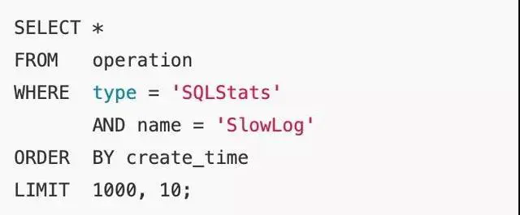

好吧，可能90%以上的 DBA 解决该问题就到此为止。但当 LIMIT 子句变成 “LIMIT 1000000,10” 时，程序员仍然会抱怨：我只取10条记录为什么还是慢？

要知道数据库也并不知道第1000000条记录从什么地方开始，即使有索引也需要从头计算一次。出现这种性能问题，多数情形下是程序员偷懒了。

在前端数据浏览翻页，或者大数据分批导出等场景下，是可以将上一页的最大值当成参数作为查询条件的。SQL 重新设计如下：

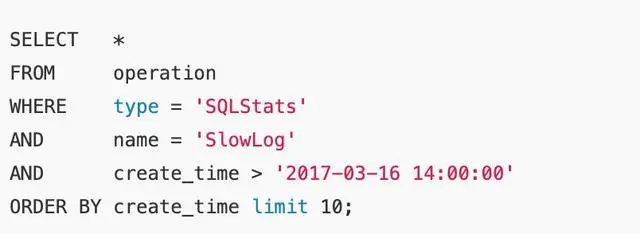

在新设计下查询时间基本固定，不会随着数据量的增长而发生变化。

## 隐式转换,索引失效
   
SQL语句中查询变量和字段定义类型不匹配是另一个常见的错误。比如下面的语句：

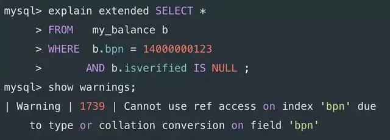

其中字段 bpn 的定义为 varchar(20)，MySQL 的策略是将字符串转换为数字之后再比较。函数作用于表字段，索引失效。

上述情况可能是应用程序框架自动填入的参数，而不是程序员的原意。现在应用框架很多很繁杂，使用方便的同时也小心它可能给自己挖坑。
 
## 关联更新、删除
虽然 MySQL5.6 引入了物化特性，但需要特别注意它目前仅仅针对查询语句的优化。对于更新或删除需要手工重写成 JOIN。

比如下面 UPDATE 语句，MySQL 实际执行的是循环/嵌套子查询（DEPENDENT SUBQUERY)，其执行时间可想而知。

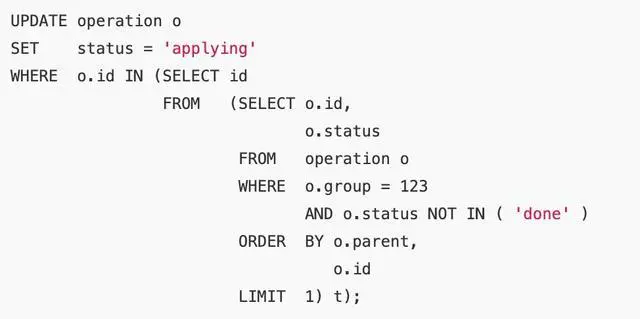

执行计划：   

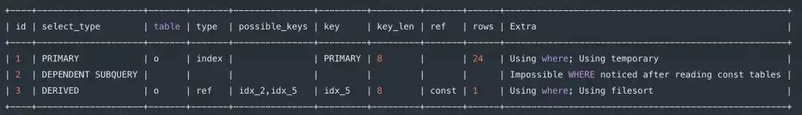

重写为 JOIN 之后，子查询的选择模式从 DEPENDENT SUBQUERY 变成 DERIVED，执行速度大大加快，从7秒降低到2毫秒
   
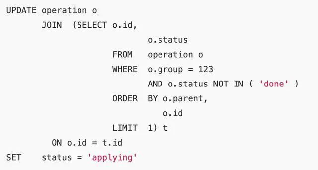

执行计划：   

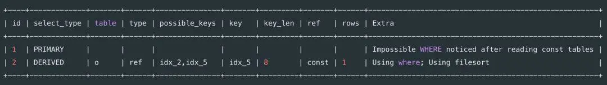

## 混合排序
MySQL 不能利用索引进行混合排序。但在某些场景，还是有机会使用特殊方法提升性能的。

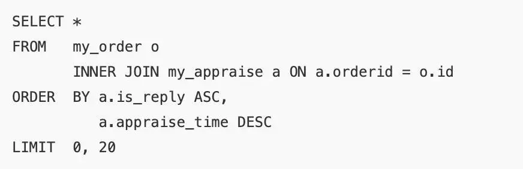

执行计划显示为全表扫描：

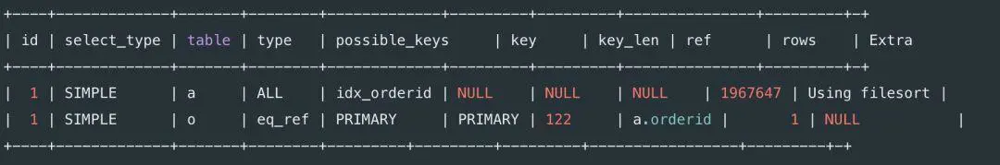

由于 is_reply 只有0和1两种状态，我们按照下面的方法重写后，执行时间从1.58秒降低到2毫秒。

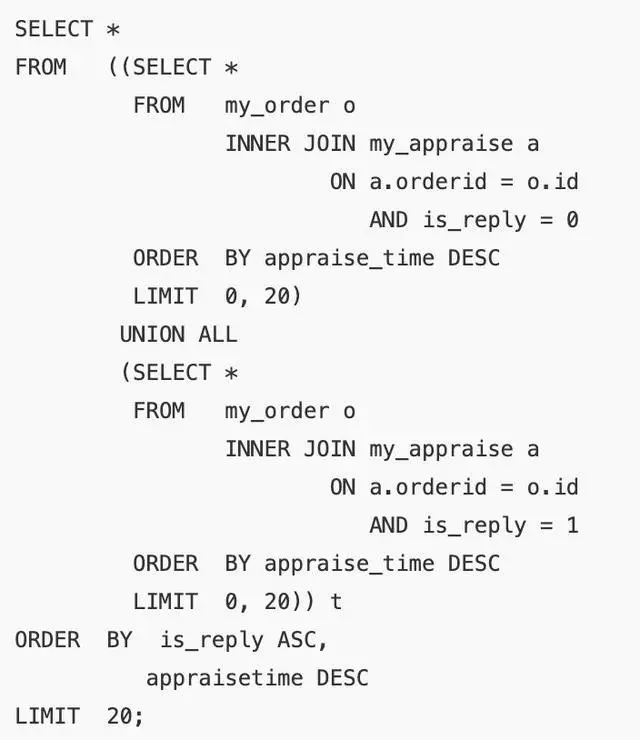

## EXISTS语句
MySQL 对待 EXISTS 子句时，仍然采用嵌套子查询的执行方式。如下面的 SQL 语句：

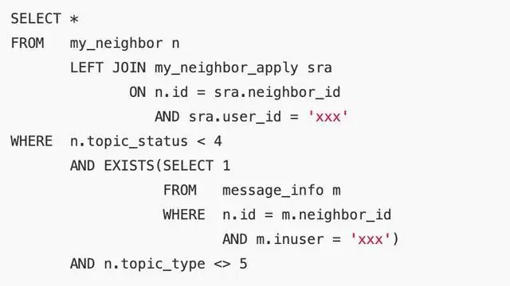

执行计划为：

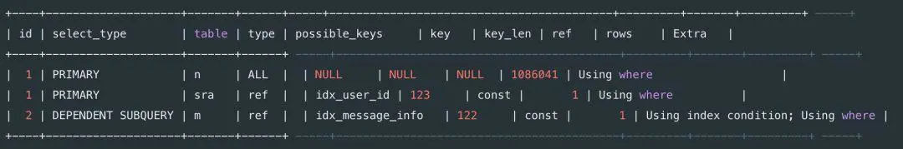

新的执行计划：

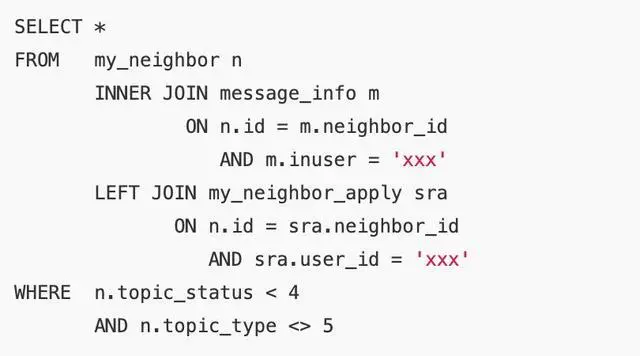

去掉 exists 更改为 join，能够避免嵌套子查询，将执行时间从1.93秒降低为1毫秒。

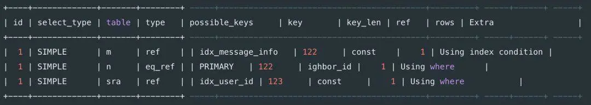

## 条件下推
外部查询条件不能够下推到复杂的视图或子查询的情况有：

聚合子查询；

含有 LIMIT 的子查询；

UNION 或 UNION ALL 子查询；

输出字段中的子查询；

如下面的语句，从执行计划可以看出其条件作用于聚合子查询之后

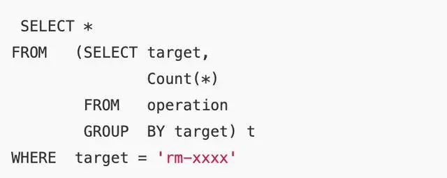

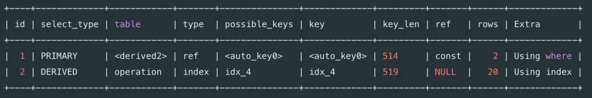

确定从语义上查询条件可以直接下推后，重写如下：

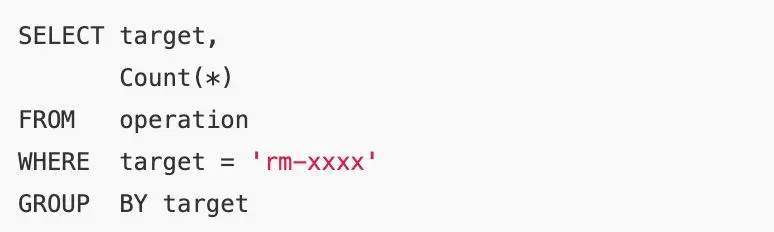

执行计划变为：

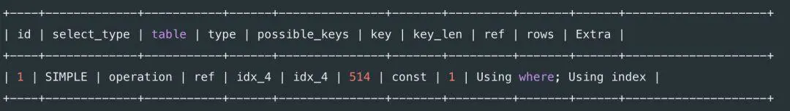

## 提前缩小范围
先上初始 SQL 语句：

数为90万，时间消耗为12秒。

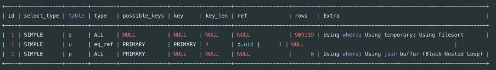

由于最后 WHERE 条件以及排序均针对最左主表，因此可以先对 my_order 排序提前缩小数据量再做左连接。SQL 重写后如下，执行时间缩小为1毫秒左右。

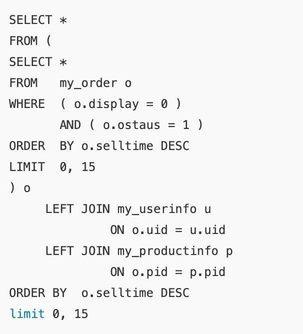

再检查执行计划：子查询物化后（select_type=DERIVED)参与 JOIN。虽然估算行扫描仍然为90万，但是利用了索引以及 LIMIT 子句后，实际执行时间变得很小。

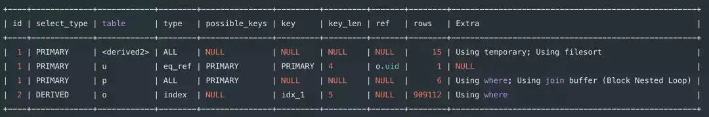

## 中间结果集下推
再来看下面这个已经初步优化过的例子(左连接中的主表优先作用查询条件)：

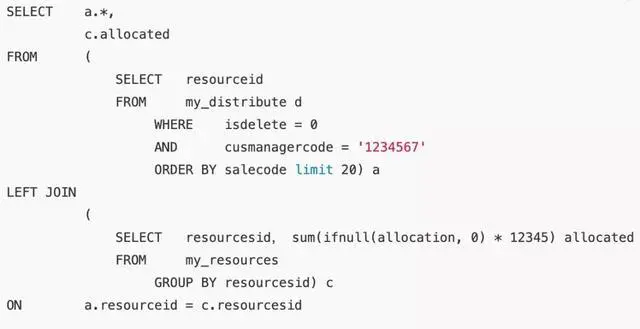

那么该语句还存在其它问题吗？不难看出子查询 c 是全表聚合查询，在表数量特别大的情况下会导致整个语句的性能下降。

其实对于子查询 c，左连接最后结果集只关心能和主表 resourceid 能匹配的数据。因此我们可以重写语句如下，执行时间从原来的2秒下降到2毫秒。

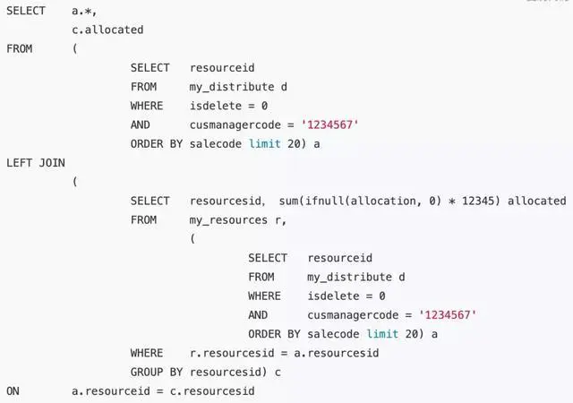

但是子查询 a 在我们的SQL语句中出现了多次。这种写法不仅存在额外的开销，还使得整个语句显的繁杂。使用 WITH 语句再次重写：

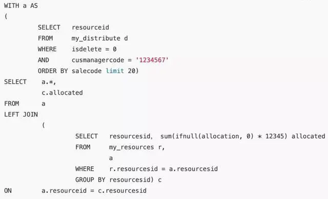

## 总结
   
数据库编译器产生执行计划，决定着SQL的实际执行方式。但是编译器只是尽力服务，所有数据库的编译器都不是尽善尽美的。

上述提到的多数场景，在其它数据库中也存在性能问题。了解数据库编译器的特性，才能避规其短处，写出高性能的SQL语句。

程序员在设计数据模型以及编写SQL语句时，要把算法的思想或意识带进来。

编写复杂SQL语句要养成使用 WITH 语句的习惯。简洁且思路清晰的SQL语句也能减小数据库的负担 。
   

### 参考资料
https://www.jianshu.com/p/591e15374d09
