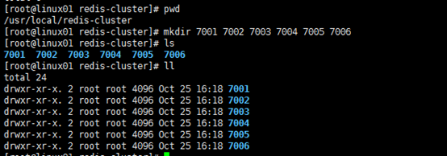
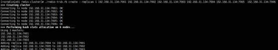
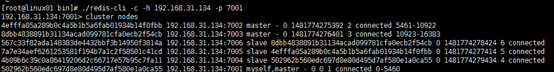

# REDIS安装部署

[redis云体验](https://try.redis.io/)

## 单机通过apt-get安装redis
```bash
# 系统环境配置
sudo apt-get update
sudo apt-get upgrade
# 安装部署
sudo apt-get install redis-server
#如果需要设置为系统服务则执行
sudo systemctl enable redis-server.service
```
配置文件路径如下：
```text
/etc/redis/redis.conf
```

## 单机通过bin包部署
官网下载地址：https://redis.io/download 或者 https://download.redis.io/releases/
```bash
mkdir /usr/local/bin/redis
cd /usr/local/bin/redis
wget https://download.redis.io/releases/redis-6.0.9.tar.gz
tar xzf redis-6.0.9.tar.gz
ln -s redis-6.0.9 redis
cd redis
make
# 编译成功后启动服务端
src/redis-server
# 编译成功后启动客户端
src/redis-cli
```

环境变量配置：略

## REDIS主从部署
### 单机多节点模拟主从
#### 规划
|主节点|从节点（两个）|
|---|---|
|6380|6381、6382|
#### 配置
以[单机通过bin包部署]()为前提
```bash
cd /usr/local/bin/redis
# 创建一个master-slave目录
mkdir master-slave
cd master-slave
# 创建三个子目录6380、6381、6382
mkdir 6380 6381 6382
# 依次拷贝redis解压目录下的redis.conf配置文件，到这三个子目录中。

cp redis/redis.conf 6380/.
cp redis/redis.conf 6381/.
cp redis/redis.conf 6382/.
# 配置主从
# 主从复制的开启，完全是在从节点发起的，不需要在主节点变更
# 三种设置主从方式
# 配置文件：在从服务器的配置文件中加入：slaveof <masterip> <masterport>
# 启动命令：redis-server启动命令后加入 --slaveof <masterip> <masterport>
# 客户端命令：Redis服务器启动后，直接通过客户端执行命令：slaveof <masterip> <masterport>，则该Redis实例成为从节点。
# 进入6380目录，修改redis.conf，将port端口修改成6380即可。
# 进入6381目录，修改redis.conf，将port端口改成6381，同时指定开启主从复制。
# 进入6382目录，修改redis.conf，将port端口改成6382，同时指定开启主从复制。
```
#### 测试
在三个终端中登录上述三个主从目录并启动服务器
```bash
redis-server ./redis.conf
```
在另外三个终端中登录上述三个主从目录并执行
```bash
redis-cli -p 对应端口
```
- 在主节点上，进行读写操作
- 在从节点上，进行读取操作

#### 断开主从
客户端断开操作
```bash
slaveof no one
```

## REDIS哨兵部署
以[REDIS主从部署]()为前提，另外配置三个Sentinel实例，监控同一个Master节点。
### 配置Sentinel
```bash
# 创建sentinels目录
mkdir sentinels
cd sentinels
# 创建s1、s2、s3目录
mkdir s1 s2 s3
# 依次拷贝redis解压目录下的sentinel.conf文件
cp  redis/sentinel.conf s1/.
cp  redis/sentinel.conf s2/.
cp  redis/sentinel.conf s3/.
# 依次修改s1、s2、s3子目录中的sentinel.conf文件，修改端口，并指定要监控的主节点。（从节点不需要指定，sentinel会自动识别）

```

## REDIS集群部署 
### 准备工作
```bash
# 安装ruby环境,redis集群管理工具redis-trib.rb依赖ruby环境，首先需要安装ruby环境：
yum -y install ruby
yum -y install rubygems
# 安装ruby和redis的接口程序,拷贝redis-3.0.0.gem至/usr/local下，执行安装：
gem install /usr/local/redis-3.0.0.gem
```
### 规划
Redis集群至少需要3个master节点，最少是1master对应1slave这种方式。所以Redis集群最少需要6个节点，可以分布在一台或者多台主机上。本教案在一台主机上创建伪分布式集群，不同的端口表示不同的redis节点，如下：


主节点：192.168.56.3:7001 192.168.56.3:7002 192.168.56.3:7003

从节点：192.168.56.3:7004 192.168.56.3:7005 192.168.56.3:7006

在/usr/local/bin/redis下创建redis-cluster目录，其下创建7001、7002、7006目录，如下：



将redis解压路径下的配置文件redis.conf，依次拷贝到每个700X目录内，并修改每个700X目录下的redis.conf配置文件：
```text
# 必选配置：
port 700X
bind 192.168.23.3   
cluster-enabled yes
# 建议配置：
daemonized  yes
logfile  /usr/local/redis/redis-cluster/700X/node.log
```

### 启动每个结点redis服务
依次以700X下的redis.conf，启动redis节点。（必须指定redis.conf文件）
```bash
redis-server  /usr/local/redis/redis-cluster/700X/redis.conf
```

### 执行创建集群命令
进入到redis源码存放目录redis/redis-4.10.3/src下，执行redis-trib.rb，此脚本是ruby脚本，它依赖ruby环境。
```bash
./redis-trib.rb create --replicas 1 192.168.159.10:7001 192.168.159.10:7002 192.168.159.10:7003 192.168.159.10:7004 192.168.159.10:7005  192.168.159.10:7006
```

创建过程如下：



### 查询集群信息 
集群创建成功登陆任意redis结点查询集群中的节点情况。
```bash
./redis-cli -c -h 192.168.56.3 -p 7001
```



说明：./redis-cli -c -h 192.168.56.3 -p 7001 ，其中: 

```text
-c表示以集群方式连接redis，
-h指定ip地址，
-p指定端口号
cluster nodes 查询集群结点信息；
cluster info 查询集群状态信。
```


## 客户端操作
### 启动客户端
```bash
redis-cli
```

### 连接测试
```bash
redis-cli
# 远程连接
# redis-cli -h 127.0.0.1 -p 6379 -a YOURPASSPHRASE
# 执行后会显示服务器地址以及端口
# 输入ping则服务器会相应pong
```

### 关闭客户端
```bash
redis-cli shutdown
```

## 服务操作以及状态
### 查看版本以及帮助信息
```bash
redis-server -v
redis-server -h
```

### 启动服务
```bash
redis-server 
#或者
redis-server start
```

### 查看进程状态
```bash
ps aux | grep "redis"
```

### 重启服务
```bash
redis-server restart
```

### 关闭服务
```bash
redis-server stop
```

## 服务配置
### 在服务端设置
简要配置如下(设置变更后需要重启服务)
```text
# 允许远程连接
# bind 127.0.0.1 ::1
# 关闭保护模式
# protected-mode no
# 如果需要，设置验证密码
requirepass 123456
# 更改内存大小
maxmemory 256mb
# 设置淘汰策略等
maxmemory-policy allkeys-lru
```

### 在客户端设置
通过客户端设置服务器配置
```bash
# 设置密码
CONFIG SET requirepass YOURPASSPHRASE
AUTH YOURPASSPHRASE
```

设置密码后的链接方式
```bash
redis-cli -h 127.0.0.1 -p 6379 -a YOURPASSPHRASE
```

## 可视化客户端工具

[安装包](https://redisdesktop.com/download)

[可通过源码编译开源版本生成安装包](https://github.com/uglide/RedisDesktopManager/releases)

## REDIS监控工具


## 参考资料
https://www.cnblogs.com/vieta/p/11192137.html
https://www.cnblogs.com/maybesuch/p/10257374.html
https://www.cnblogs.com/cqming/p/11191079.html
