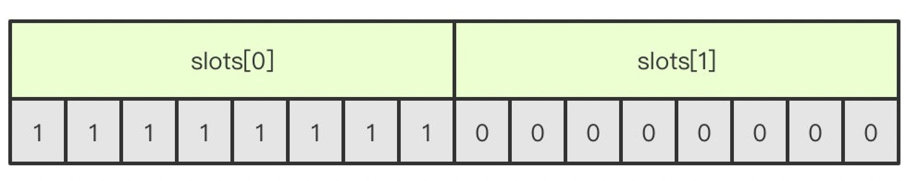

# Redis部署模式以及差异

## REDIS主从部署

### [部署方式请见对应章节](01-install.md)

主从复制模型中，有多个redis节点。其中，有且仅有一个为主节点Master。从节点Slave可以有多个。只要网络连接正常，Master会一直将自己的数据更新同步给Slaves，保持主从同步。

### 特点
- 主节点Master可读、可写.
- 从节点Slave只读。（read-only）
- 不具备高可用性，Master挂掉后Redis服务不可用

因此，主从模型可以提高读的能力，在一定程度上缓解了写的能力。因为能写仍然只有Master节点一个，可以将读的操作全部移交到从节点上，变相提高了写能力。

## REDIS哨兵部署

### [部署方式请见对应章节](01-install.md)

为了解决主从高可用问题，主节点宕机的情况下，能够将从节点变成一个主节点.

在哨兵模式中，仍然只有一个Master节点。当并发写请求较大时，哨兵模式并不能缓解写压力。

Redis 的 Sentinel 系统用于管理多个 Redis 服务器（instance）， 该系统执行以下三个任务：
- 监控（Monitoring）： Sentinel 会不断地检查你的主服务器和从服务器是否运作正常。
- 提醒（Notification）： 当被监控的某个 Redis 服务器出现问题时， Sentinel 可以通过 API 向管理员或者其他应用程序发送通知。
- 自动故障迁移（Automatic failover）： 当一个主服务器不能正常工作时， Sentinel 会开始一次自动故障迁移操作， 它会进行选举，将其中一个从服务器升级为新的主服务器， 并让失效主服务器的其他从服务器改为复制新的主服务器； 当客户端试图连接失效的主服务器时， 集群也会向客户端返回新主服务器的地址， 使得集群可以使用新主服务器代替失效服务器。

### 监控（Monitoring）
- Sentinel可以监控任意多个Master和该Master下的Slaves。（即多个主从模式）
- 同一个哨兵下的、不同主从模型，彼此之间相互独立。
- Sentinel会不断检查Master和Slaves是否正常。

### 自动故障迁移（Automatic failover）
####  Sentinel网络
监控同一个Master的Sentinel会自动连接，组成一个分布式的Sentinel网络，互相通信并交换彼此关于被监视服务器的信息。下图中，三个监控s1的Sentinel，自动组成Sentinel网络结构。Sentinel网络结构是为了解决Sentinel高可用问题。在sentinel网络中，只要还有一个sentinel活着，就可以实现故障切换。

#### 故障切换的过程
- Sentinel投票：当任何一个Sentinel发现被监控的Master下线时，会通知其它的Sentinel开会，投票确定该Master是否下线（半数以上，所以sentinel通常配奇数个）。

  

- Master选举：当Sentinel确定Master下线后，会在所有的Slaves中，选举一个新的节点，升级成Master节点。其它Slaves节点，转为该节点的从节点。

  

- 原Master重新上线：当原Master节点重新上线后，自动转为当前Master节点的从节点。
  
  

## REDIS集群部署 

### [部署方式请见对应章节](01-install.md)

### 集群概念
- 节点,一个redis集群由多个节点node组成，而多个node之间通过cluster meet命令来进行连接.
- 多个Redis服务器组成的分布式网络服务集群；
- 群之中有多个Master主节点，每一个主节点都可读可写；
- 点之间会互相通信，两两相连；
- edis集群无中心节点。

集群节点复制 

在Redis-Cluster集群中，可以给每一个主节点添加从节点，主节点和从节点直接遵循主从模型的特性。当用户需要处理更多读请求的时候，添加从节点可以扩展系统的读性能
### 节点握手过程
- 节点A收到客户端的cluster meet命令
- A根据收到的IP地址和端口号，向B发送一条meet消息
- 节点B收到meet消息返回pong
- A知道B收到了meet消息，返回一条ping消息，握手成功
- 最后，节点A将会通过gossip协议把节点B的信息传播给集群中的其他节点，其他节点也将和B进行握手

### 槽slot
redis通过集群分片的形式来保存数据，整个集群数据库被分为16384个slot，集群中的每个节点可以处理0-16384个slot，当数据库16384个slot都有节点在处理时，集群处于上线状态，反之只要有一个slot没有得到处理都会处理下线状态。通过cluster addslots命令可以将slot指派给对应节点处理。

slot是一个位数组，数组的长度是16384/8=2048，而数组的每一位用1表示被节点处理，0表示不处理，如图所示的话表示A节点处理0-7的slot。

当客户端向节点发送命令，如果刚好找到slot属于当前节点，那么节点就执行命令，反之，则会返回一个MOVED命令到客户端指引客户端转向正确的节点。（MOVED过程是自动的）

如果增加或者移出节点，对于slot的重新分配也是非常方便的，redis提供了工具帮助实现slot的迁移，整个过程是完全在线的，不需要停止服务。

### 故障转移
Redis集群的主节点内置了类似Redis Sentinel的节点故障检测和自动故障转移功能，当集群中的某个主节点下线时，集群中的其他在线主节点会注意到这一点，并对已下线的主节点进行故障转移。

集群进行故障转移的方法和Redis Sentinel进行故障转移的方法基本一样，不同的是，在集群里面，故障转移是由集群中其他在线的主节点负责进行的，所以集群不必另外使用Redis Sentinel。 

### 集群分片策略

Redis-cluster分片策略，是用来解决key存储位置的。

集群将整个数据库分为16384个槽位slot，所有key-value数据都存储在这些slot中的某一个上。一个slot槽位可以存放多个数据，key的槽位计算公式为：slot_number=crc16(key)%16384，其中crc16为16位的循环冗余校验和函数。

集群中的每个主节点都可以处理0个至16383个槽，当16384个槽都有某个节点在负责处理时，集群进入上线状态，并开始处理客户端发送的数据命令请求。

### 集群redirect转向 
由于Redis集群无中心节点，请求会随机发给任意主节点；

主节点只会处理自己负责槽位的命令请求，其它槽位的命令请求，该主节点会返回客户端一个转向错误；

客户端根据错误中包含的地址和端口重新向正确的负责的主节点发起命令请求。

## 参考资料
https://www.cnblogs.com/vieta/p/11192137.html
https://www.cnblogs.com/cqming/p/11191079.html
