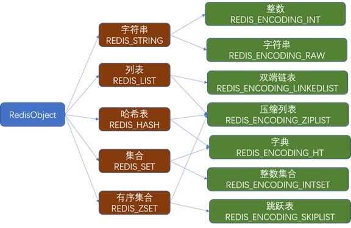
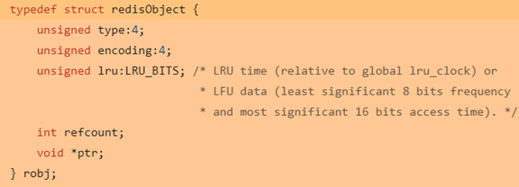
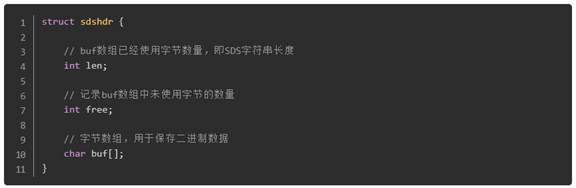
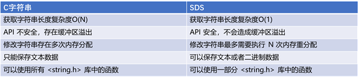
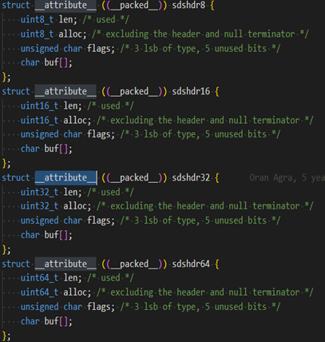
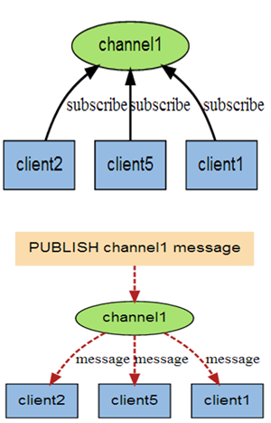
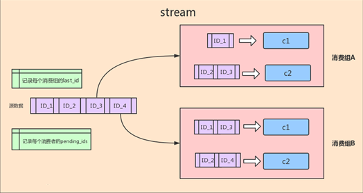
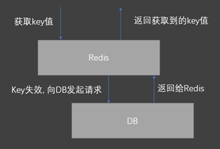
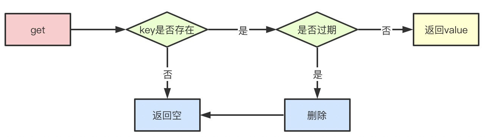
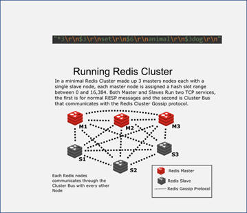

# Reids基本概念

Redis是现在最受欢迎的NoSQL数据库之一，Redis是一个使用ANSI C编写的开源、包含多种数据结构、支持网络、基于内存、可选持久性的键值对存储数据库，其具备如下特性：
- 基于内存运行，性能高效
- 支持分布式，理论上可以无限扩展
- key-value存储系统
- 开源的使用ANSI C语言编写、遵守BSD协议、支持网络、可基于内存亦可持久化的日志型、Key-Value数据库，并提供多种语言的API

相比于其他数据库类型，Redis具备的特点是：
- C/S通讯模型
- 单进程单线程模型
- 丰富的数据类型
- 操作具有原子性
- 持久化
- 高并发读写
- 支持lua脚本

## Redis的应用场景有哪些？
- 缓存热点数据
- 计数器、限流
- 发布订阅、排行榜
- 分布式锁
- 分布式队列
- 共享Session

## Redis的数据类型及主要特性
Redis提供的数据类型主要分为5种自有类型和一种自定义类型，这5种自有类型包括：
- String类型
- 哈希类型
- 列表类型
- 集合类型
- 顺序集合类型

### String类型：
它是一个二进制安全的字符串，意味着它不仅能够存储字符串、还能存储图片、视频等多种类型, 最大长度支持512M。

对每种数据类型，Redis都提供了丰富的操作命令，如：

- GET/MGET
- SET/SETEX/MSET/MSETNX
- INCR/DECR
- GETSET
- DEL

### 哈希类型：
该类型是由field和关联的value组成的map。其中，field和value都是字符串类型的。

Hash的操作命令如下：

- HGET/HMGET/HGETALL
- HSET/HMSET/HSETNX
- HEXISTS/HLEN
- HKEYS/HDEL
- HVALS

### 集合-列表类型：
该类型是一个插入顺序排序的字符串元素集合, 基于双链表实现。

List的操作命令如下：

- LPUSH/LPUSHX/LPOP/RPUSH/RPUSHX/RPOP/LINSERT/LSET
- LINDEX/LRANGE
- LLEN/LTRIM

### 集合-去重类型：
Set类型是一种无顺序集合, 它和List类型最大的区别是：集合中的元素没有顺序, 且元素是唯一的。

Set类型的底层是通过哈希表实现的，其操作命令为：

- SADD/SPOP/SMOVE/SCARD
- SINTER/SDIFF/SDIFFSTORE/SUNION

Set类型主要应用于：在某些场景，如社交场景中，通过交集、并集和差集运算，通过Set类型可以非常方便地查找共同好友、共同关注和共同偏好等社交关系。

### 集合-有序集合类型：
ZSet是一种有序集合类型，每个元素都会关联一个double类型的分数权值，通过这个权值来为集合中的成员进行从小到大的排序。与Set类型一样，其底层也是通过哈希表实现的。

ZSet命令：

- ZADD/ZPOP/ZMOVE/ZCARD/ZCOUNT
- ZINTER/ZDIFF/ZDIFFSTORE/ZUNION


## Redis的数据结构
Redis的数据结构如下图所示：



如下是定义一个Struct数据结构的例子：



### 简单动态字符串SDS (Simple Dynamic String)
基于C语言中传统字符串的缺陷，Redis自己构建了一种名为简单动态字符串的抽象类型，简称SDS，其结构如下：



SDS几乎贯穿了Redis的所有数据结构，应用十分广泛。

SDS的特点

和C字符串相比，SDS的特点如下：



1. 常数复杂度获取字符串长度
    
    Redis中利用SDS字符串的len属性可以直接获取到所保存的字符串的长
　　　　度，直接将获取字符串长度所需的复杂度从C字符串的O(N)降低到了O(1)。

1. 减少修改字符串时导致的内存重新分配次数

    通过C字符串的特性，我们知道对于一个包含了N个字符的C字符串来说，其底层实现总是N+1个字符长的数组（额外一个空字符结尾）

　　那么如果这个时候需要对字符串进行修改，程序就需要提前对这个C字符串数组进行一次内存重分配（可能是扩展或者释放）　

　　而内存重分配就意味着是一个耗时的操作。

Redis巧妙的使用了SDS避免了C字符串的缺陷。在SDS中，buf数组的长度不一定就是字符串的字符数量加一，buf数组里面可以包含未使用的字节，而这些未使用的字节由free属性记录。

与此同时，SDS采用了空间预分配的策略，避免C字符串每一次修改时都需要进行内存重分配的耗时操作，将内存重分配从原来的每修改N次就分配N次——>降低到了修改N次最多分配N次。

如下是Redis对SDS的简单定义：




## Redis特性1：事务
- 命令序列化，按顺序执行
- 原子性
- 三阶段: 开始事务 - 命令入队 - 执行事务
- 命令：MULTI/EXEC/DISCARD

redis通过MULTI、EXEC、WATCH等命令来实现事务机制，事务执行过程将一系列多个命令按照顺序一次性执行，并且在执行期间，事务不会被中断，也不会去执行客户端的其他请求，直到所有命令执行完毕。事务的执行过程如下：

1. 服务端收到客户端请求，事务以MULTI开始
1. 如果客户端正处于事务状态，则会把事务放入队列同时返回给客户端QUEUED，反之则直接执行这个命令
1. 当收到客户端EXEC命令时，WATCH命令监视整个事务中的key是否有被修改，如果有则返回空回复到客户端表示失败，否则redis会遍历整个事务队列，执行队列中保存的所有命令，最后返回结果给客户端

WATCH的机制本身是一个CAS的机制，被监视的key会被保存到一个链表中，如果某个key被修改，那么REDIS_DIRTY_CAS标志将会被打开，这时服务器会拒绝执行事务。


## Redis特性2：发布订阅(Pub/Sub)
- Pub/sub是一种消息通讯模式
- Pub发送消息, Sub接受消息
- Redis客户端可以订阅任意数量的频道
- “fire and forgot”, 发送即遗忘
- 命令：Publish/Subscribe/Psubscribe/UnSub



## Redis特性3：Stream
- Redis 5.0新增
- 等待消费
- 消费组(组内竞争)
- 消费历史数据
- FIFO



## Redis常见问题解析：热key问题
所谓热key问题就是，突然有几十万的请求去访问redis上的某个特定key，那么这样会造成流量过于集中，达到物理网卡上限，从而导致这台redis的服务器宕机引发雪崩。

针对热key的解决方案：

- 提前把热key打散到不同的服务器，降低压力
- 加入二级缓存，提前加载热key数据到内存中，如果redis宕机，走内存查询


## Redis常见问题解析：雪崩
当某一时刻发生大规模的缓存失效的情况，比如你的缓存服务宕机了，会有大量的请求进来直接打到DB上，这样可能导致整个系统的崩溃，称为雪崩。雪崩和击穿、热key的问题不太一样的是，他是指大规模的缓存都过期失效了。

针对雪崩几个解决方案：

- 针对不同key设置不同的过期时间，避免同时过期
- 限流，如果redis宕机，可以限流，避免同时刻大量请求打崩DB
- 二级缓存，同热key的方案。


## Redis常见问题解析：击穿
概念：在Redis获取某一key时, 由于key不存在, 而必须向DB发起一次请求的行为, 称为“Redis击穿”。缓存击穿的概念就是单个key并发访问过高，过期时导致所有请求直接打到db上，这个和热key的问题比较类似，只是说的点在于过期导致请求全部打到DB上而已。




引发击穿的原因：

- 第一次访问
- 恶意访问不存在的key
- Key过期

合理的规避方案：

- 服务器启动时, 提前写入
- 规范key的命名, 通过中间件拦截
- 对某些高频访问的Key，设置合理的TTL或永不过期
- 加锁更新，比如请求查询A，发现缓存中没有，对A这个key加锁，同时去数据库查询数据，写入缓存，再返回给用户，这样后面的请求就可以从缓存中拿到数据了。
- 将过期时间组合写在value中，通过异步的方式不断的刷新过期时间，防止此类现象。

## Redis常见问题解析：穿透
缓存穿透是指查询不存在缓存中的数据，每次请求都会打到DB，就像缓存不存在一样。
针对这个问题，加一层布隆过滤器。布隆过滤器的原理是在你存入数据的时候，会通过散列函数将它映射为一个位数组中的K个点，同时把他们置为1。

这样当用户再次来查询A，而A在布隆过滤器值为0，直接返回，就不会产生击穿请求打到DB了。

显然，使用布隆过滤器之后会有一个问题就是误判，因为它本身是一个数组，可能会有多个值落到同一个位置，那么理论上来说只要我们的数组长度够长，误判的概率就会越低，这种问题就根据实际情况来就好了。

## Redis的过期策略
redis主要有2种过期删除策略

### 惰性删除
惰性删除指的是当我们查询key的时候才对key进行检测，如果已经达到过期时间，则删除。显然，他有一个缺点就是如果这些过期的key没有被访问，那么他就一直无法被删除，而且一直占用内存。

    

### 定期删除
定期删除指的是redis每隔一段时间对数据库做一次检查，删除里面的过期key。由于不可能对所有key去做轮询来删除，所以redis会每次随机取一些key去做检查和删除。

那么定期+惰性都没有删除过期的key怎么办？

假设redis每次定期随机查询key的时候没有删掉，这些key也没有做查询的话，就会导致这些key一直保存在redis里面无法被删除，这时候就会走到redis的内存淘汰机制。

- volatile-lru：从已设置过期时间的key中，移出最近最少使用的key进行淘汰
- volatile-ttl：从已设置过期时间的key中，移出将要过期的key
- volatile-random：从已设置过期时间的key中随机选择key淘汰
- allkeys-lru：从key中选择最近最少使用的进行淘汰
- allkeys-random：从key中随机选择key进行淘汰
- noeviction：当内存达到阈值的时候，新写入操作报错

## 持久化方式
redis持久化方案分为RDB和AOF两种。
### RDB
RDB持久化可以手动执行也可以根据配置定期执行，它的作用是将某个时间点上的数据库状态保存到RDB文件中，RDB文件是一个压缩的二进制文件，通过它可以还原某个时刻数据库的状态。由于RDB文件是保存在硬盘上的，所以即使redis崩溃或者退出，只要RDB文件存在，就可以用它来恢复还原数据库的状态。

可以通过SAVE或者BGSAVE来生成RDB文件。

SAVE命令会阻塞redis进程，直到RDB文件生成完毕，在进程阻塞期间，redis不能处理任何命令请求，这显然是不合适的。

BGSAVE则是会fork出一个子进程，然后由子进程去负责生成RDB文件，父进程还可以继续处理命令请求，不会阻塞进程。

### AOF
AOF和RDB不同，AOF是通过保存redis服务器所执行的写命令来记录数据库状态的。

AOF通过追加、写入、同步三个步骤来实现持久化机制。

当AOF持久化处于激活状态，服务器执行完写命令之后，写命令将会被追加append到aof_buf缓冲区的末尾

在服务器每结束一个事件循环之前，将会调用flushAppendOnlyFile函数决定是否要将aof_buf的内容保存到AOF文件中，可以通过配置appendfsync来决定。

- always ##aof_buf内容写入并同步到AOF文件
- everysec ##将aof_buf中内容写入到AOF文件，如果上次同步AOF文件时间距离现在超过1秒，则再次对AOF文件进行同步
- no ##将aof_buf内容写入AOF文件，但是并不对AOF文件进行同步，同步时间由操作系统决定

如果不设置，默认选项将会是everysec，因为always来说虽然最安全（只会丢失一次事件循环的写命令），但是性能较差，而everysec模式只不过会可能丢失1秒钟的数据，而no模式的效率和everysec相仿，但是会丢失上次同步AOF文件之后的所有写命令数据。

## Redis中的DB
edis有没有什么方法使不同的应用程序数据彼此分开同时又存储在相同的实例上呢？就相当于MySQL数据库，不同的应用程序数据存储在不同的数据库下。

redis下，数据库是由一个整数索引标识，而不是由一个数据库名称。默认情况下，一个客户端连接到数据库0。redis配置文件中下面的参数来控制数据库总数：

/etc/redis/redis.conf 文件中，有个配置项 databases = 16 //默认有16个数据库

可以通过下面的命令来切换到不同的数据库下
```bash
select 2 # 从0开始
```
随后，所有的命令将使用数据库3，知道你明确的切换到另一个数据库下。

每个数据库都有属于自己的空间，不必担心之间的key冲突。

不同的数据库下，相同的key取到各自的值。

flushdb命令清除数据，只会清除当前的数据库下的数据，不会影响到其他数据库。

flushall命令会清除整个实例的数据。在执行这个命令前要格外小心。

数据库的数量是可以配置的，默认情况下是16个。修改redis.conf下的databases指令：

 
redis没有提供任何方法来关联标识不同的数据库。因此，需要你来跟踪什么数据存储到哪个数据库下。

## Redis协议简介
Redis客户端通讯协议：RESP(Redis Serialization Protocol)，其特点是：

- 简单
- 解析速度快
- 可读性好

Redis集群内部通讯协议：RECP(Redis Cluster Protocol ) ，其特点是：

每一个node两个tcp 连接
一个负责client-server通讯(P: 6379)
一个负责node之间通讯(P: 10000 + 6379)



## Redis协议支持的数据类型：

- 简单字符(首字节: “+”)
  ```text
  “+OK\r\n”
  ```
      
- 错误(首字节: “-”)
  ```text
  “-error msg\r\n”
  ```

- 数字(首字节: “:”)
  ```text
  “:123\r\n”
  ```

- 批量字符(首字节: “$”)
  ```text
  “&hello\r\nWhoa re you\r\n”
  ```

- 数组(首字节: “*”)
  ```text
  “*0\r\n”
  “*-1\r\n”
  ```

## 参考资料
https://zhuanlan.zhihu.com/p/263028782
https://www.cnblogs.com/xy51/p/11325792.html
