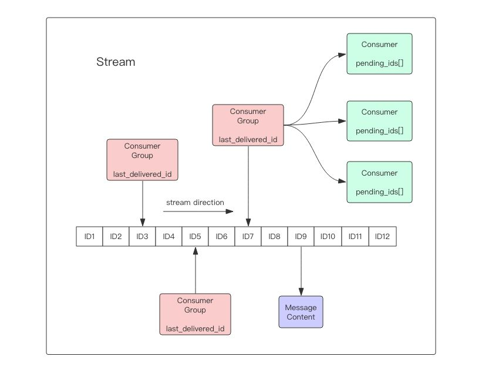
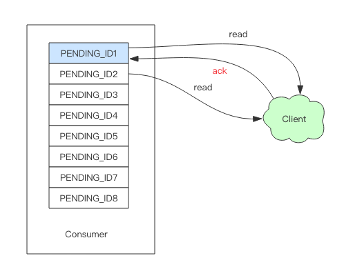

# Redis实现消息队列的方案
Redis作为内存中的数据结构存储，常用作数据库、缓存和消息代理。它支持数据结构，如 字符串，散列，列表，集合，带有范围查询的排序集（sorted sets），位图（bitmaps），超级日志（hyperloglogs），具有半径查询和流的地理空间索引。Redis具有内置复制，Lua脚本，LRU驱逐，事务和不同级别的磁盘持久性，并通过Redis Sentinel和Redis Cluster自动分区。

为了实现其出色的性能，Redis使用内存数据集（in-memory dataset）。

MQ应用有很多，比如ActiveMQ,RabbitMQ,Kafka等，但是也可以基于redis来实现，可以降低系统的维护成本和实现复杂度，本篇介绍redis中实现消息队列的几种方案。

- 1.基于List的 LPUSH+BRPOP 的实现
- 2.PUB/SUB，订阅/发布模式
- 3.基于Sorted-Set的实现
- 4.基于Stream类型的实现

## 基于异步消息队列List lpush-brpop(rpush-blpop)

使用rpush和lpush操作入队列，lpop和rpop操作出队列。

List支持多个生产者和消费者并发进出消息，每个消费者拿到都是不同的列表元素。

但是当队列为空时，lpop和rpop会一直空轮训，消耗资源；所以引入阻塞读blpop和brpop（b代表blocking），阻塞读在队列没有数据的时候进入休眠状态，一旦数据到来则立刻醒过来，消息延迟几乎为零。

注意:还有个问题需要解决：空闲连接的问题。

如果线程一直阻塞在那里，Redis客户端的连接就成了闲置连接，闲置过久，服务器一般会主动断开连接，减少闲置资源占用，这个时候blpop和brpop或抛出异常，所以在编写客户端消费者的时候要小心，如果捕获到异常，还有重试。

### 缺点：

- 做消费者确认ACK麻烦，不能保证消费者消费消息后是否成功处理的问题（宕机或处理异常等），通常需要维护一个Pending列表，保证消息处理确认。
- 不能做广播模式，如pub/sub，消息发布/订阅模型
- 不能重复消费，一旦消费就会被删除
- 不支持分组消费

## PUB/SUB,订阅/发布模式
- SUBSCRIBE，用于订阅信道
- PUBLISH，向信道发送消息
- UNSUBSCRIBE，取消订阅

此模式允许生产者只生产一次消息，由中间件负责将消息复制到多个消息队列，每个消息队列由对应的消费组消费。

优点
- 典型的广播模式，一个消息可以发布到多个消费者
- 多信道订阅，消费者可以同时订阅多个信道，从而接收多类消息
- 消息即时发送，消息不用等待消费者读取，消费者会自动接收到信道发布的消息

缺点
- 消息一旦发布，不能接收。换句话就是发布时若客户端不在线，则消息丢失，不能寻回
- 不能保证每个消费者接收的时间是一致的
- 若消费者客户端出现消息积压，到一定程度，会被强制断开，导致消息意外丢失。通常发生在消息的生产远大于消费速度时
- 可见，Pub/Sub 模式不适合做消息存储，消息积压类的业务，而是擅长处理广播，即时通讯，即时反馈的业务。

## 基于Sorted-Set的实现
Sortes Set(有序列表)，类似于java的SortedSet和HashMap的结合体，一方面她是一个set，保证内部value的唯一性，另一方面它可以给每个value赋予一个score，代表这个value的排序权重。内部实现是“跳跃表”。

有序集合的方案是在自己确定消息顺ID时比较常用，使用集合成员的Score来作为消息ID，保证顺序，还可以保证消息ID的单调递增。通常可以使用时间戳+序号的方案。确保了消息ID的单调递增，利用SortedSet的依据Score排序的特征，就可以制作一个有序的消息队列了。

优点
- 就是可以自定义消息ID，在消息ID有意义时，比较重要。

缺点
- 缺点也明显，不允许重复消息（因为是集合），同时消息ID确定有错误会导致消息的顺序出错。

## 基于Stream类型的实现
Stream为redis 5.0后新增的数据结构。支持多播的可持久化消息队列，实现借鉴了Kafka设计。



Redis Stream的结构如上图所示，它有一个消息链表，将所有加入的消息都串起来，每个消息都有一个唯一的ID和对应的内容。消息是持久化的，Redis重启后，内容还在。

每个Stream都有唯一的名称，它就是Redis的key，在我们首次使用xadd指令追加消息时自动创建。

每个Stream都可以挂多个消费组，每个消费组会有个游标last_delivered_id在Stream数组之上往前移动，表示当前消费组已经消费到哪条消息了。每个消费组都有一个Stream内唯一的名称，消费组不会自动创建，它需要单独的指令xgroup create进行创建，需要指定从Stream的某个消息ID开始消费，这个ID用来初始化last_delivered_id变量。

每个消费组(Consumer Group)的状态都是独立的，相互不受影响。也就是说同一份Stream内部的消息会被每个消费组都消费到。

同一个消费组(Consumer Group)可以挂接多个消费者(Consumer)，这些消费者之间是竞争关系，任意一个消费者读取了消息都会使游标last_delivered_id往前移动。每个消费者者有一个组内唯一名称。

消费者(Consumer)内部会有个状态变量pending_ids，它记录了当前已经被客户端读取的消息，但是还没有ack。如果客户端没有ack，这个变量里面的消息ID会越来越多，一旦某个消息被ack，它就开始减少。这个pending_ids变量在Redis官方被称之为PEL，也就是Pending Entries List，这是一个很核心的数据结构，它用来确保客户端至少消费了消息一次，而不会在网络传输的中途丢失了没处理。

### 增删改查
    
- xadd 追加消息
- xdel 删除消息，这里的删除仅仅是设置了标志位，不影响消息总长度
- xrange 获取消息列表，会自动过滤已经删除的消息
- xlen 消息长度
- del 删除Stream

### 独立消费
我们可以在不定义消费组的情况下进行Stream消息的独立消费，当Stream没有新消息时，甚至可以阻塞等待。Redis设计了一个单独的消费指令xread，可以将Stream当成普通的消息队列(list)来使用。使用xread时，我们可以完全忽略消费组(Consumer Group)的存在，就好比Stream就是一个普通的列表(list)。

### 创建消费组
Stream通过xgroup create指令创建消费组(Consumer Group)，需要传递起始消息ID参数用来初始化last_delivered_id变量。

### 消费
Stream提供了xreadgroup指令可以进行消费组的组内消费，需要提供消费组名称、消费者名称和起始消息ID。它同xread一样，也可以阻塞等待新消息。读到新消息后，对应的消息ID就会进入消费者的PEL(正在处理的消息)结构里，客户端处理完毕后使用xack指令通知服务器，本条消息已经处理完毕，该消息ID就会从PEL中移除。

### Stream消息太多怎么办
读者很容易想到，要是消息积累太多，Stream的链表岂不是很长，内容会不会爆掉就是个问题了。xdel指令又不会删除消息，它只是给消息做了个标志位。

Redis自然考虑到了这一点，所以它提供了一个定长Stream功能。在xadd的指令提供一个定长长度maxlen，就可以将老的消息干掉，确保最多不超过指定长度。

```text
127.0.0.1:6379> xlen codehole
(integer) 5
127.0.0.1:6379> xadd codehole maxlen 3 * name xiaorui age 1
1527855160273-0
127.0.0.1:6379> xlen codehole
(integer) 3
```

我们看到Stream的长度被砍掉了。

### 消息如果忘记ACK会怎样



Stream在每个消费者结构中保存了正在处理中的消息ID列表PEL，如果消费者收到了消息处理完了但是没有回复ack，就会导致PEL列表不断增长，如果有很多消费组的话，那么这个PEL占用的内存就会放大。

### PEL如何避免消息丢失
在客户端消费者读取Stream消息时，Redis服务器将消息回复给客户端的过程中，客户端突然断开了连接，消息就丢失了。但是PEL里已经保存了发出去的消息ID。待客户端重新连上之后，可以再次收到PEL中的消息ID列表。不过此时xreadgroup的起始消息必须是任意有效的消息ID，一般将参数设为0-0，表示读取所有的PEL消息以及自last_delivered_id之后的新消息。

### 分区Partition
Redis没有原生支持分区的能力，想要使用分区，需要分配多个Stream，然后在客户端使用一定的策略来讲消息放入不同的stream。

### 结论
Stream的消费模型借鉴了kafka的消费分组的概念，它弥补了Redis Pub/Sub不能持久化消息的缺陷。但是它又不同于kafka，kafka的消息可以分partition，而Stream不行。如果非要分parition的话，得在客户端做，提供不同的Stream名称，对消息进行hash取模来选择往哪个Stream里塞。如果读者稍微研究过Redis作者的另一个开源项目Disque的话，这极可能是作者意识到Disque项目的活跃程度不够，所以将Disque的内容移植到了Redis里面。这只是本人的猜测，未必是作者的初衷。如果读者有什么不同的想法，可以在评论区一起参与讨论。

## 参考资料
http://www.cdeason.cn/2019/08/25/Redis%E5%AE%9E%E7%8E%B0%E6%B6%88%E6%81%AF%E9%98%9F%E5%88%97%E7%9A%84%E6%96%B9%E6%A1%88/
