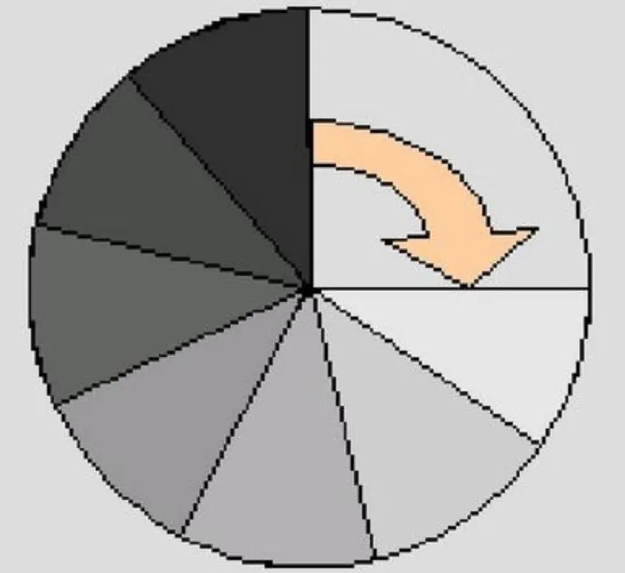
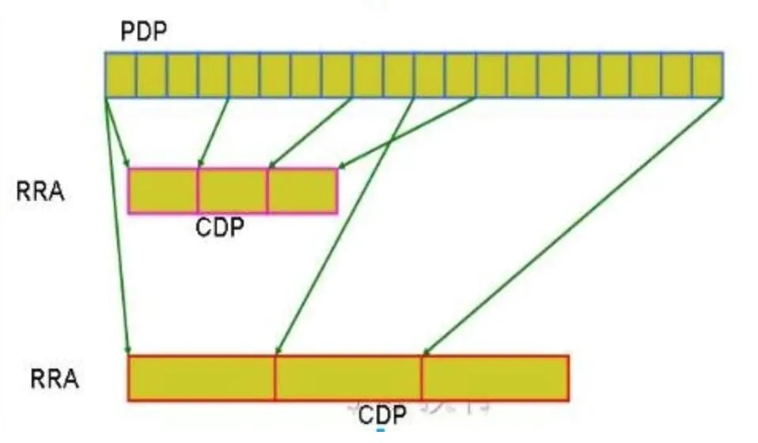

## RRD （Round Robin Database）
RRD 数据库是一个环形的数据库，数据库由一个固定大小的数据文件来存放数据，此数据库不会像传统数据库一样为随着数据的增多而文件的大小也在增加，RRD在创建好后其文件大小就固定，可以把它想像成一个圆，圆的众多直径把圆划分成一个个扇形，每个扇形就是可以存数据的槽位，每个槽位上被打上了一个时间戳，在圆心上有一个指针，随着时间的流逝，取回数据后，指针会负责把数据填充在相应的槽位上，当指针转了360度后，最开始的数据就会被覆盖，就这样RRD循环填充着数据。

    
### 基本概念
- 源数据搜集：采用一些数据搜集工具，如脚本、shell命令、SNMP等工具在一定时间间隔里把数据搜集填充到rrd数据库中，这些需要数据搜集的对象叫DS，一个DS里在一个时间里可以搜集的数据可以有多个，比如一个时间点上对网卡来说有进来的流量，也有流出的流量，所以这是2个数据成为一组数据。
- 临时存储：源数据获取到后是存放在一个数据库的一个临时区域，这些源数据叫做PDP
- 分组-聚合：RRDTool把这些PDP数据作为数据源通过分组、再利用聚合函数计算后把计算后的结果放在RRD数据库的时间槽(time slot)上，这些数据叫做CDP，CDP才是RRDTool绘图时真正打交道的数据，
- 在从源数据中取数据做聚合计算时会有一个挑选数据的基准，也就是说是以几个源数据为一组做聚合，根据现实需求的不同，对源数据可以很灵活的选择不同的时间段提取源数据，再聚合提取不同的聚合值，这样就产生不同组别的CDP数据，这些有以相同时间段挑选源数据及相同聚合函数计算的结果组成的数据就叫RRA，所以根据挑选源数据的标准及采用的聚合函数的不同，RRA可以有多组。

### 基本术语
- DS：Data Source 数据源，用于定义搜集数据的工具所搜集数据的一些特性
- Time Solt：时间槽，用于存放通过聚合后的数据区域
- PDP：Primary Data Point 主数据节点，每个时间点产生的数据，即是搜集的源数据，没有做聚合的数据
- CDP（Consolidation Data Point 聚合数据节点）：通过对获取的源数据分组、聚合计算后得到的数据叫CDP，
- RRA（Round Robin Archive 轮转归档）：以相同的分组、聚合函数计算后的CDP数据组就组成了RRA
- Resolution（解析度）：这是一个时间跨度，表示在做聚合计算时是以几个连续的time slot里的数据做聚合，在默认时rrd是以300秒的间隔产生一个time slot。
- CF：Consolidation Function，合并函数或聚合函数，以RRDTool中有AVERAGE、MAX、MIN、LAST4种

以一个图来说明PDP、CDP、RRA之间的关系：

PDP是以规定的时间间隔（默认为300秒）搜集的源数据，第一个RRA以4个PDP（即4*300秒）为一组做CF后组成的数据，第二个RRA则是以10个PDP为一组做CF后组成的数据。    
    
    
### 参考资料
https://www.jianshu.com/p/31afb8492eff
