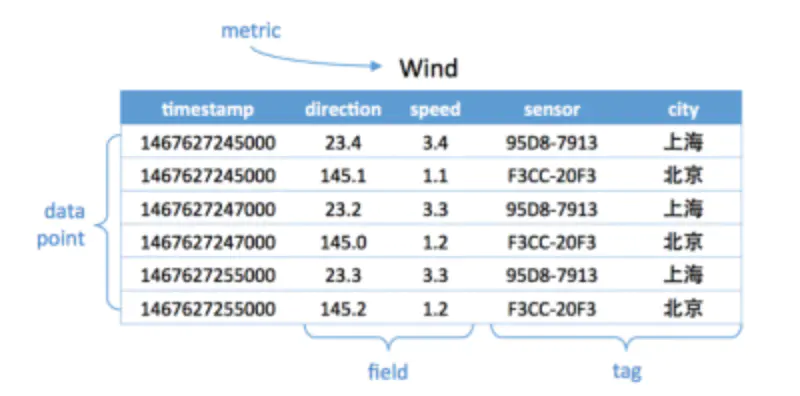
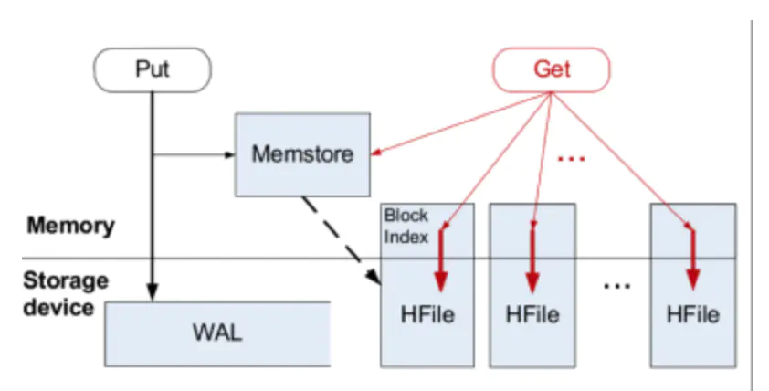
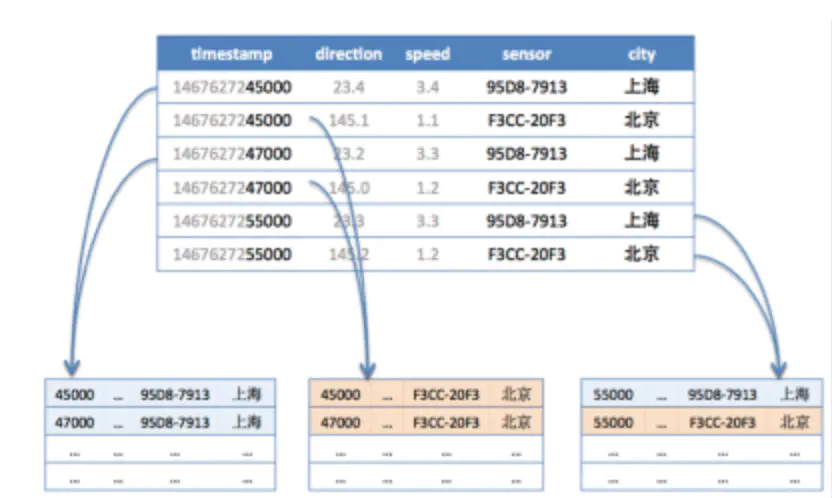

## Time Series Database (TSDB)
2017年时序数据库忽然火了起来。开年2月Facebook开源了beringei时序数据库；到了4月基于PostgreSQL打造的时序数据库TimeScaleDB也开源了，而早在2016年7月，百度云在其天工物联网平台上发布了国内首个多租户的分布式时序数据库产品TSDB，成为支持其发展制造，交通，能源，智慧城市等产业领域的核心产品，同时也成为百度战略发展产业物联网的标志性事件。

随着分布式系统监控、物联网的发展，TSDB开始受到更多的关注。

### 什么是时间序列数据库
维基百科上对于时间序列的定义是‘一系列数据点按照时间顺序排列’
> 时间序列数据就是历史烙印，具有不变性,、唯一性、时间排序性

时间序列数据跟关系型数据库有太多不同，但是很多公司并不想放弃关系型数据库。 于是就产生了一些特殊的用法，比如用 MySQL 的 VividCortex, 用 Postgres 的 Timescale。 很多人觉得特殊的问题需要特殊的解决方法，于是很多时间序列数据库从头写起，不依赖任何现有的数据库, 比如 Graphite，InfluxDB。
> mysql 的引擎，除了常见的 innodb 和 myisam ，还有一个引擎叫 archive ，它的作用和 [rrd](../rrd/SUMMARY.md) 差不多，支持插入和查询操作。

- 时序数据是基于时间的一系列的数据。在有时间的坐标中将这些数据点连成线，往过去看可以做成多纬度报表，揭示其趋势性、规律性、异常性；往未来看可以做大数据分析，机器学习，实现预测和预警。

- 时序数据库就是存放时序数据的数据库，并且需要支持时序数据的快速写入、持久化、多纬度的聚合查询等基本功能。

### 数据写入的特点
- 写入平稳、持续、高并发高吞吐：时序数据的写入是比较平稳的，这点与应用数据不同，应用数据通常与应用的访问量成正比，而应用的访问量通常存在波峰波谷。时序数据的产生通常是以一个固定的时间频率产生，不会受其他因素的制约，其数据生成的速度是相对比较平稳的。
- 写多读少：时序数据上95%-99%的操作都是写操作，是典型的写多读少的数据。这与其数据特性相关，例如监控数据，你的监控项可能很多，但是你真正去读的可能比较少，通常只会关心几个特定的关键指标或者在特定的场景下才会去读数据。
- 实时写入最近生成的数据，无更新：时序数据的写入是实时的，且每次写入都是最近生成的数据，这与其数据生成的特点相关，因为其数据生成是随着时间推进的，而新生成的数据会实时的进行写入。数据写入无更新，在时间这个维度上，随着时间的推进，每次数据都是新数据，不会存在旧数据的更新，不过不排除人为的对数据做订正。

### 数据查询和分析的特点
- 按时间范围读取：通常来说，你不会去关心某个特定点的数据，而是一段时间的数据。
- 最近的数据被读取的概率高
- 历史数据粗粒度查询的概率搞
- 多种精度查询
- 多维度分析

### 数据存储的特点
- 数据量大：拿监控数据来举例，如果我们采集的监控数据的时间间隔是1s，那一个监控项每天会产生86400个数据点，若有10000个监控项，则一天就会产生864000000个数据点。在物联网场景下，这个数字会更大。整个数据的规模，是TB甚至是PB级的。
- 冷热分明：时序数据有非常典型的冷热特征，越是历史的数据，被查询和分析的概率越低。
- 具有时效性：时序数据具有时效性，数据通常会有一个保存周期，超过这个保存周期的数据可以认为是失效的，可以被回收。一方面是因为越是历史的数据，可利用的价值越低；另一方面是为了节省存储成本，低价值的数据可以被清理。
- 多精度数据存储：在查询的特点里提到时序数据出于存储成本和查询效率的考虑，会需要一个多精度的查询，同样也需要一个多精度数据的存储。

### 数据模型
时间序列数据可以分成两部分

- 序列 ：就是标识符（维度），主要的目的是方便进行搜索和筛选
- 数据点：时间戳和数值构成的数组
  - 行存：一个数组包含多个点，如 [{t: 2017-09-03-21:24:44, v: 0.1002}, {t: 2017-09-03-21:24:45, v: 0.1012}]
  - 列存：两个数组，一个存时间戳，一个存数值，如[ 2017-09-03-21:24:44, 2017-09-03-21:24:45], [0.1002, 0.1012]
  
  一般情况下：列存能有更好的压缩率和查询性能
    
### 基本概念
- metric: 度量，相当于关系型数据库中的table。
- data point: 数据点，相当于关系型数据库中的row。
- timestamp：时间戳，代表数据点产生的时间。
- field: 度量下的不同字段。比如位置这个度量具有经度和纬度两个field。一般情况下存放的是会随着时间戳的变化而变化的数据。
- tag: 标签，或者附加信息。一般存放的是并不随着时间戳变化的属性信息。timestamp加上所有的tags可以认为是table的primary key。

如下图，度量为Wind，每一个数据点都具有一个timestamp，两个field：direction和speed，两个tag：sensor、city。它的第一行和第三行，存放的都是sensor号码为95D8-7913的设备，属性城市是上海。随着时间的变化，风向和风速都发生了改变，风向从23.4变成23.2；而风速从3.4变成了3.3。

    
### 应用场景
所有有时序数据产生，并且需要展现其历史趋势、周期规律、异常性的，进一步对未来做出预测分析的，都是时序数据库适合的场景。
    
例：

在工业物联网环境监控方向，百度天工的客户就遇到了这么一个难题，由于工业上面的要求，需要将工况数据存储起来。客户每个厂区具有20000个监测点，500毫秒一个采集周期，一共20个厂区。这样算起来一年将产生惊人的26万亿个数据点。假设每个点50Byte，数据总量将达1P（如果每台服务器10T的硬盘，那么总共需要100多台服务器）。这些数据不只是要实时生成，写入存储；还要支持快速查询，做可视化的展示，帮助管理者分析决策；并且也能够用来做大数据分析，发现深层次的问题，帮助企业节能减排，增加效益。最终客户采用了百度天工的时序数据库方案，帮助他解决了难题。

### 时序数据库遇到的挑战
很多人可能认为在传统关系型数据库上加上时间戳一列就能作为时序数据库。数据量少的时候确实也没问题，但少量数据是展现的纬度有限，细节少，可置信低，更加不能用来做大数据分析。很明显时序数据库是为了解决海量数据场景而设计的。

可以看到时序数据库需要解决以下几个问题

- 时序数据的写入：如何支持每秒钟上千万上亿数据点的写入。
- 时序数据的读取：又如何支持在秒级对上亿数据的分组聚合运算。
- 成本敏感：由海量数据存储带来的是成本问题。如何更低成本的存储这些数据，将成为时序数据库需要解决的重中之重。

这些问题不是用一篇文章就能含盖的，同时每个问题都可以从多个角度去优化解决。在这里只从数据存储这个角度来尝试回答如何解决大数据量的写入和读取。
            
### 开源时间序列数据库
- 1999/07/16 RRDTool First release
- 2009/12/30 Graphite 0.9.5
- 2011/12/23 OpenTSDB 1.0.0
- 2013/05/24 KairosDB 1.0.0-beta
- 2013/10/24 InfluxDB 0.0.1
- 2014/08/25 Heroic 0.3.0
- 2017/03/27 TimescaleDB 0.0.1-beta

RRDTool 是最早的时间序列数据库，它自带画图功能，现在大部分时间序列数据库都使用Grafana来画图。

Graphite 是用 Python 写的 RRD 数据库，它的存储引擎 Whisper 也是 Python 写的， 它画图和聚合能力都强了很多，但是很难水平扩展。

OpenTSDB 使用 HBase 解决了水平扩展的问题;新发布的 OpenTSDB 中也加入了对 Cassandra 的支持。 故事还没完，Spotify 的人本来想使用 KairosDB，但是觉得项目发展方向不对以及性能太差，就自己撸了一个 Heroic。

KairosDB 最初是基于OpenTSDB修改的，但是作者认为兼容HBase导致他们不能使用很多 Cassandra 独有的特性， 于是就抛弃了HBase仅支持Cassandra。

InfluxDB 早期是完全开源的，后来为了维持公司运营，闭源了集群版本。 在 Percona Live 上他们做了一个开源数据库商业模型正面临危机的演讲，里面调侃红帽的段子很不错。 并且今年的 Percona Live 还有专门的时间序列数据库单元。  
> InfluxDB 在存储引擎上纠结了很久， leveldb, rocksdb, boltdb 都玩了个遍，最后决定自己造个轮子叫 Time Structured Merge Tree。
>
> Time Structured Merge Tree (TSM) 和 Log Structured Merge Tree (LSM) 的名字都有点误导性，关键并不是树，也不是日志或者时间，而是 Merge。
> 
> - 写入的时候，数据先写入到内存里，之后批量写入到硬盘。
> - 读的时候，同时读内存和硬盘然后合并结果。
> - 删除的时候，写入一个删除标记，被标记的数据在读取时不会被返回。
> - 后台会把小的块合并成大的块，此时被标记删除的数据才真正被删除
> - 相对于普通数据，有规律的时间序列数据在合并的过程中可以极大的提高压缩比。
>
> 在单机上InfluxDB采取类似于LSM tree的存储结构TSM；而分片的方案InfluxDB先通过<database>+<timestamp>（事实上还要加上retentionPolicy）确定ShardGroup，再通过<metric>+<tags>的hash code确定到具体的Shard。
  
  
### 存储
#### 单机存储
如果只是存储起来，直接写成日志就行。但因为后续还要快速的查询，所以需要考虑存储的结构。

传统数据库存储采用的都是B tree，这是由于其在查询和顺序插入时有利于减少寻道次数的组织形式。我们知道磁盘寻道时间是非常慢的，一般在10ms左右。磁盘的随机读写慢就慢在寻道上面。对于随机写入B tree会消耗大量的时间在磁盘寻道上，导致速度很慢。我们知道SSD具有更快的寻道时间，但并没有从根本上解决这个问题。

对于90%以上场景都是写入的时序数据库，B tree很明显是不合适的。

业界主流都是采用LSM tree替换B tree，比如Hbase, Cassandra等nosql中。这里我们详细介绍一下。

##### LSM tree
LSM tree 包括内存里的数据结构和磁盘上的文件两部分，
> 对应Hbase里的MemStore和HLog；
>
> 对应Cassandra里的MemTable和sstable

LSM tree操作流程如下：

- 数据写入和更新时首先写入位于内存里的数据结构。为了避免数据丢失也会先写到WAL文件中。

- 内存里的数据结构会定时或者达到固定大小会刷到磁盘。这些磁盘上的文件不会被修改。

- 随着磁盘上积累的文件越来越多，会定时的进行合并操作，消除冗余数据，减少文件数量。

#### 分布式存储
分布式存储首先要考虑的是如何将数据分布到多台机器上面，也就是 分片（sharding）问题。时序数据库的分片方法和其他分布式系统是相通的。
- 哈希分片：这种方法实现简单，均衡性较好，但是集群不易扩展。

- 一致性哈希：这种方案均衡性好，集群扩展容易，只是实现复杂。代表有Amazon的DynamoDB和开源的Cassandra。

- 范围划分：通常配合全局有序，复杂度在于合并和分裂。代表有Hbase。

- 结合时序数据库的特点，根据metric+tags分片是比较好的一种方式，因为往往会按照一个时间范围查询，这样相同metric和tags的数据会分配到一台机器上连续存放，顺序的磁盘读取是很快的。

- 考虑时序数据时间范围很长的情况，需要根据时间范围再分成几段，分别存储到不同的机器上，这样对于大范围时序数据就可以支持并发查询，优化查询速度。

如下图，第一行和第三行都是同样的tag（sensor=95D8-7913;city=上海），所以分配到同样的分片，而第五行虽然也是同样的tag，但是根据时间范围再分段，被分到了不同的分片。

### 低延迟
时间序列数据库主要是用来分析的，所以提高响应速度对于诊断生产环境的问题是十分重要的。

### 内存时间序列数据库
Facebook 写了叫 Gorilla 的纯内存时间序列数据库发表在 VLDB 上，现在已经开源，改名为 Beringei（都是猩猩…）

### 提前聚合
因为查询中经常需要对一个很长的时间区间取一些粗粒度的值，比如6月到8月每天的平均CPU使用率。 这些聚合值（均值，最大，最小) 都可以在存储数据的时候计算出来。[BtrDB](http://link.zhihu.com/?target=https%3A//github.com/SoftwareDefinedBuildings/btrdb) 和 [Akumuli](http://link.zhihu.com/?target=https%3A//github.com/akumuli/Akumuli) 都在内部节点中存储聚合值，这样在很多查询中底层的节点不需要被访问就可以得到结果。

### 处理旧数据
- 很多时间序列数据都没有多大用处，特别是当系统长时间正常运行时，完整的历史数据意义并不大。
- 所以有些数据库比如 RDDTool 和 Graphite 会自动删除高精度的数据，只保留低精度的。
- 但是对于很多新的时间序列数据库，在聚合和删除大量旧数据的同时保证系统正常运行并不像删除一个本地文件那样简单。
- 如果监控系统比被监控系统还不稳定就比较尴尬了。

### 元数据索引
- 时间序列的标识符是时间序列数据库里主要的元数据。
- Heroic 使用 Elasticsearch 来存储元数据， 查询首先通过 Elasticsearch 来取得符合要求的序列标识符，之后从 Cassandra 根据标识符来读取对应的数据。
- 但是维护一个完整的搜索引擎带来的运维压力和增加的通信时间都是不能忽视的。
- 因此 InfluxDB 和 Prometheus 就自己写了倒排索引来索引元数据。
        
        
### 参考资料
https://www.jianshu.com/p/31afb8492eff
https://my.oschina.net/xiaominmin/blog/1788536
