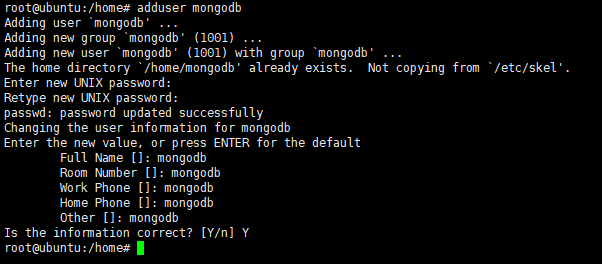

# User

## 查看用户

cat /etc/passwd

```
adduser es
echo es|passwd --stdin es

# 添加sudoer
visudo
es      ALL=(ALL)       ALL
```

## 创建用户

创建用户有两条命令：

* adduer
* useradd

对应着两条删除用户的命令

* deluser
* userdel

这两种命令之间的区别：

* adduser：会自动为创建的用户指定主目录、系统shell版本，会在创建时输入用户密码。 
* useradd：需要使用参数选项指定上述基本设置，如果不使用任何参数，则创建的用户无密码、无主目录、没有指定shell版本。

```
su
// input password
adduser mongodb
```



这样在创建用户名时，就创建了用户的主目录以及密码。

默认情况下： adduser在创建用户时会主动调用 /etc/adduser.conf； 在创建用户主目录时默认在/home下，而且创建为 /home/用户名

如果主目录已经存在，就不再创建，但是此主目录虽然作为新用户的主目录，而且默认登录时会进入这个目录下，但是这个目录并不是属于新用户，当使用userdel删除新用户时，并不会删除这个主目录，因为这个主目录在创建前已经存在且并不属于这个用户。

为用户指定shell版本为：/bin/bash 因此常用参数选项为：

* home： 指定创建主目录的路径，默认是在/home目录下创建用户名同名的目录，这里可以指定；如果主目录同名目录存在，则不再创建，仅在登录时进入主目录。
* quiet： 即只打印警告和错误信息，忽略其他信息。
* debug： 定位错误信息。
* conf： 在创建用户时使用指定的configuration文件。
* force-badname： 默认在创建用户时会进行/etc/adduser.conf中的正则表达

.2 useradd 注意： 在使用useradd命令创建新用户时，不会为用户创建主目录，不会为用户指定shell版本，不会为用户创建密码。

（1）不使用任何参数选项创建用户：sudo useradd tt

为用户指定登录密码：sudo passwd tt 输出显示： 输入新的 UNIX 密码： 重新输入新的 UNIX 密码： passwd：已成功更新密码 1 2 3 为用户指定命令解释程序(通常为/bin/bash)：sudo usermod -s /bin/bash tt 为用户指定用户主目录：sudo usermod -d /home/tt tt （2）为用户指定参数的useradd命令：

常用命令行选项：

\-d： 指定用户的主目录 -m： 如果存在不再创建，但是此目录并不属于新创建用户；如果主目录不存在，则强制创建； -m和-d一块使用。

\-s： 指定用户登录时的shell版本

\-M： 不创建主目录

例如：sudo useradd -d "/home/tt" -m -s "/bin/bash" tt 解释： -d “/home/tt” ：就是指定/home/tt为主目录 -m 就是如果/home/tt不存在就强制创建 -s 就是指定shell版本

修改用户密码：｀sudo passwd tt｀ 输出显示：

输入新的 UNIX 密码： 重新输入新的 UNIX 密码： passwd：已成功更新密码 1 2 3

## 删除用户

2.1 deluser 只删除用户：sudo deluser tt 输出显示： 正在删除用户 'tt'... 警告：组"tt"没有其他成员了。 完成。 1 2 3 连同用户的主目录和邮箱一起删除：sudo deluser --remove-home tt 输出显示： 正在寻找要备份或删除的文件... 正在删除文件... 正在删除用户 'tt'... 警告：组"tt"没有其他成员了。 完成。 1 2 3 4 5 连同用户拥有的所有文件删除：sudo deluser --remove-all-files tt 2.2 userdel 只删除用户：sudo userdel tt

连同用户主目录一起删除：sudo derlser -r tt 如果创建时主目录已经存在，即主目录不属于当前要删除的用户，则无法删除主目录。

1.  相关文件

    /etc/passwd - 使 用 者 帐 号 资 讯，可以查看用户信息

    /etc/shadow - 使 用 者 帐 号 资 讯 加 密

    /etc/group - 群 组 资 讯

    /etc/default/useradd - 定 义 资 讯

    /etc/login.defs - 系 统 广 义 设 定

    /etc/skel - 内 含 定 义 档 的 目 录
