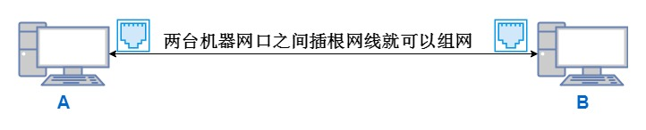
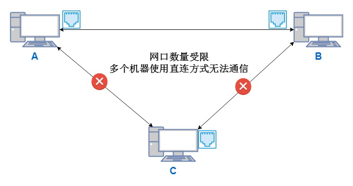
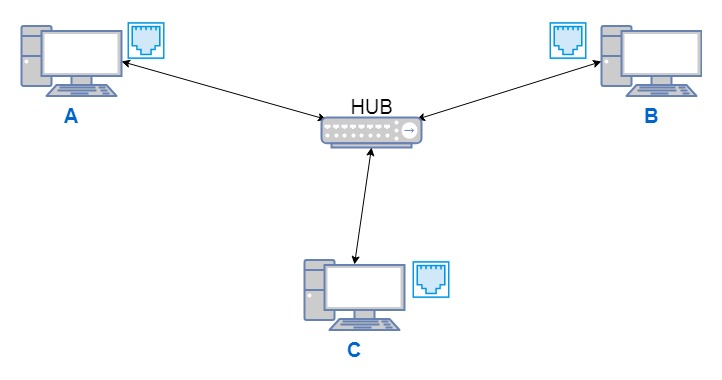
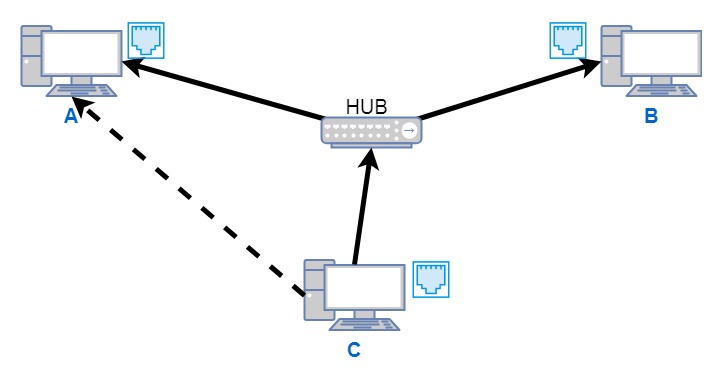
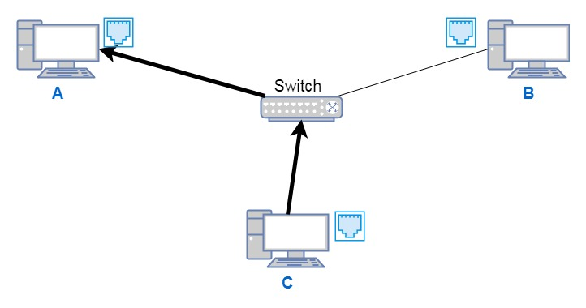
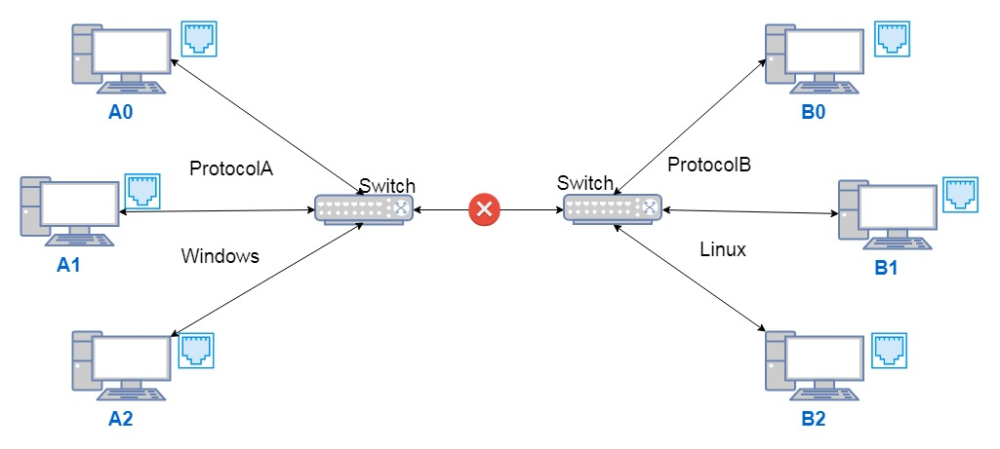
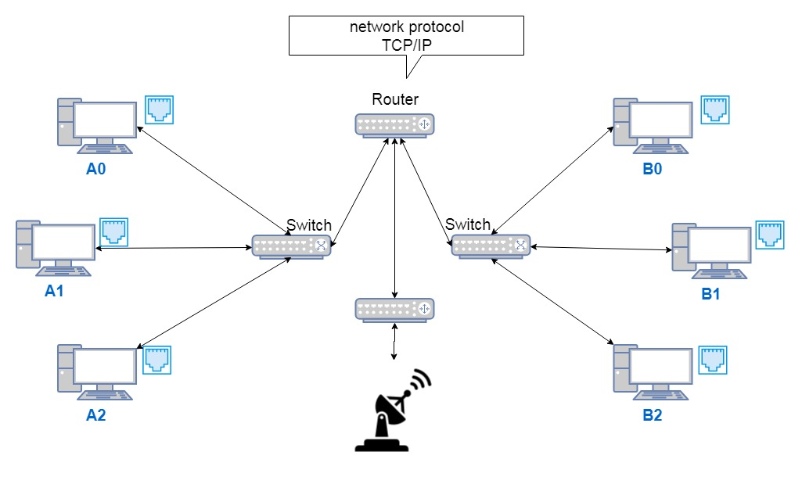

# 网卡、集成器、交换机、路由工作原理

* **网口**

## 

## 

* **集线器**

## 

## 

* **交换机**

## 

## 

* **路由器**

## 

* **MAC地址和IP地址**
  * **MAC：Media Access Control Address（媒体访问控制地址）、LAN Address（局域网地址）、Ethernet Address（以太网地址）、Physical Address（物理地址），是处于OSI模型中的第二层：数据链路层，在网络上唯一标识一块网卡。**
  * **IP：Internet Protocol Address（互联网协议地址），处于OSI模型中的第三层网络层，屏蔽了物理地址差异。**
  * **MAC地址是物理的，固定的；IP地址是逻辑的，可变的。二者运行时的映射解析由ARP（Address Resolution Protocol，地址解析协议）协议完成。**
