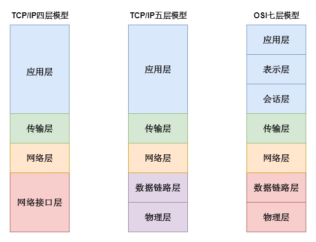
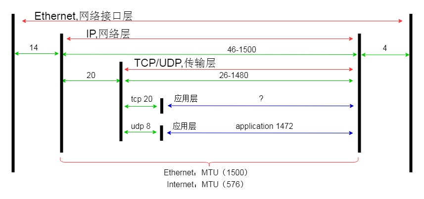

# 网络协议

* **体系模型**

* **协议簇**

| 七层模型（OSI概念模型） | 协议簇                         |
| ------------- | --------------------------- |
| 应用层           | HTTP FTP SMTP Telnet        |
| 表示层           | 无                           |
| 会话层           | 无                           |
| 传输层           | TCP UDP                     |
| 网络层           | IP RIP                      |
| 数据链路层         | SLIP CSLIP MTU PPP ARP RARP |
| 物理层           |                             |

* **协议封包长度**

* **参考资料**

[https://www.cnblogs.com/wxgblogs/p/5641643.html](chapter1.md)

[https://blog.csdn.net/meidiya123/article/details/78262729](chapter1.md)
