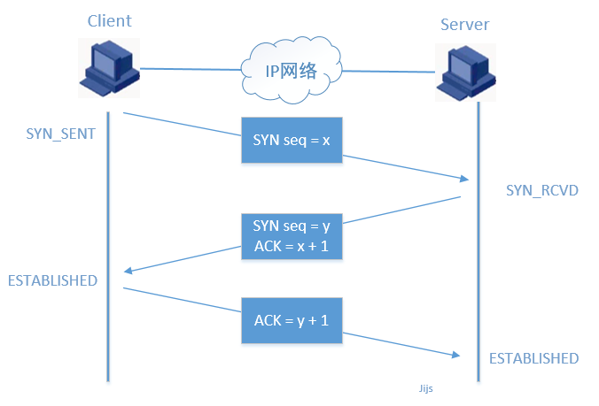
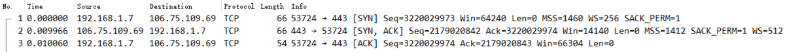
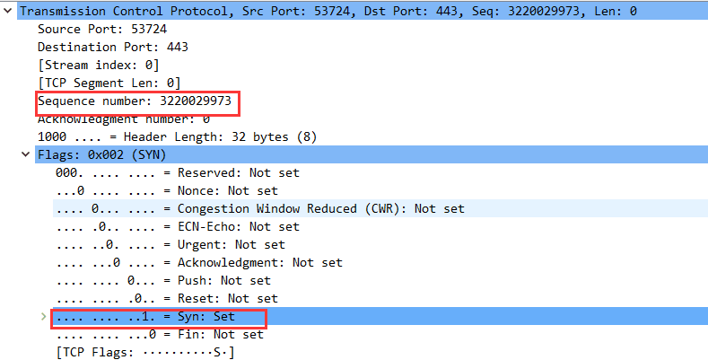
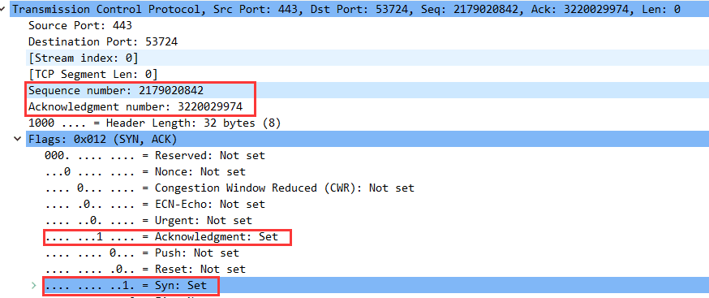
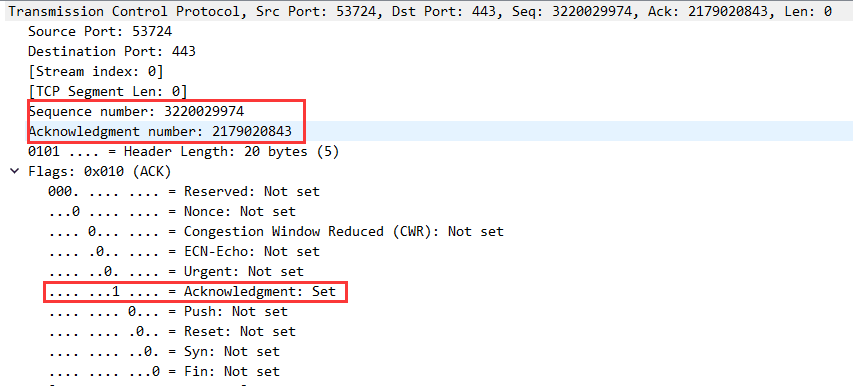
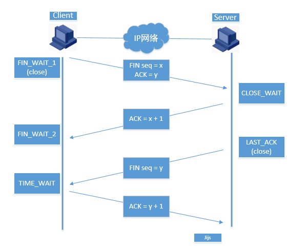

# TCP三次握手四次回收

在TCP报文的报头中，有几个标志字段： 1. SYN：同步连接序号，TCP SYN报文就是把这个标志设置为1，来请求建立连接； 1. ACK：请求/应答状态。0为请求，1为应答； 1. FIN：结束连线。如果FIN为0是结束连线请求，FIN为1表示结束连线； 1. RST：连线复位，首先断开连接，然后重建； 1. PSH：通知协议栈尽快把TCP数据提交给上层程序处理。

## 三次握手



下面通过我们 wireshark 抓包工具来分析三次握手



### 第一次握手

建立连接。客户端发送连接请求报文段，将SYN（Synchronize Sequence Numbers）位置为1，Sequence Number为x；（x 是随机生成的一个 int 数值）然后，客户端进入SYN_SEND状态，等待服务器的确认；



### 第二次握手

服务器收到SYN报文段。服务器收到客户端的SYN报文段，需要对这个SYN报文段进行确认，设置Acknowledgment Number为x+1(Sequence Number+1)；同时，自己自己还要发送SYN请求信息，将SYN位置为1，Sequence Number为 y （y 是随机生存的一个 int 数值）；服务器端将上述所有信息放到一个报文段（即SYN+ACK报文段）中，一并发送给客户端，此时服务器进入SYN_RECV状态；



### 第三次握手

客户端收到服务器的ACK报文段。然后将Acknowledgment Number设置为y+1，向服务器发送ACK报文段，这个报文段发送完毕以后，客户端和服务器端都进入ESTABLISHED状态，完成TCP三次握手



## 四次挥手



### 第一次挥手

Client （可以使客户端，也可以是服务器端），设置Sequence Number和Acknowledgment Number，向 Server发送一个FIN报文段；此时，Client 进入FIN_WAIT\_1状态；

这表示 Client 没有数据要发送给 Server了；

### 第二次挥手

Server 收到了 Client 发送的FIN报文段，向 Client 回一个ACK报文段，Acknowledgment Number 为 Sequence Number 加 1；Client 进入 FIN_WAIT\_2 状态；Server 告诉 Client ，我“同意”你的关闭请求；

Server 第一次响应后，还可以继续向 Client 发送数据，这里只是告诉 Client ，我收到你发送的关闭请求。

### 第三次挥手

Server 向 Client 发送 FIN 报文段，请求关闭连接，同时 Server 进入 CLOSE_WAIT 状态；

当 Server 的数据响应完成后，再告诉 Client，我这边也可以关闭请求了， 这时Server 就不能再向 Client 发送数据了

### 第四次挥手

Client 收到 Server 发送的 FIN 报文段，向 Server 发送 ACK 报文段，然后 Client 进入TIME_WAIT 状态；

Server 收到 Client 的 ACK 报文段以后，就关闭连接；

此时，Client等待2MSL后依然没有收到回复，则证明 Server 端已正常关闭，那好，Client 也可以关闭连接了。

### 什么是MSL

MSL是Maximum Segment Lifetime英文的缩写，中文可以译为“报文最大生存时间”，他是任何报文在网络上存在的最长时间，超过这个时间报文将被丢弃。因为tcp报文（segment）是ip数据报（datagram）的数据部分，具体称谓请参见《数据在网络各层中的称呼》一文，而ip头中有一个TTL域，TTL是time to live的缩写，中文可以译为“生存时间”，这个生存时间是由源主机设置初始值但不是存的具体时间，而是存储了一个ip数据报可以经过的最大路由数，每经过一个处理他的路由器此值就减1，当此值为0则数据报将被丢弃，同时发送ICMP（Internet Control Message Protocol）报文通知源主机。RFC 793中规定MSL为2分钟，实际应用中常用的是30秒，1分钟和2分钟等。

2MSL即两倍的MSL，TCP的TIME_WAIT状态也称为2MSL等待状态，当TCP的一端发起主动关闭，在发出最后一个ACK包后，即第3次握手完成后发送了第四次握手的ACK包后就进入了TIME_WAIT状态，必须在此状态上停留两倍的MSL时间，等待2MSL时间主要目的是怕最后一个ACK包对方没收到，那么对方在超时后将重发第三次握手的FIN包，主动关闭端接到重发的FIN包后可以再发一个ACK应答包。在TIME_WAIT状态时两端的端口不能使用，要等到2MSL时间结束才可继续使用。当连接处于2MSL等待阶段时任何迟到的报文段都将被丢弃。不过在实际应用中可以通过设置SO_REUSEADDR选项达到不必等待2MSL时间结束再使用此端口。

TTL与MSL是有关系的但不是简单的相等的关系，MSL要大于等于TTL。

## 为什么要三次握手？

TCP 建立连接，其实通过两次握手就可以建立连接了，为什么要三次呢？是不是多此一举呢？

1、《计算机网络》中是这样说的：

为了防止已失效的连接请求报文段突然又传送到了服务端，因而产生错误。 在书中同时举了一个例子，如下： 已失效的连接请求报文段”的产生在这样一种情况下：client发出的第一个连接请求报文段并没有丢失，而是在某个网络结点长时间的滞留了，以致延误到连接释放以后的某个时间才到达server。本来这是一个早已失效的报文段。但server收到此失效的连接请求报文段后，就误认为是client再次发出的一个新的连接请求。于是就向client发出确认报文段，同意建立连接。假设不采用“三次握手”，那么只要server发出确认，新的连接就建立了。由于现在client并没有发出建立连接的请求，因此不会理睬server的确认，也不会向server发送数据。但server却以为新的运输连接已经建立，并一直等待client发来数据。这样，server的很多资源就白白浪费掉了。采用“三次握手”的办法可以防止上述现象发生。例如刚才那种情况，client不会向server的确认发出确认。server由于收不到确认，就知道client并没有要求建立连接。”

2、网络故障

比如，现在网络出现了故障，只能发请求数据包，而接收不到响应数据包，那么只要发送一次请求，服务器就建立请求，这样肯定也是不对的，网络请求有来有回才能完成通讯。所以三次握手是必不可少的。

## 为什么要四次挥手呢

TCP协议是一种面向连接的、可靠的、基于字节流的运输层通信协议。TCP是全双工模式，这就意味着，当 Client 发出FIN报文段时，只是表示 Client 已经没有数据要发送了，Client 告诉 Server，它的数据已经全部发送完毕了；但是，这个时候 Client 还是可以接受来自 Server 的数据；当 Server 返回ACK报文段时，表示它已经知道 Client 没有数据发送了，但是 Server 还是可以发送数据到 Client 的；当 Server 也发送了FIN报文段时，这个时候就表示 Server 也没有数据要发送了，就会告诉 Client ，我也没有数据要发送了，之后彼此就会愉快的中断这次TCP连接。如果要正确的理解四次分手的原理，就需要了解四次分手过程中的状态变化。

## SYN

SYN：同步序列编号（Synchronize Sequence Numbers）。是TCP/IP建立连接时使用的握手信号。在客户机和服务器之间建立正常的TCP网络连接时，客户机首先发出一个SYN消息，服务器使用SYN+ACK应答表示接收到了这个消息，最后客户机再以ACK消息响应。这样在客户机和服务器之间才能建立起可靠的TCP连接，数据才可以在客户机和服务器之间传递。

TCP连接的第一个包，非常小的一种数据包。SYN 攻击包括大量此类的包，由于这些包看上去来自实际不存在的站点，因此无法有效进行处理。每个机器的欺骗包都要花几秒钟进行尝试方可放弃提供正常响应。

### 攻击性质

在黑客攻击事件中，SYN攻击是最常见又最容易被利用的一种攻击手法。

SYN攻击属于DDoS攻击的一种，它利用TCP协议缺陷，通过发送大量的半连接请求，耗费CPU和内存资源。SYN攻击除了能影响主机外，还可以危害路由器、防火墙等网络系统，事实上SYN攻击并不管目标是什么系统，只要这些系统打开TCP服务就可以实施。服务器接收到连接请求（syn= j），将此信息加入未连接队列，并发送请求包给客户（syn=k,ack=j+1），此时进入SYN_RECV状态。当服务器未收到客户端的确认包时，重发请求包，一直到超时，才将此条目从未连接队列删除。配合IP欺骗，SYN攻击能达到很好的效果，通常，客户端在短时间内伪造大量不存在的IP地址，向服务器不断地发送syn包，服务器回复确认包，并等待客户的确认，由于源地址是不存在的，服务器需要不断的重发直至超时，这些伪造的SYN包将长时间占用未连接队列，正常的SYN请求被丢弃，目标系统运行缓慢，严重者引起网络堵塞甚至系统瘫痪。

### 攻击原理

关于SYN攻击防范技术，人们研究得比较早。归纳起来，主要有两大类，一类是通过防火墙、路由器等过滤网关防护，另一类是通过加固TCP/IP协议栈防范

SYN Flood利用TCP协议缺陷，发送了大量伪造的TCP连接请求，使得被攻击方资源耗尽，无法及时回应或处理正常的服务请求。一个正常的TCP连接需要三次握手，首先客户端发送一个包含SYN标志的数据包，其后服务器返回一个SYN/ACK的应答包，表示客户端的请求被接受，最后客户端再返回一个确认包ACK，这样才完成TCP连接。在服务器端发送应答包后，如果客户端不发出确认，服务器会等待到超时，期间这些半连接状态都保存在一个空间有限的缓存队列中；如果大量的SYN包发到服务器端后没有应答，就会使服务器端的TCP资源迅速耗尽，导致正常的连接不能进入，甚至会导致服务器的系统崩溃。

### 攻击器

SYN攻击实现起来非常的简单，互联网上有大量现成的SYN攻击工具。

#### windows系统下的SYN工具

以synkill.exe为例，运行工具，选择随机的源地址和源端口，并填写目标机器地址和TCP端口，激活运行，很快就会发现目标系统运行缓慢。如果攻击效果不明显，可能是目标机器并未开启所填写的TCP端口或者防火墙拒绝访问该端口，此时可选择允许访问的TCP端口，通常，windows系统开放tcp139端口，UNIX系统开放tcp7、21、23等端口。

### 检测攻击

检测SYN攻击非常的方便，当你在服务器上看到大量的半连接状态时，特别是源IP地址是随机的，基本上可以断定这是一次SYN攻击。我们使用系统自带的netstat 工具来检测SYN攻击

```bash
# netstat -n -p TCP
tcp　0　 0 10.11.11.11:23　124.173.152.8:25882　 SYN_RECV　-
tcp　0　 0 10.11.11.11:23　236.15.133.204:2577　 SYN_RECV　-
tcp　0　 0 10.11.11.11:23　127.160.6.129:51748　 SYN_RECV　-
tcp　0　 0 10.11.11.11:23　222.220.13.25:47393　 SYN_RECV　-
tcp　0　 0 10.11.11.11:23　212.200.204.182:60427 SYN_RECV　-
tcp　0　 0 10.11.11.11:23　232.115.18.38:278　 SYN_RECV　-
tcp　0　 0 10.11.11.11:23　239.116.95.96:5122　SYN_RECV　-
tcp　0　 0 10.11.11.11:23　236.219.139.207:49162 SYN_RECV　-
```

上面是在LINUX系统中看到的，很多连接处于SYN_RECV状态（在WINDOWS系统中是SYN_RECEIVED状态），源IP地址都是随机的，表明这是一种带有IP欺骗的SYN攻击。 我们也可以通过下面的命令直接查看在LINUX环境下某个端囗的未连接队列的条目数：

```bash
#netstat -n -p TCP | grep SYN_RECV | grep :22 | wc -l
324
```

显示TCP端囗22的未连接数有324个，虽然还远达不到系统极限，但应该引起管理员的注意。

### 防范技术

关于SYN攻击防范技术，人们研究得比较早。归纳起来，主要有两大类，一类是通过防火墙、路由器等过滤网关防护，另一类是通过加固TCP/IP协议栈防范

#### 注册表设置

在“开始->运行->键入regedit”

启用 SYN 攻击保护的命名值位于注册表项 HKEY_LOCAL_MACHINE\SYSTEM\CurrentControlSet\services\Tcpip\Parameters之下。值名称：SynAttackProtect。推荐值：2。

以下部分中的所有项和值均位于注册表项 HKEY_LOCAL_MACHINE\SYSTEM\CurrentControlSet\services\Tcpip\Parameters 之下。

指定必须在触发 SYN flood 保护之前超过的 TCP 连接请求阈值。值名称：TcpMaxPortsExhausted。推荐值：5。

启用 SynAttackProtect 后，该值指定 SYN_RCVD 状态中的 TCP 连接阈值，超过 SynAttackProtect 时，触发 SYN flood 保护。值名称：TcpMaxHalfOpen。推荐值数据：500。

启用 SynAttackProtect 后，指定至少发送了一次重传的 SYN_RCVD 状态中的 TCP 连接阈值。超过 SynAttackProtect 时，触发 SYN flood 保护。值名称：TcpMaxHalfOpenRetried。推荐值数据：400

#### 丰富带宽资源

不难看出syn攻击时消耗大量带宽资源,所以要想防御syn洪水攻击,一个丰富的带宽资源是非常有必要的，通常的流量攻击，攻击者也是利用拥挤的带宽资源来堵死目标网络的，所以这个也是一个重要的防御前提。

#### 防火墙

利用防火墙来进行防护攻击是目前最有效的方法，当然前提是攻击在防护带宽范围之内，也就是为什么第二条推荐带宽资源，这是保证在防火墙前面不会造成堵塞，来达到防火墙的防护目的。 \[1]

## 参考资料

[https://www.jianshu.com/p/f876f19112a2](https://www.jianshu.com/p/f876f19112a2) [https://baike.baidu.com/item/SYN/8880122?fr=aladdin](https://baike.baidu.com/item/SYN/8880122?fr=aladdin)
