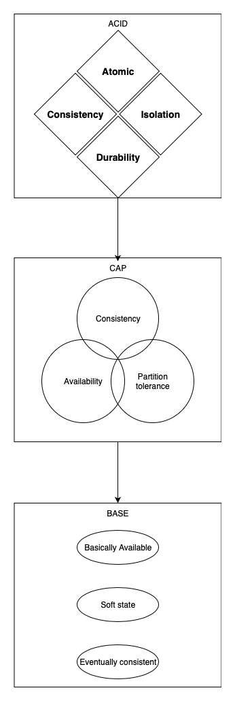
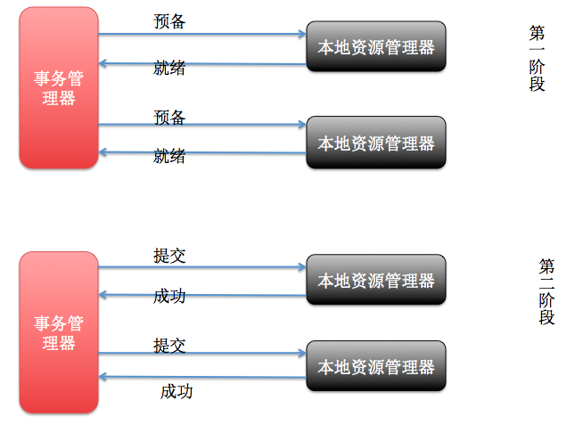
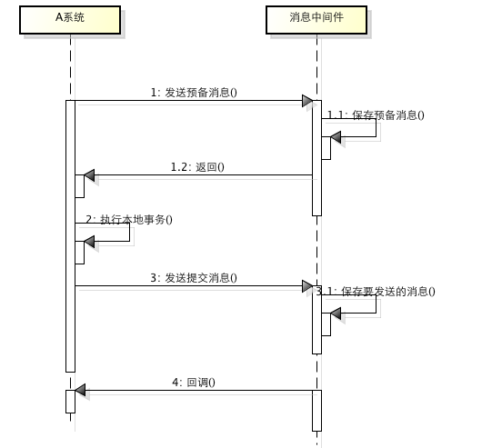
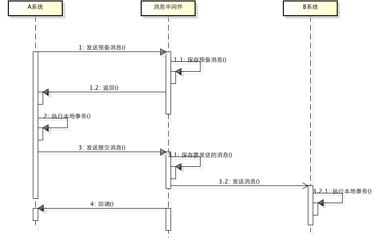

# CAP理论

## [数据库中的ACID理论](broken-reference)

## 事务的几个阶段

## CAP理论

一个经典的分布式系统理论。CAP理论告诉我们：一个分布式系统不可能同时满足一致性（C：Consistency）、可用性（A：Availability）和分区容错性（P：Partition tolerance）这三个基本需求，最多只能同时满足其中两项。

### 1、一致性（C：Consistency）

在分布式环境下，一致性是指数据在多个副本之间能否保持一致的特性。在一致性的需求下，当一个系统在数据一致的状态下执行更新操作后，应该保证系统的数据仍然处于一直的状态。

对于一个将数据副本分布在不同分布式节点上的系统来说，如果对第一个节点的数据进 行了更新操作并且更新成功后，却没有使得第二个节点上的数据得到相应的更新，于是在对第二个节点的数据进行读取操作时，获取的依然是老数据（或称为脏数 据），这就是典型的分布式数据不一致的情况。在分布式系统中，如果能够做到针对一个数据项的更新操作执行成功后，所有的用户都可以读取到其最新的值，那么 这样的系统就被认为具有强一致性

### 2、可用性（A：Availability）

可用性是指系统提供的服务必须一直处于可用的状态，对于用户的每一个操作请求总是能够在有限的时间内返回结果。这里的重点是"有限时间内"和"返回结果"。

"有限时间内"是指，对于用户的一个操作请求，系统必须能够在指定的时间内返回对 应的处理结果，如果超过了这个时间范围，那么系统就被认为是不可用的。另外，"有限的时间内"是指系统设计之初就设计好的运行指标，通常不同系统之间有很 大的不同，无论如何，对于用户请求，系统必须存在一个合理的响应时间，否则用户便会对系统感到失望。

"返回结果"是可用性的另一个非常重要的指标，它要求系统在完成对用户请求的处理后，返回一个正常的响应结果。正常的响应结果通常能够明确地反映出队请求的处理结果，即成功或失败，而不是一个让用户感到困惑的返回结果。

### 3、分区容错性（P：Partition tolerance）

分区容错性约束了一个分布式系统具有如下特性：分布式系统在遇到任何网络分区故障的时候，仍然需要能够保证对外提供满足一致性和可用性的服务，除非是整个网络环境都发生了故障。

网络分区是指在分布式系统中，不同的节点分布在不同的子网络（机房或异地网络） 中，由于一些特殊的原因导致这些子网络出现网络不连通的状况，但各个子网络的内部网络是正常的，从而导致整个系统的网络环境被切分成了若干个孤立的区域。 需要注意的是，组成一个分布式系统的每个节点的加入与退出都可以看作是一个特殊的网络分区。

既然一个分布式系统无法同时满足一致性、可用性、分区容错性三个特点，所以我们就需要抛弃一样：

| 选择 | 说明                                                              |
| -- | --------------------------------------------------------------- |
| CA | 放弃分区容错性，加强一致性和可用性，其实就是传统的单机数据库的选择                               |
| AP | 放弃一致性（这里说的一致性是强一致性），追求分区容错性和可用性，这是很多分布式系统设计时的选择，例如很多NoSQL系统就是如此 |
| CP | 放弃可用性，追求一致性和分区容错性，基本不会选择，网络问题会直接让整个系统不可用                        |

### CAP分布式事务的一致性协议:XA

XA:作为资源管理器（数据库）与事务管理器的接口标准。目前，Oracle、Informix、DB2和Sybase等各大数据库厂家都提供对XA的支持。，而事务管理器作为全局的调度者，负责各个本地资源的提交和回滚。XA实现分布式事务的原理如下：

总的来说，XA协议比较简单，而且一旦商业数据库实现了XA协议，使用分布式事务的成本也比较低。但是，XA也有致命的缺点，那就是性能不理想，特别是在交易下单链路，往往并发量很高，XA无法满足高并发场景。XA目前在商业数据库支持的比较理想，在mysql数据库中支持的不太理想，mysql的XA实现，没有记录prepare阶段日志，主备切换回导致主库与备库数据不一致。许多nosql也没有支持XA，这让XA的应用场景变得非常狭隘。

#### [XA,2PC,TCC](https://blog.csdn.net/kusedexingfu/article/details/103484198)

#### [分布式事务六种解决方案](https://zhuanlan.zhihu.com/p/183753774)

#### [5种分布式事务解决方案优缺点对比](https://developer.51cto.com/art/201907/600249.htm)

#### [Seata 官网](https://seata.io/zh-cn/docs/overview/what-is-seata.html)

#### [Seata 概述](http://www.dreamwu.com/post-1741.html)

#### [Seata 详解](http://blog.itpub.net/31561269/viewspace-2375540/)

#### [Seata 示例](https://mp.weixin.qq.com/s?\__biz=MzAxNTM4NzAyNg==\&mid=2247489120\&idx=1\&sn=3361751a1339ba80804c81ced0744b60\&chksm=9b85869dacf20f8bf395d924324d02619664e37b7b4a87b281e1ba58daa346e946d6118bc35b\&scene=132#wechat_redirect)

#### [Seata 模式](https://blog.csdn.net/fanfan4569/article/details/102522210)

#### [Seata\_模式选型](http://www.360doc.com/content/19/0830/20/99071\_858122841.shtml)

#### [Seata Springboot](https://blog.csdn.net/zhangchangbin123/article/details/89310131)

#### XA：2PC

#### XA：3PC

#### XA：TCC

所谓的TCC编程模式，也是两阶段提交的一个变种。TCC提供了一个编程框架，将整个业务逻辑分为三块：Try、Confirm和Cancel三个操作。以在线下单为例，Try阶段会去扣库存，Confirm阶段则是去更新订单状态，如果更新订单失败，则进入Cancel阶段，会去恢复库存。总之，TCC就是通过代码人为实现了两阶段提交，不同的业务场景所写的代码都不一样，复杂度也不一样，因此，这种模式并不能很好地被复用。

## BASE理论

在分布式（数据库分片或分库存在的多个实例上）系统下，CAP 理论并不适合数据库事务（因为更新一些错误的数据而导致的失败，无论使用什么样的高可用方案都是徒劳，因为数据发生了无法修正的错误）。此外分布式事务XA 虽然保证了数据库在分布式系统下的ACID（原子性、一致性、隔离性、持久性）特性，但也带来了一些性能方面的代价，对于并发和响应时间要求比较高的电商平台来说，是很难接受的。 eBay 尝试了另外一条完全不同的路，放宽了数据库事务的ACID 要求，提出了一套名为 BASE 的新准则。

BASE是：

* Basically Available（基本可用）
* Soft state（软状态）
* Eventually consistent（最终一致性）

BASE理论是对CAP中一致性和可用性权衡的结果，其来源于对大规模互联网系统分布式实践的总结， 是基于CAP定理逐步演化而来的。BASE理论的核心思想是：即使无法做到强一致性，但每个应用都可以根据自身业务特点，采用适当的方式来使系统达到最终一致性。接下来看一下BASE中的三要素：

### 1、基本可用

基本可用是指分布式系统在出现不可预知故障的时候，允许损失部分可用性----注意，这绝不等价于系统不可用。比如：

* 响应时间上的损失。正常情况下，一个在线搜索引擎需要在0.5秒之内返回给用户相应的查询结果，但由于出现故障，查询结果的响应时间增加了1\~2秒
* 系统功能上的损失：正常情况下，在一个电子商务网站上进行购物的时候，消费者几乎能够顺利完成每一笔订单，但是在一些节日大促购物高峰的时候，由于消费者的购物行为激增，为了保护购物系统的稳定性，部分消费者可能会被引导到一个降级页面

### 2、软状态

软状态指允许系统中的数据存在中间状态，并认为该中间状态的存在不会影响系统的整体可用性，即允许系统在不同节点的数据副本之间进行数据同步的过程存在延时。比如订单状态，有一个待支付、支付中、支付成功、支付失败， 那么支付中就是一个中间状态，这个中间状态在支付成功以后，在支付表中的状态同步给订单状态之前，中间会存在一个时间内的不一致。

### 3、最终一致性

最终一致性强调的是所有的数据副本，在经过一段时间的同步之后，最终都能够达到一个一致的状态。因此，最终一致性的本质是需要系统保证最终数据能够达到一致，而不需要实时保证系统数据的强一致性。

总的来说，BASE理论面向的是大型高可用可扩展的分布式系统，和传统的事物ACID特性是相反的，它完全不同于ACID的强一致性模型，而是通过牺牲强一致性来获得可用性，并允许数据在一段时间内是不一致的，但最终达到一致状态。但同时，在实际的分布式场景中，不同业务单元和组件对数据一致性的要求是不同的，因此在具体的分布式系统架构设计过程中，ACID特性和BASE理论往往又会结合在一起。

### BASE-消息中间件

所谓的消息事务就是基于消息中间件的两阶段提交，本质上是对消息中间件的一种特殊利用，它是将本地事务和发消息放在了一个分布式事务里，保证要么本地操作成功成功并且对外发消息成功，要么两者都失败，开源的RocketMQ就支持这一特性，具体原理如下：

* 1、A系统向消息中间件发送一条预备消息
* 2、消息中间件保存预备消息并返回成功
* 3、A执行本地事务
* 4、A发送提交消息给消息中间件

通过以上4步完成了一个消息事务。对于以上的4个步骤，每个步骤都可能产生错误，下面一一分析：

* 步骤一出错，则整个事务失败，不会执行A的本地操作
* 步骤二出错，则整个事务失败，不会执行A的本地操作
* 步骤三出错，这时候需要回滚预备消息，怎么回滚？答案是A系统实现一个消息中间件的回调接口，消息中间件会去不断执行回调接口，检查A事务执行是否执行成功，如果失败则回滚预备消息
* 步骤四出错，这时候A的本地事务是成功的，那么消息中间件要回滚A吗？答案是不需要，其实通过回调接口，消息中间件能够检查到A执行成功了，这时候其实不需要A发提交消息了，消息中间件可以自己对消息进行提交，从而完成整个消息事务

基于消息中间件的两阶段提交往往用在高并发场景下，将一个分布式事务拆成一个消息事务（A系统的本地操作+发消息）+B系统的本地操作，其中B系统的操作由消息驱动，只要消息事务成功，那么A操作一定成功，消息也一定发出来了，这时候B会收到消息去执行本地操作，如果本地操作失败，消息会重投，直到B操作成功，这样就变相地实现了A与B的分布式事务。原理如下：

虽然上面的方案能够完成A和B的操作，但是A和B并不是严格一致的，而是最终一致的，我们在这里牺牲了一致性，换来了性能的大幅度提升。当然，这种玩法也是有风险的，如果B一直执行不成功，那么一致性会被破坏，具体要不要玩，还是得看业务能够承担多少风险。

参考资料

* [CAP 定理的含义](http://www.ruanyifeng.com/blog/2018/07/cap.html)
* [An Illustrated Proof of the CAP - - - Theorem](https://mwhittaker.github.io/blog/an_illustrated_proof_of_the_cap_theorem/)
* [分布式架构的基本理论论CAP、BASE 以及应用](https://www.jianshu.com/p/ee1f567e4bd8)
* [从ACID到CAP到BASE](https://segmentfault.com/a/1190000004468442)
* [分布式事务及其一致性协议](https://segmentfault.com/a/1190000015437715)
* [分布式事务之TCC服务设计和实现注意事项](https://segmentfault.com/a/1190000015612188)
* [MySQL 中基于 XA 实现的分布式事务](https://blog.51cto.com/1374115/2140150)
* [分布式事务XA](https://www.cnblogs.com/zengkefu/p/5742617.html)
* [XA规范，1PC,2PC,3PC](https://www.jianshu.com/p/28f1869500fa)
* [分布式事务之TCC服务设计和实现注意事项](https://segmentfault.com/a/1190000015612188)
* [分布式一致性算法之从2PC到3PC](https://www.jianshu.com/p/2bcf2c8c726a)
