# kafka-manager

[下载地址](https://github.com/yahoo/CMAK/releases)

## 部署

### Java 11

```
unzip cmak-3.0.0.5.zip
ln -s cmak-3.0.0.5 cmak
cd cmak
vim conf/application.conf
# kafka-manager.zkhosts="192.168.1.22:2181,192.168.1.23:2181,192.168.1.24:2181"
# cmak.zkhosts="192.168.105.25:2181"
# 创建启动脚本
vim start.sh
# bin/cmak -Dconfig.file=conf/application.conf -Dhttp.port=9900
# nohup bin/cmak -Dconfig.file=conf/application.conf -Dhttp.port=9900 &
sh start.sh
bin/cmak
```

### Java 8

```
# download bin package
unzip kafka-manager-1.3.3.4.zip
ln -s kafka-manager-1.3.3.4 kafka-manager
cd kafka-manager
vim conf/application.conf
# kafka-manager.zkhosts="10.0.0.50:12181,10.0.0.60:12181,10.0.0.70:12181"
# 创建启动脚本
vim start.sh
# bin/kafka-manager -Dconfig.file=conf/application.conf -Dhttp.port=9900
# nohup bin/kafka-manager -Dconfig.file=conf/application.conf -Dhttp.port=9900 > application.log 2>&1 &
sh start.sh
```

### 验证

```
ps -ef | grep kafka-manager
# kafka     3663     1  3 16:36 pts/2    00:00:27 java -Duser.dir=/home/kafka/kafka-manager-1.3.3.4 
jps -ml
# 3663 play.core.server.ProdServerStart

http://ip:9900
```

## 使用

### Add Cluster

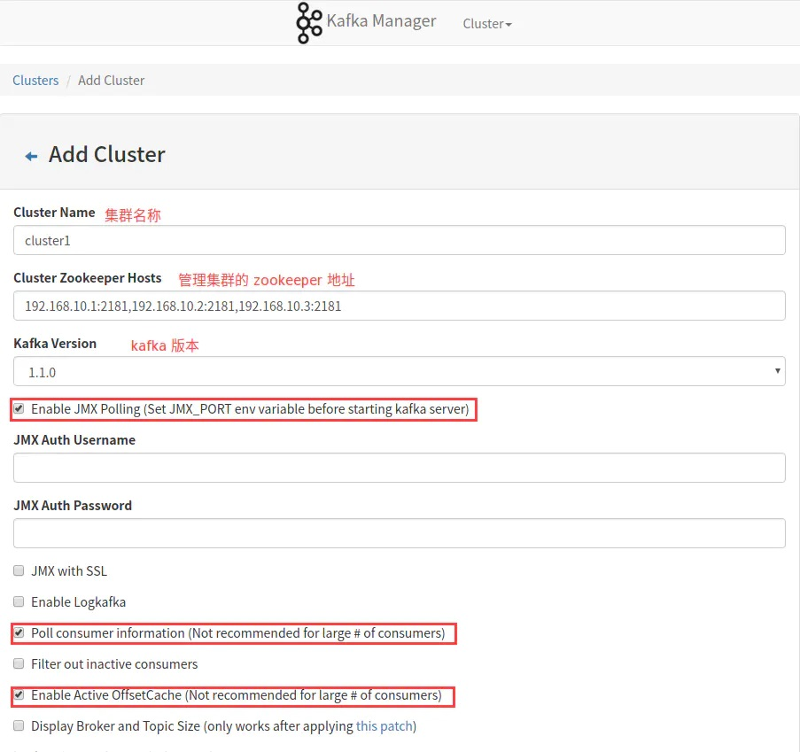

Enable JMX Polling:是否开启 JMX 轮训，该部分直接影响部分 kafka broker 和 topic 监控指标指标的获取（生效的前提是 kafka 启动时开启了 JMX_PORT。主要影响如下之指标的查看：

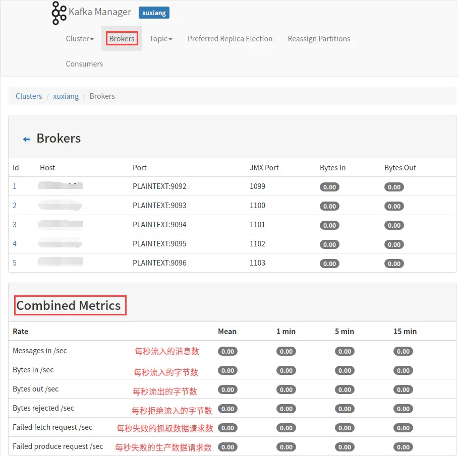

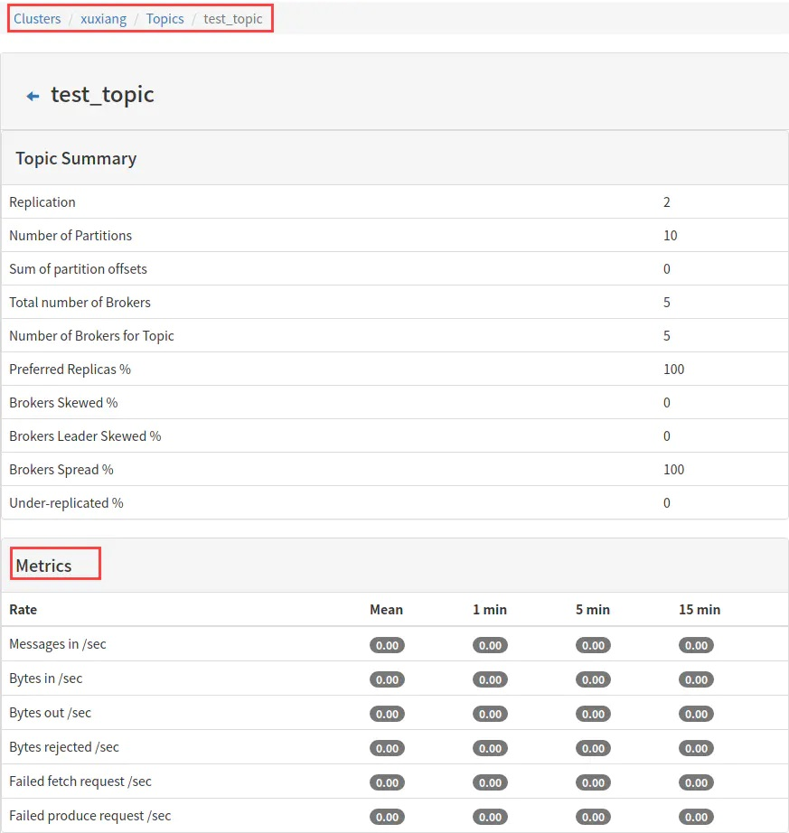

Poll consumer information:是否开启获取消费信息，直接影响能够在消费者页面和 topic 页面查看消费信息。

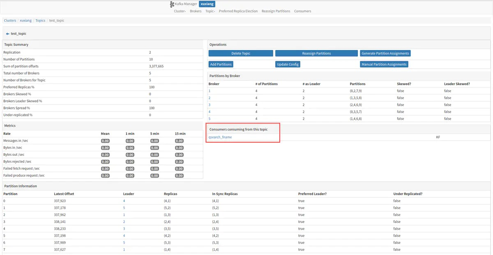

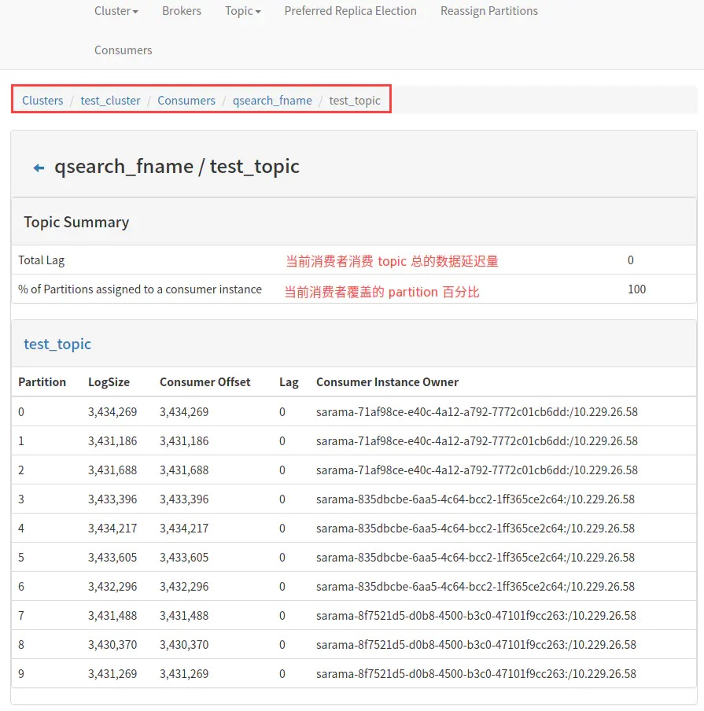

Enable Active OffsetCache:是否开启 offset 缓存，决定 kafka-manager 是否缓存住 topic 的相关偏移量。

其余参数说明

| 参数名                                   | 参数说明                         | 默认值       | 备注                                           |
| ------------------------------------- | ---------------------------- | --------- | -------------------------------------------- |
| brokerViewUpdatePeriodSeconds         | Broker视图周期更新时间/单位（s）         | 30        |                                              |
| clusterManagerThreadPoolSize          | 集群管理线程池大小                    | 2         |                                              |
| clusterManagerThreadPoolQueueSize     | 集群管理线程池列队大小                  | 100       |                                              |
| KafkaCommandThreadPoolSize            | Kafka命令线程池大小                 | 2         |                                              |
| logkafkaCommandThreadPoolQueueSize    | logkafka命令线程池列队大小            | 100       |                                              |
| logkafkaUpdatePeriodSeconds           | Logkafka周期更新时间/单位（s）         | 30        |                                              |
| partitionOffsetCacheTimeoutSecs       | Partition Offset缓存过期时间/单位（s） | 5         |                                              |
| brokerViewThreadPoolSize              | Broker视图线程池大小                | 8         | 3 \* number_of_brokers                       |
| brokerViewThreadPoolQueue Size        | Broker视图线程池队列大小              | 1000      | 3 \* total # of partitions across all topics |
| offsetCacheThreadPoolSize             | Offset缓存线程池大小                | 8         |                                              |
| offsetCacheThreadPoolQueueSize        | Offset缓存线程池列队大小              | 1000      |                                              |
| kafkaAdminClientThreadPoolSize        | Kafka管理客户端线程池大小              | 8         |                                              |
| kafkaAdminClientTheadPoolQueue Size   | Kafka管理客户端线程池队列大小            | 1000      |                                              |
| kafkaManagedOffsetMetadataCheckMillis | Offset元数据检查时间                | 30000     | （这部分解释属自己理解）                                 |
| kafkaManagedOffsetGroupCacheSize      | Offset组缓存大小                  | 100000    | （这部分解释属自己理解）                                 |
| kafkaManagedOffsetGroupExpireDays     | Offset组缓存保存时间                | 7         | （这部分解释属自己理解）                                 |
| Security Protocol                     | 安全协议                         | PLAINTEXT | \[SASL_PLAINTEXT,SASL_SSL,SSL]               |

### Topic


#### Brokers Skew% （broker 倾斜率）

该 topic 占有的 broker 中，拥有超过该 topic 平均分区数的 broker 所占的比重。举个例子说明：

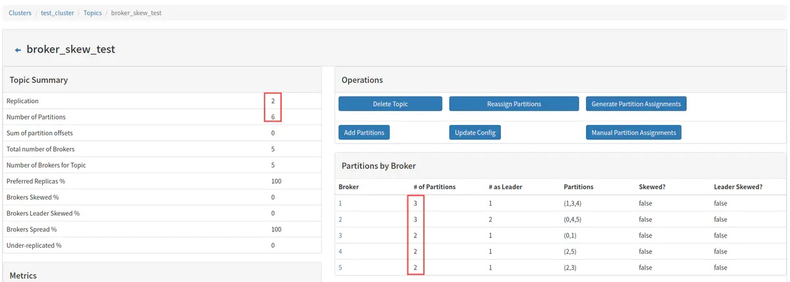

上图，我们以一个 6 个分区，2 个副本的 topic 举例，该 topic 一共 6 \* 2 = 12 个 分区，分布在 5 个 broker 上，平均一个 broker 应该拥有 2.4 个分区，因为分区为整数，所以 2 个或者 3 个都是属于平均范围，5 个 broker 并没有那个拥有超过平均分区数的，所以 Brokers Skew% 为 0。 如果此时，我将 broker 1 上的分区 1 的副本移动到 broker 2 上，如下图所示：


上图，broker 2 上拥有 4 个分区，超过平均的 2 个或 3 个的平均水平，broker 2 就倾斜了，broker 倾斜率 1/5=20%。

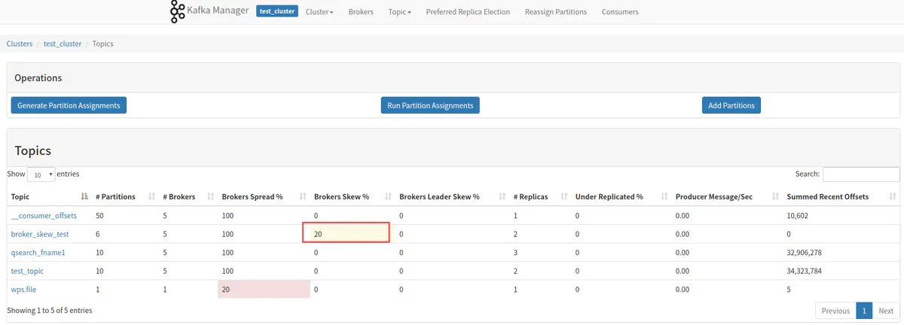

注意如下这种情况也是不计算作倾斜的。

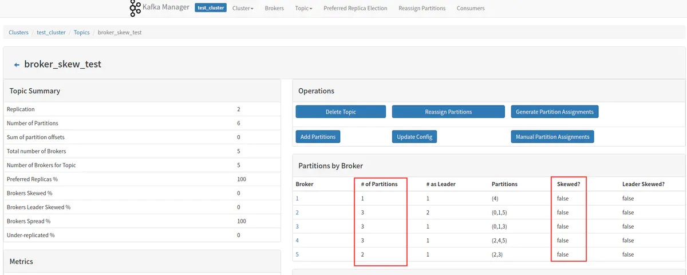

#### Brokers Leader Skew% （broker leader 分区倾斜率）:

该 topic 占有的 broker 中，拥有超过该 topic 平均 Leader 分区数的 broker 所占的比重。同样举个例子说明：

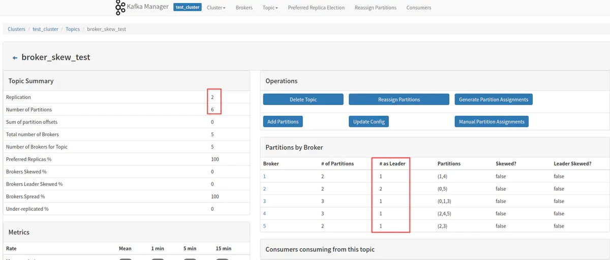

我们还是以一个 6 个分区，2 个副本的 topic 举例，该 topic 一共有 6 个 Leader 分区，分布在 5 个 broker 上，平均一个 broker 应该拥有 1.2 个 Leader 分区，因为分区为整数，所以 1 个或者 2 个都是属于平均范围，如图所示，5 个 broker 没有那个拥有超过 2 个的 Leader 分区，所以 Brokers Leader Skew% 为 0。 如果此时，我们将 broker3 的 Leader 分区移动到 broker2，如下图所示：

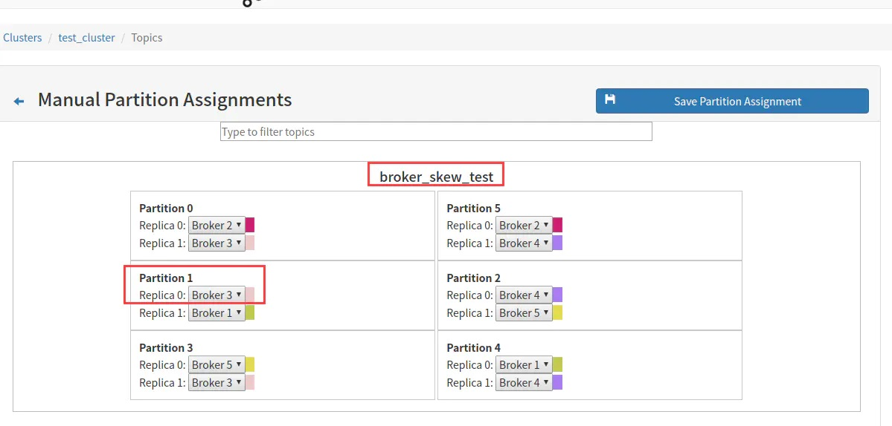

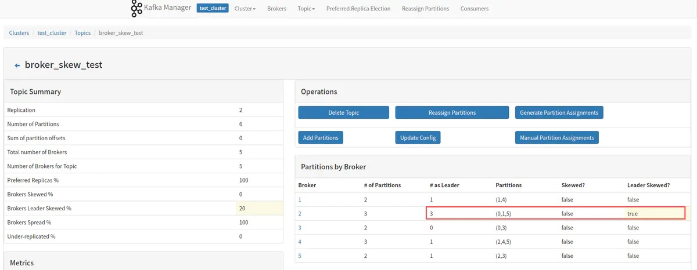

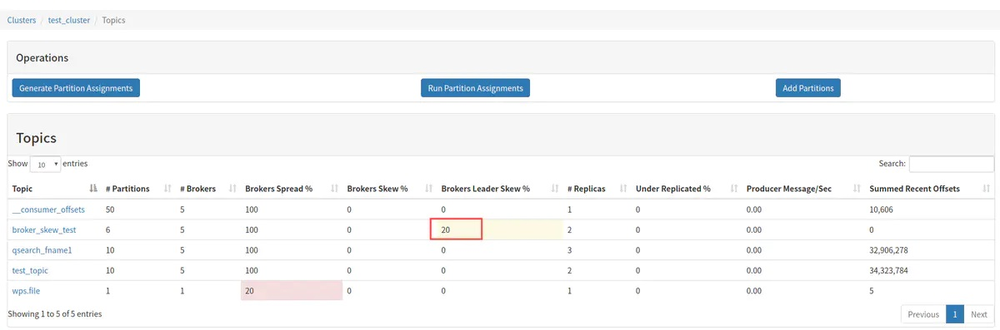

此时，broker2 拥有 3 个 leader 分区，超过平均范围的 2 个，所以 broker2 就 Leader 分区倾斜了，倾斜率 1/5=20%。

#### Under Replicated%:

该 topic 下的 partition，其中副本处于失效或者失败的比率。失败或者失效是指副本不处于 ISR 队列中。目前控制副本是否处于 ISR 中由 replica.log.max.ms 这个参数控制。

replica.log.max.ms: 如果一个follower在这个时间内没有发送fetch请求或消费leader日志到结束的offset，leader将从ISR中移除这个follower，并认为这个follower已经挂了，默认值 10000 ms

用下图举例说明：

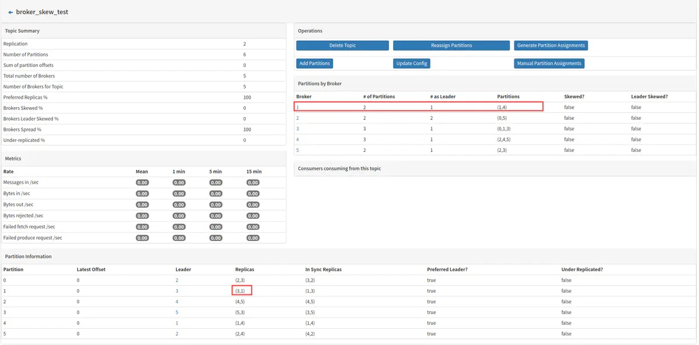

broker1 此时拥有 partition1 和 partition4，其中 partition4 时 Leader，partition1 是副本，如果此时 broker 故障不可用，则会出现如下情况：

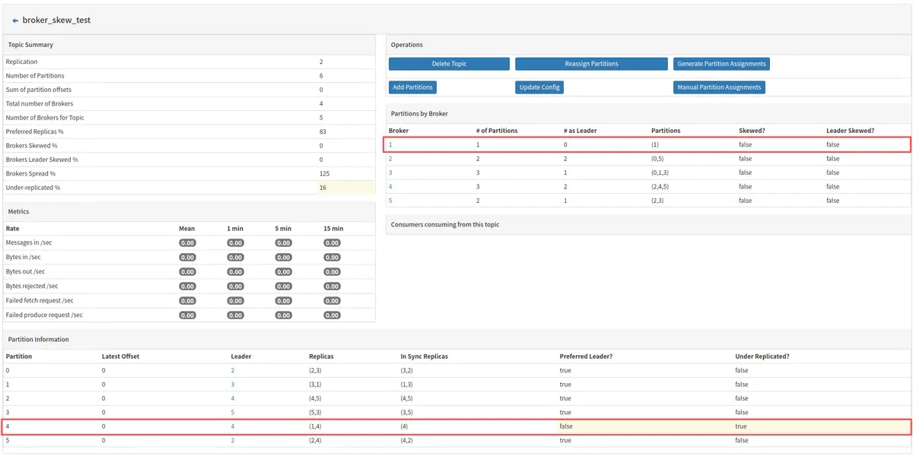

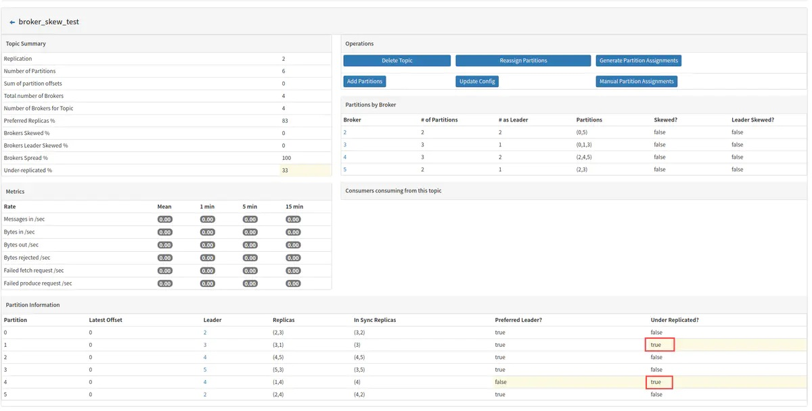

上述两张图片时接连展现，先是发现borker1 上 partition4 这个 Leader 分区失效，继而从 ISR 队列中取出 broker4 上的副本作为 Leader 分区，然后在后期同步检测过程中发现broker1 上 partition1 这个副本失效。最后导致的结果就是 partition1 和 partition4 都出于副本失效或者失败的状态。此时 Under Replicated 的数值为：2/6=33%。

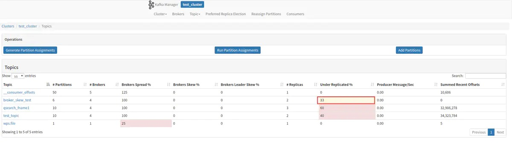

上面三个参数对于衡量 topic 的稳定性有重要的影响：

* Broker Skew: 反映 broker 的 I/O 压力，broker 上有过多的副本时，相对于其他 broker ，该 broker 频繁的从 Leader 分区 fetch 抓取数据，磁盘操作相对于其他 broker 要多，如果该指标过高，说明 topic 的分区均不不好，topic 的稳定性弱；
* Broker Leader Skew：数据的生产和消费进程都至于 Leader 分区打交道，如果 broker 的 Leader 分区过多，该 broker 的数据流入和流出相对于其他 broker 均要大，该指标过高，说明 topic 的分流做的不够好；
* Under Replicated: 该指标过高时，表明 topic 的数据容易丢失，数据没有复制到足够的 broker 上。

### Topic 详情

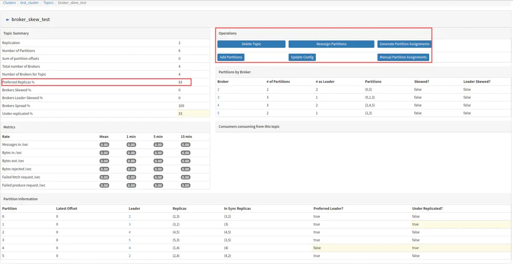

#### Preferred Replicas

分区的副本中，采用副本列表中的第一个副本作为 Leader 的所占的比重，如上图，6 个副本组，其中只有 partition4 不是采用副本中的第一个在 broker1 中的分区作为 leader 分区，所以 Preferred Replicas 的值为 5/6=83%。

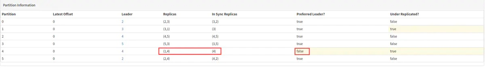

> In an ideal scenario, the leader for a given partition should be the "preferred replica". This guarantees that the leadership load across the brokers in a cluster are evenly balanced.

上述是关于“优先副本”的相关描述，即在理想的状态下，分区的 leader 最好是 “优先副本”，这样有利于保证集群中 broker 的领导权比较均衡。重新均衡集群的 leadership 可采用 kafka manager 提供的工具：

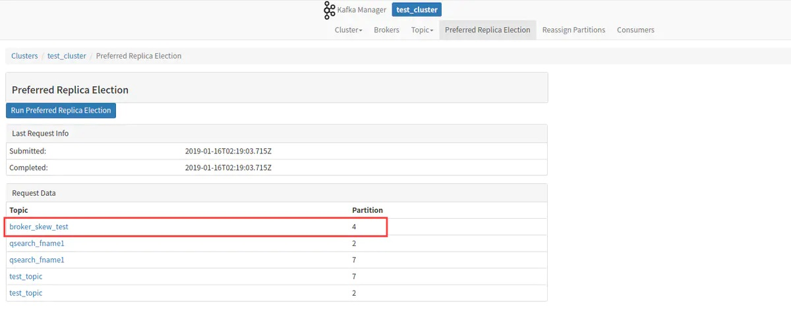

### topic 操作

| 操作                             | 说明                     |
| ------------------------------ | ---------------------- |
| Delete Topic                   | 删除 topic               |
| Reassign Partitions            | 平衡集群负载                 |
| Add Partitions                 | 增加分区                   |
| Update Config                  | Topic 配置信息更新           |
| Manual Partition Assignments   | 手动为每个分区下的副本分配 broker   |
| Generate Partition Assignments | 系统自动为每个分区下的副本分配 broker |

一般而言，手动调整、系统自动分配分区和添加分区之后，都需要调用 Reassign Partition。

#### Manual Partition Assignments

一般当有 Broker Skew 时或者 Broker Leader Skew 后可以借助该功能进行调整，本文前面的 Broker Skew 和 Broker Leader Skew 的说明都借助了该工具。 例如将下图中的 broker1 的分区4 移动到 broker2 上。

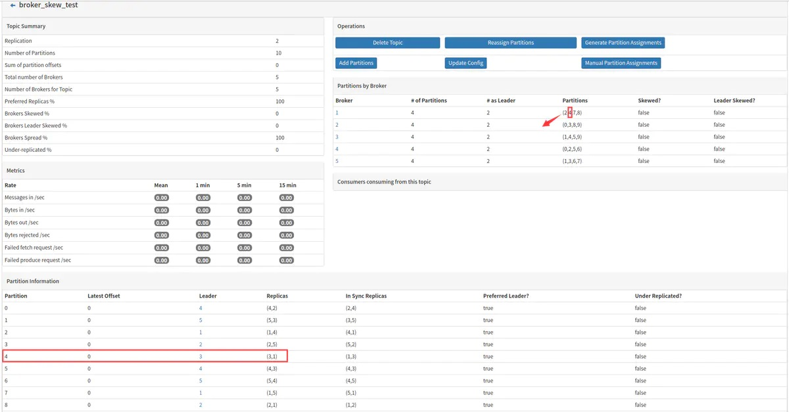

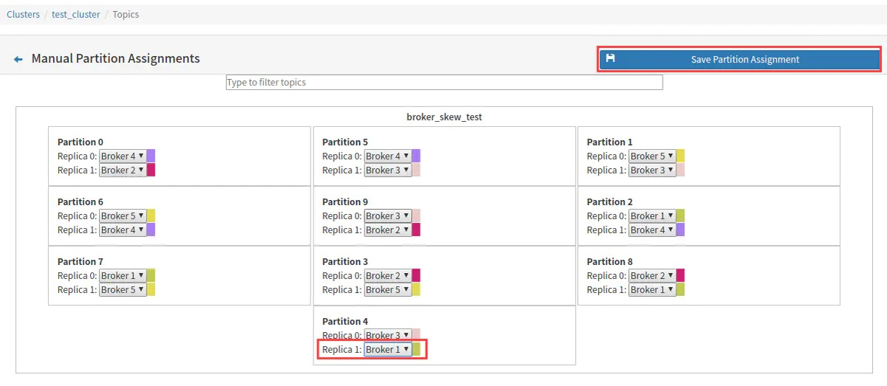

#### Generate Partition Assignments

该功能一般在批量移动 partition 时比较方便，比如集群新增 broker 或者 topic 新增 partition 后，将分区移动到指定的 broker。 例如下图将 topic 由原来的分布在 5 个 broker 修改为 4 个 broker：

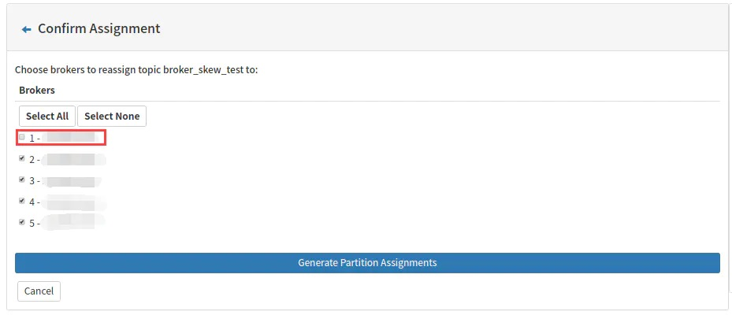

#### Update Config

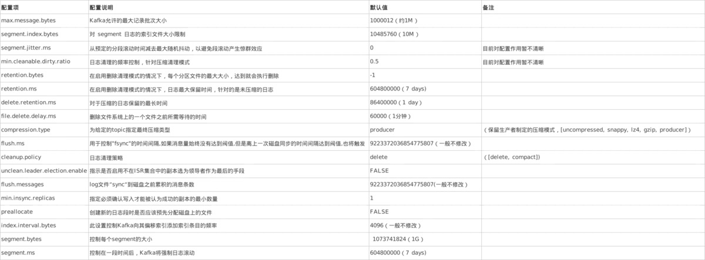

### 消费监控

kafka manager 能够获取到当前消费 kafka 集群消费者的相关信息。

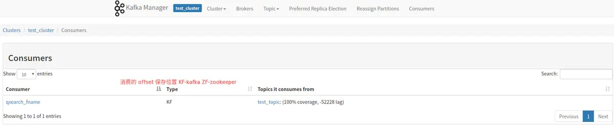

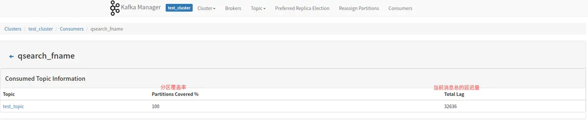

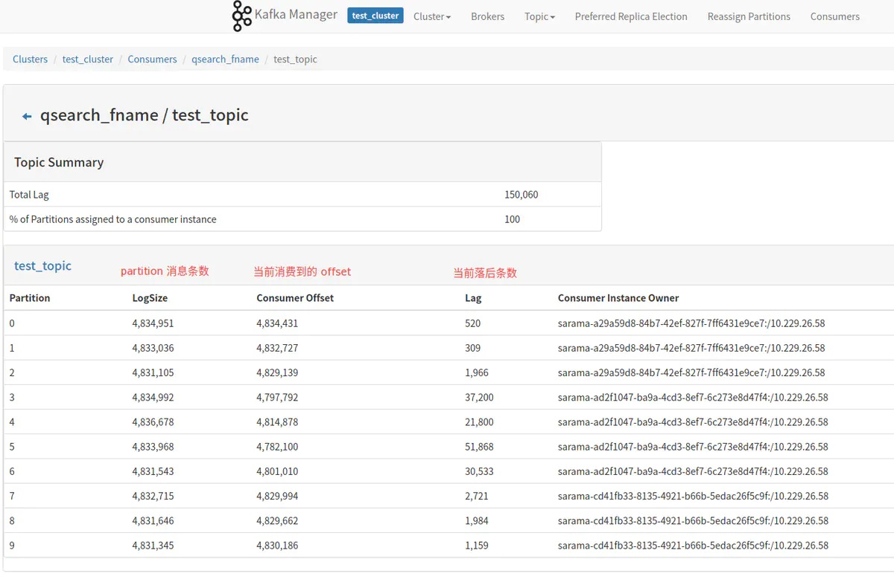

## 参考资料

[https://www.jianshu.com/p/6a592d558812](https://www.jianshu.com/p/6a592d558812)
