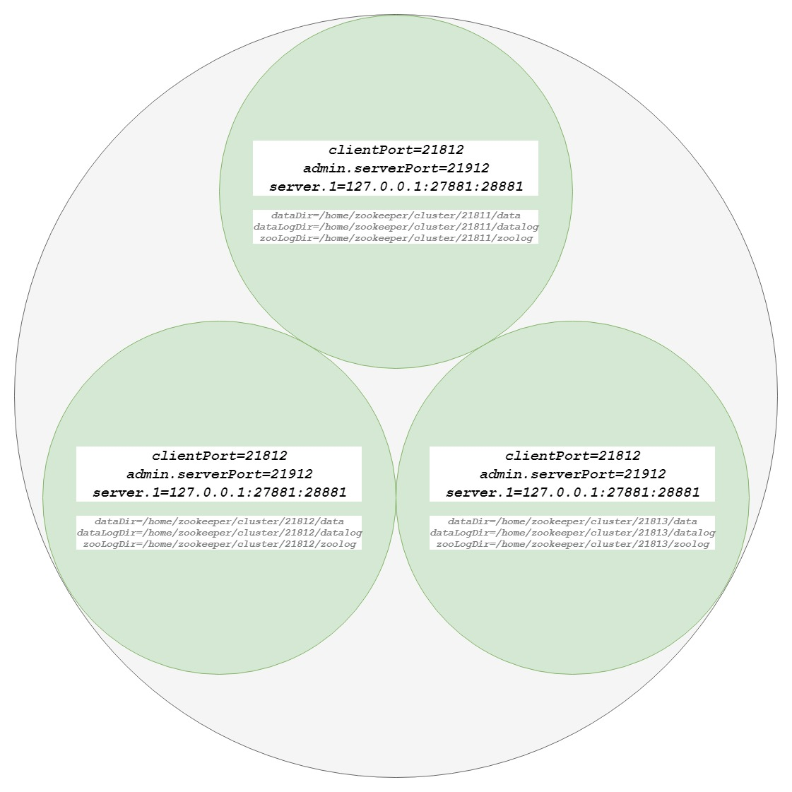

# 集群部署

zookeeper集群的目的是为了保证系统的性能承载更多的客户端连接设专门提供的机制。通过集群可以实现以下功能：

* 读写分离：提高承载，为更多的客户端提供连接，并保障性能。
* 主从自动切换：提高服务容错性，部分节点故障不会影响整个服务集群。  

半数以上运行机制说明： 集群至少需要三台服务器，并且强烈建议使用奇数个服务器。因为zookeeper 通过判断大多数节点的存活来判断整个服务是否可用。比如3个节点，挂掉了2个表示整个集群挂掉，而用偶数4个，挂掉了2个也表示其并不是大部分存活，因此也会挂掉。

## 伪集群

```bash
mkdir -p cluster/node-2182 cluster/node-2182/data cluster/node-2182/log 
mkdir -p cluster/node-2183 cluster/node-2183/data cluster/node-2183/log
mkdir -p cluster/node-2184 cluster/node-2184/data cluster/node-2184/log

touch cluster/node-2182/zoo.cfg
touch cluster/node-2183/zoo.cfg
touch cluster/node-2184/zoo.cfg
```

* node-2182/zoo.cfg

```bash
# The number of milliseconds of each tick
tickTime=2000
# The number of ticks that the initial 
# synchronization phase can take
initLimit=10
# The number of ticks that can pass between 
# sending a request and getting an acknowledgement
syncLimit=5
# the directory where the snapshot is stored.
# do not use /tmp for storage, /tmp here is just 
# example sakes.
dataDir=/Users/pwd/Library/Developer/zookeeper/cluster/node-2182/data
dataLogDir=/Users/pwd/Library/Developer/zookeeper/cluster/node-2182/log
# the port at which the clients will connect
clientPort=2182
# the maximum number of client connections.
# increase this if you need to handle more clients
#maxClientCnxns=60
#
# Be sure to read the maintenance section of the 
# administrator guide before turning on autopurge.
#
# http://zookeeper.apache.org/doc/current/zookeeperAdmin.html#sc_maintenance
#
# The number of snapshots to retain in dataDir
#autopurge.snapRetainCount=3
# Purge task interval in hours
# Set to "0" to disable auto purge feature
#autopurge.purgeInterval=1
server.1=localhost:21811:21821 
server.2=localhost:21812:21822
server.3=localhost:21813:21823
```

* node-2183/zoo.cfg

```bash
# The number of milliseconds of each tick
tickTime=2000
# The number of ticks that the initial 
# synchronization phase can take
initLimit=10
# The number of ticks that can pass between 
# sending a request and getting an acknowledgement
syncLimit=5
# the directory where the snapshot is stored.
# do not use /tmp for storage, /tmp here is just 
# example sakes.
dataDir=/Users/pwd/Library/Developer/zookeeper/cluster/node-2183/data
dataLogDir=/Users/pwd/Library/Developer/zookeeper/cluster/node-2183/log
# the port at which the clients will connect
clientPort=2183
# the maximum number of client connections.
# increase this if you need to handle more clients
#maxClientCnxns=60
#
# Be sure to read the maintenance section of the 
# administrator guide before turning on autopurge.
#
# http://zookeeper.apache.org/doc/current/zookeeperAdmin.html#sc_maintenance
#
# The number of snapshots to retain in dataDir
#autopurge.snapRetainCount=3
# Purge task interval in hours
# Set to "0" to disable auto purge feature
#autopurge.purgeInterval=1
server.1=localhost:21811:21821 
server.2=localhost:21812:21822
server.3=localhost:21813:21823
```

* node-2184/zoo.cfg

```bash
# The number of milliseconds of each tick
tickTime=2000
# The number of ticks that the initial 
# synchronization phase can take
initLimit=10
# The number of ticks that can pass between 
# sending a request and getting an acknowledgement
syncLimit=5
# the directory where the snapshot is stored.
# do not use /tmp for storage, /tmp here is just 
# example sakes.
dataDir=/Users/pwd/Library/Developer/zookeeper/cluster/node-2184/data
dataLogDir=/Users/pwd/Library/Developer/zookeeper/cluster/node-2184/log
# the port at which the clients will connect
clientPort=2184
# the maximum number of client connections.
# increase this if you need to handle more clients
#maxClientCnxns=60
#
# Be sure to read the maintenance section of the 
# administrator guide before turning on autopurge.
#
# http://zookeeper.apache.org/doc/current/zookeeperAdmin.html#sc_maintenance
#
# The number of snapshots to retain in dataDir
#autopurge.snapRetainCount=3
# Purge task interval in hours
# Set to "0" to disable auto purge feature
#autopurge.purgeInterval=1
server.1=localhost:21811:21821 
server.2=localhost:21812:21822
server.3=localhost:21813:21823
```

```bash
# myid中的服务号和各个配置文件中的服务号保持一致
echo "1" > node-2182/data/myid
echo "2" > node-2183/data/myid
echo "3" > node-2184/data/myid

zkServer.sh start node-2182/zoo.cfg
zkServer.sh start node-2183/zoo.cfg
zkServer.sh start node-2184/zoo.cfg
```

* 验证

```bash
zkCli.sh -server localhost:2182,localhost:2183,localhost:2184
```

## 集群部署

### 部署规划



### [环境准备](chapter01-0.md)

```
mkdir /home/zookeeper/cluster
cd /home/zookeeper/cluster
mkdir 21811 21812 21813
# 各个目录下执行
mkdir data datalog conf logger zoolog
```

### 准备文件

*   21811/conf

    zoo.cfg

    ```
    tickTime=2000
    initLimit=10
    syncLimit=5
    maxClientCnxns=60
    clientPort=21811
    admin.serverPort=21911
    dataDir=/home/zookeeper/cluster/21811/data
    dataLogDir=/home/zookeeper/cluster/21811/datalog
    zooLogDir=/home/zookeeper/cluster/21811/zoolog

    server.1=127.0.0.1:27881:28881
    server.2=127.0.0.1:27882:28882
    server.3=127.0.0.1:27883:28883
    ```

    log4j.properties

    ```
    zookeeper.log.dir=/home/zookeeper/cluster/21811/logger
    zookeeper.root.logger=INFO, ROLLINGFILE
    log4j.appender.ROLLINGFILE=org.apache.log4j.DailyRollingFileAppender
    ```
*   21812/conf

    zoo.cfg

    ```
    tickTime=2000
    initLimit=10
    syncLimit=5
    maxClientCnxns=60
    clientPort=21812
    admin.serverPort=21912
    dataDir=/home/zookeeper/cluster/21812/data
    dataLogDir=/home/zookeeper/cluster/21812/datalog
    zooLogDir=/home/zookeeper/cluster/21812/zoolog

    server.1=127.0.0.1:27881:28881
    server.2=127.0.0.1:27882:28882
    server.3=127.0.0.1:27883:28883
    ```

    log4j.properties

    ```
    zookeeper.log.dir=/home/zookeeper/cluster/21812/logger
    zookeeper.root.logger=INFO, ROLLINGFILE
    log4j.appender.ROLLINGFILE=org.apache.log4j.DailyRollingFileAppender
    ```
*   21813/zoo.cfg

    zoo.cfg

    ```
    tickTime=2000
    initLimit=10
    syncLimit=5
    maxClientCnxns=60
    clientPort=21813
    admin.serverPort=21913
    dataDir=/home/zookeeper/cluster/21813/data
    dataLogDir=/home/zookeeper/cluster/21813/datalog
    zooLogDir=/home/zookeeper/cluster/21813/zoolog

    server.1=127.0.0.1:27881:28881
    server.2=127.0.0.1:27882:28882
    server.3=127.0.0.1:27883:28883
    ```

    log4j.properties

    ```
    zookeeper.log.dir=/home/zookeeper/cluster/21813/logger
    zookeeper.root.logger=INFO, ROLLINGFILE
    log4j.appender.ROLLINGFILE=org.apache.log4j.DailyRollingFileAppender
    ```

    在各个节点下的data下指定server的id

    ```
    echo 1 > /home/zookeeper/cluster/21811/data/myid
    echo 2 > /home/zookeeper/cluster/21812/data/myid
    echo 3 > /home/zookeeper/cluster/21813/data/myid
    ```

### 配置语法：

server.<节点ID>=IP地址:<数据同步端口>:<选举端口>

* 节点ID：服务id手动指定1至125之间的数字，并写到对应服务节点的 {dataDir}/myid 文件中。
* IP地址：节点的远程IP地址，可以相同。但生产环境就不能这么做了，因为在同一台机器就无法达到容错的目的。所以这种称作为伪集群。
* 数据同步端口：主从同时数据复制端口，（做伪集群时端口号不能重复）。
* 远举端口：主从节点选举端口，（做伪集群时端口号不能重复）。

### 服务启动

```
zkServer.sh --config /home/zookeeper/cluster/21811/conf start
zkServer.sh --config /home/zookeeper/cluster/21812/conf start
zkServer.sh --config /home/zookeeper/cluster/21813/conf start
```

查看启动状态

```
zkServer.sh --config /home/zookeeper/cluster/21811/conf status
zkServer.sh --config /home/zookeeper/cluster/21812/conf status
zkServer.sh --config /home/zookeeper/cluster/21813/conf status
```

可以看出节点的leader，follower，observer角色信息

检查集群复制情况： 1. 分别连接指定节点 zkCli.sh 后加参数-server 表示连接指定IP与端口。

```
zkCli.sh -server 127.0.0.1:21811
zkCli.sh -server 127.0.0.1:21812
zkCli.sh -server 127.0.0.1:21813
zkCli.sh -server 127.0.0.1:21811,127.0.0.1:21812,127.0.0.1:21813
```

1. 任意节点中创建数据，查看其它节点已经同步成功。

### 集群角色说明

zookeeper 集群中总共有三种角色，分别是

* leader（主节点）
* follower(子节点) 
* observer（次级子节点）

| 角色       | 描述                                                                         |
| -------- | -------------------------------------------------------------------------- |
| leader   | 主节点，又名领导者。用于写入数据，通过选举产生，如果宕机将会选举新的主节点。                                     |
| follower | 子节点，又名追随者。用于实现数据的读取。同时他也是主节点的备选节点，并用拥有投票权。                                 |
| observer | 次级子节点，又名观察者。用于读取数据，与follower区别在于没有投票权，不能选为主节点。并且在计算集群可用状态时不会将observer计算入内。 |

observer配置：\
只要在集群配置中加上observer后缀即可，示例如下：\
server.3=127.0.0.1:21813:28883:observer

### [集群选举](chapter02-2.md)

## 常用配置参数

* clientPort：用于配置当前服务器对客户端暴露的端口，一般配置为2181,无默认值。这是一个TCP port。
* dataDir：dataDir里放的是内存数据结构的snapshot，便于快速恢复，无默认值。
* dataLogDir：dataLogDir如果没提供的话使用的则是dataDir。zookeeper的持久化都存储在这两个目录里。dataLogDir里是放到的顺序日志(WAL)。为了达到性能最大化，一般建议把dataDir和dataLogDir分到不同的磁盘上，这样就可以充分利用磁盘顺序写的特性。
* server.1=localhost:21811:21821：配置中有两个TCP port。后面一个是用于Zookeeper选举用的，而前一个是Leader和Follower或Observer交换数据使用的。我们还注意到server.后面的数字。这个就是myid
* tickTime=2000：这就表示在zookeeper里1 tick表示1000 ms，所有其他用到时间的地方都会用多少tick来表示
* initLimit:用于配置leader服务器等待Follewer服务器启动，并完成数据同步的时间，默认为10，表示10\*tickTime
* syncLimit=5:用于配置leader服务器和Follewer服务器之间进行心跳检测的最大延时时间，默认为5，表示5\*tickTime
* maxClientCnxns=60：从socket层面限制单个客户端和单台服务器之间的最大并发连接数，即以IP地址粒度来进行连接数的限制，如果为0，表示不作限制，默认为60
* clientPortAddress:针对多网卡的机器，该参数允许为每个IP地址指定不同的监听端口
* server.id=host:port:port:用于配置组成zookeeper集群的机器列表，其中id为serverId,与myid文件中的值对应。第一个端口用于指定Leader服务器和Follewer服务器进行运行时通信和数据同步所使用的端口，第二个端口用于进行Leader选举过程中的投票通信  
* minSessionTimeout和maxSessionTimeout：客户端连接zookeeper的时候，都会设置一个session timeout，如果超过这个时间client没有与zookeeper server有联系，则这个session会被设置为过期(如果这个session上有临时节点，则会被全部删除，这就是实现集群感知的基础)。但是这个时间不是客户端可以无限制设置的，服务器可以设置这两个参数来限制客户端,设置的范围其默认为分别为2 和 20，时间表示为2tickTime\~20tickTime。
* autopurge.snapRetainCount和autopurge.purgeInterval：客户端在与zookeeper交互过程中会产生非常多的日志，而且zookeeper也会将内存中的数据作为snapshot保存下来，这些数据是不会被自动删除的，这样磁盘中这样的数据就会越来越多。不过可以通过这两个参数来设置，让zookeeper自动删除数据。autopurge.purgeInterval就是设置多少小时清理一次。而autopurge.snapRetainCount是设置保留多少个snapshot，之前的则删除。不过如果你的集群是一个非常繁忙的集群，然后又碰上这个删除操作，可能会影响zookeeper集群的性能，所以一般会让这个过程在访问低谷的时候进行，但是遗憾的是zookeeper并没有设置在哪个时间点运行的设置，所以有的时候我们会禁用这个自动删除的功能，而在服务器上配置一个cron，然后在凌晨来干这件事,默认为3，切自定义值小于3也会取值3。
* myid：在dataDir里会放置一个myid文件，里面就一个数字，用来唯一标识这个服务。这个id是很重要的，一定要保证整个集群中唯一。zookeeper会根据这个id来取出server.x上的配置。比如当前id为1，则对应着zoo.cfg里的server.1的配置。而且在leader选举的时候，这个id的大小也是有意义的。

### 仅支持系统属性方式配置的参数：

* snapCount:用于配置相邻两次数据快照之间的事务操作次数，即zookeeper会在snapCount次事务之后进行一次数据快照，默认为100000
* preAllocSize:用于配置zookeeper事务日志文件预分配的磁盘空间大小,默认为65536，单位KB,即64MB,与snapCount同时修改，如将snapCount设置为500，每次事务操作的数据量最多为1KB,则preAllocSize设置为500即可
* forceSync:用于配置zookeeper是否在事务提交的时候，将日志写入操作强制刷入磁盘，默认为yes,表示强制刷盘
* skipAcl:用于配置zookeeper是否跳过ACL权限检查，默认为mo，即会对每一个客户端请求进行权限检查

## [常用命令](https://blog.csdn.net/dandandeshangni/article/details/80558383)

## 参考资料

[https://www.cnblogs.com/yuyijq/p/3438829.html](https://www.cnblogs.com/yuyijq/p/3438829.html) [https://blog.csdn.net/dandandeshangni/article/details/80558383](https://blog.csdn.net/dandandeshangni/article/details/80558383)
