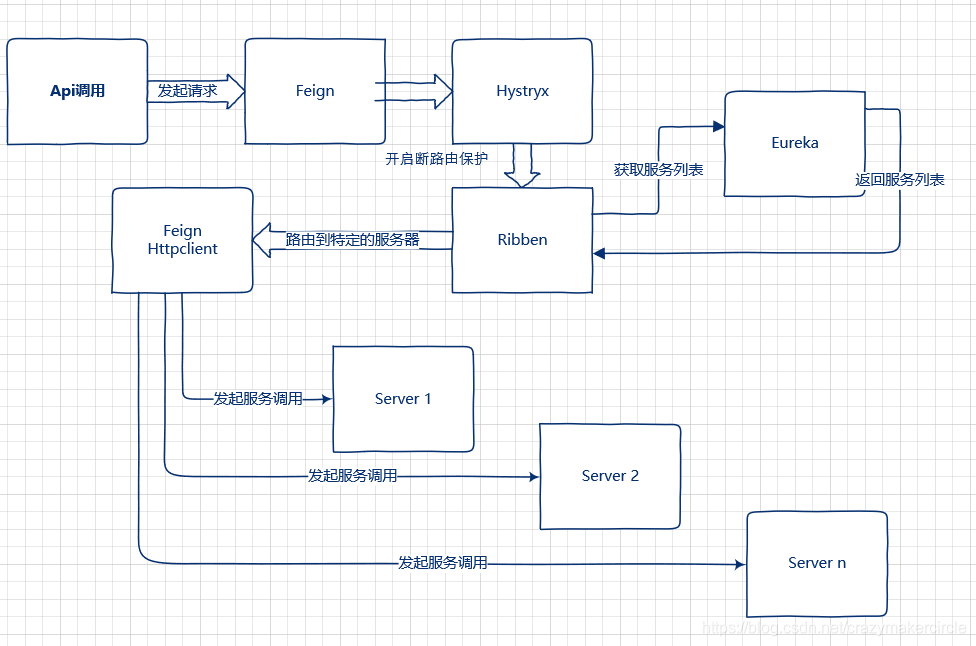

# feign-ribbon-hystrix

在微服务架构的应用中， Feign、Hystrix，Ribbon三者都是必不可少的，可以说已经成为铁三角。

## Feign介绍

Feign是一款Java语言编写的HttpClient绑定器，在Spring Cloud微服务中用于实现微服务之间的声明式调用。Feign 可以定义请求到其他服务的接口，用于微服务间的调用，不用自己再写http请求，在客户端实现，调用此接口就像远程调用其他服务一样，当请求出错时可以调用接口的实现类来返回

Feign是一个声明式的web service客户端，它使得编写web service客户端更为容易。创建接口，为接口添加注解，即可使用Feign。Feign可以使用Feign注解或者JAX-RS注解，还支持热插拔的编码器和解码器。Spring Cloud为Feign添加了Spring MVC的注解支持，并整合了Ribbon和Eureka来为使用Feign时提供负载均衡。

[feign源码的github地址](https://github.com/OpenFeign/feign)

## Ribbon介绍

Ribbon 作为负载均衡，在客户端实现，服务段可以启动两个端口不同但servername一样的服务

Ribbon是Netflix发布的开源项目，主要功能是提供客户端的软件负载均衡算法，将Netflix的中间层服务连接在一起。Ribbon客户端组件提供一系列完善的配置项如连接超时，重试等。简单的说，就是在配置文件中列出Load Balancer后面所有的机器，Ribbon会自动的帮助你基于某种规则（如简单轮询，随机连接等）去连接这些机器。我们也很容易使用Ribbon实现自定义的负载均衡算法。简单地说，Ribbon是一个客户端负载均衡器。

Ribbon工作时分为两步：第一步先选择 Eureka Server, 它优先选择在同一个Zone且负载较少的Server；第二步再根据用户指定的策略，在从Server取到的服务注册列表中选择一个地址。其中Ribbon提供了多种策略，例如轮询、随机、根据响应时间加权等。

[ribbon源码的github地址](https://github.com/Netflix/ribbon)

## Hystrix介绍

Hystrix作为熔断流量控制，在客户端实现，在方法上注解，当请求出错时可以调用注解中的方法返回

Hystrix熔断器，容错管理工具，旨在通过熔断机制控制服务和第三方库的节点,从而对延迟和故障提供更强大的容错能力。在Spring Cloud Hystrix中实现了线程隔离、断路器等一系列的服务保护功能。它也是基于Netflix的开源框架 Hystrix实现的，该框架目标在于通过控制那些访问远程系统、服务和第三方库的节点，从而对延迟和故障提供更强大的容错能力。Hystrix具备了服务降级、服务熔断、线程隔离、请求缓存、请求合并以及服务监控等强大功能。

[Hystrix源码的github地址](https://github.com/Netflix/hystrix)

## 三者之间的关系图

如果微服务项目加上了spring-cloud-starter-netflix-hystrix依赖，那么，feign会通过代理模式， 自动将所有的方法用 hystrix 进行包装。

在Spring Cloud微服务体系下，微服务之间的互相调用可以通过Feign进行声明式调用，在这个服务调用过程中Feign会通过Ribbon从服务注册中心获取目标微服务的服务器地址列表，之后在网络请求的过程中Ribbon就会将请求以负载均衡的方式打到微服务的不同实例上，从而实现Spring Cloud微服务架构中最为关键的功能即服务发现及客户端负载均衡调用。

另一方面微服务在互相调用的过程中，为了防止某个微服务的故障消耗掉整个系统所有微服务的连接资源，所以在实施微服务调用的过程中我们会要求在调用方实施针对被调用微服务的熔断逻辑。而要实现这个逻辑场景在Spring Cloud微服务框架下我们是通过Hystrix这个框架来实现的。

调用方会针对被调用微服务设置调用超时时间，一旦超时就会进入熔断逻辑，而这个故障指标信息也会返回给Hystrix组件，Hystrix组件会根据熔断情况判断被调微服务的故障情况从而打开熔断器，之后所有针对该微服务的请求就会直接进入熔断逻辑，直到被调微服务故障恢复，Hystrix断路器关闭为止。

三者之间的关系图，大致如下：



## Feign典型配置说明

Feign自身可以支持多种HttpClient工具包，例如OkHttp及Apache HttpClient，针对Apache HttpClient的典型配置如下：

```yaml
feign:
  #替换掉JDK默认HttpURLConnection实现的 Http Client
  httpclient:
    enabled: true
  hystrix:
    enabled: true
  client:
    config:
      default:
       #连接超时时间
        connectTimeout: 5000
       #读取超时时间
        readTimeout: 5000
```

## Hystrix配置说明

在Spring Cloud微服务体系中Hystrix主要被用于实现实现微服务之间网络调用故障的熔断、过载保护及资源隔离等功能。

```yaml
hystrix:
  propagate:
    request-attribute:
      enabled: true
  command:
    #全局默认配置
    default:
      #线程隔离相关
      execution:
        timeout:
          #是否给方法执行设置超时时间，默认为true。一般我们不要改。
          enabled: true
        isolation:
          #配置请求隔离的方式，这里是默认的线程池方式。还有一种信号量的方式semaphore，使用比较少。
          strategy: threadPool
          thread:
            #方式执行的超时时间，默认为1000毫秒，在实际场景中需要根据情况设置
            timeoutInMilliseconds: 10000
            #发生超时时是否中断方法的执行，默认值为true。不要改。
            interruptOnTimeout: true
            #是否在方法执行被取消时中断方法，默认值为false。没有实际意义，默认就好！
            interruptOnCancel: false
  circuitBreaker:   #熔断器相关配置
    enabled: true   #是否启动熔断器，默认为true，false表示不要引入Hystrix。
    requestVolumeThreshold: 20     #启用熔断器功能窗口时间内的最小请求数，假设我们设置的窗口时间为10秒，
    sleepWindowInMilliseconds: 5000    #所以此配置的作用是指定熔断器打开后多长时间内允许一次请求尝试执行，官方默认配置为5秒。
    errorThresholdPercentage: 50   #窗口时间内超过50%的请求失败后就会打开熔断器将后续请求快速失败掉,默认配置为50
```

## Ribbon配置说明

Ribbon在Spring Cloud中对于支持微服之间的通信发挥着非常关键的作用，其主要功能包括客户端负载均衡器及用于中间层通信的客户端。在基于Feign的微服务通信中无论是否开启Hystrix，Ribbon都是必不可少的，Ribbon的配置参数主要如下：

```yaml
ribbon:
  eager-load:
    enabled: true
  #说明：同一台实例的最大自动重试次数，默认为1次，不包括首次
  MaxAutoRetries: 1
  #说明：要重试的下一个实例的最大数量，默认为1，不包括第一次被调用的实例
  MaxAutoRetriesNextServer: 1
  #说明：是否所有的操作都重试，默认为true
  OkToRetryOnAllOperations: true
  #说明：从注册中心刷新服务器列表信息的时间间隔，默认为2000毫秒，即2秒
  ServerListRefreshInterval: 2000
  #说明：使用Apache HttpClient连接超时时间，单位为毫秒
  ConnectTimeout: 3000
  #说明：使用Apache HttpClient读取的超时时间，单位为毫秒
  ReadTimeout: 3000
```

## 配置超时重试关系

如上图所示，在Spring Cloud中使用Feign进行微服务调用分为两层：Hystrix的调用和Ribbon的调用，Feign自身的配置会被覆盖。

而如果开启了Hystrix，那么Ribbon的超时时间配置与Hystrix的超时时间配置则存在依赖关系，因为涉及到Ribbon的重试机制，所以一般情况下都是Ribbon的超时时间小于Hystrix的超时时间，否则会出现以下错误：

> 2019-10-12 21:56:20,208 111231 \[http-nio-8084-exec-2] WARN o.s.c.n.z.f.r.s.AbstractRibbonCommand - The Hystrix timeout of 10000ms for the command operation is set lower than the combination of the Ribbon read and connect timeout, 24000ms.

Ribbon和Hystrix的超时时间配置的关系

那么Ribbon和Hystrix的超时时间配置的关系具体是什么呢？如下：

> Hystrix的超时时间=Ribbon的重试次数(包含首次) \* (ribbon.ReadTimeout + ribbon.ConnectTimeout)

而Ribbon的重试次数的计算方式为：

> Ribbon重试次数(包含首次)= 1 + ribbon.MaxAutoRetries + ribbon.MaxAutoRetriesNextServer + (ribbon.MaxAutoRetries \* ribbon.MaxAutoRetriesNextServer)

以上图中的Ribbon配置为例子，Ribbon的重试次数=1+(1+1+1)=4，所以Hystrix的超时配置应该>=4\*(3000+3000)=24000毫秒。在Ribbon超时但Hystrix没有超时的情况下，Ribbon便会采取重试机制；而重试期间如果时间超过了Hystrix的超时配置则会立即被熔断（fallback）。

如果不配置Ribbon的重试次数，则Ribbon默认会重试一次，加上第一次调用Ribbon，总的的重试次数为2次，以上述配置参数为例，Hystrix超时时间配置为2\*6000=12000，由于很多情况下，大家一般不会主动配置Ribbon的重试次数，所以这里需要注意下！强调下，以上超时配置的值只是示范，超时配置有点大不太合适实际的线上场景，大家根据实际情况设置即可！

说明下，如果不启用Hystrix，Feign的超时时间则是Ribbon的超时时间，Feign自身的配置也会被覆盖。

## 参考资料

[https://www.cnblogs.com/crazymakercircle/p/11664812.html](https://www.cnblogs.com/crazymakercircle/p/11664812.html)
