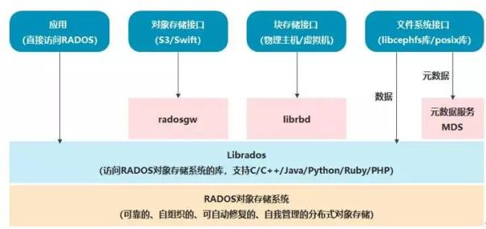
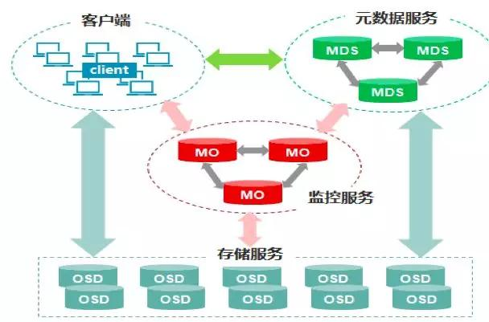
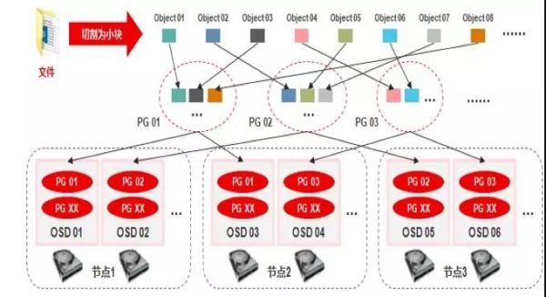
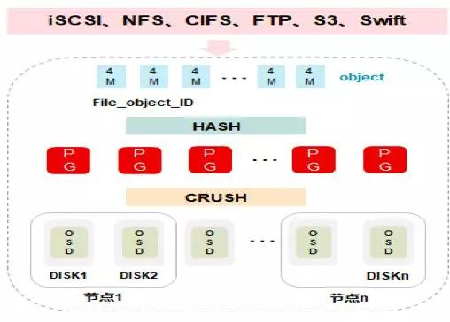
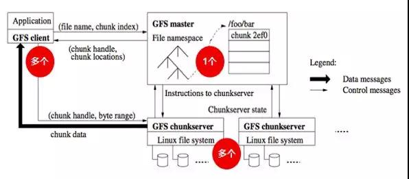
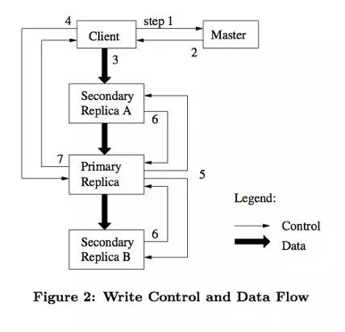
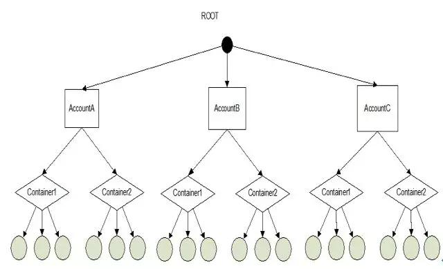
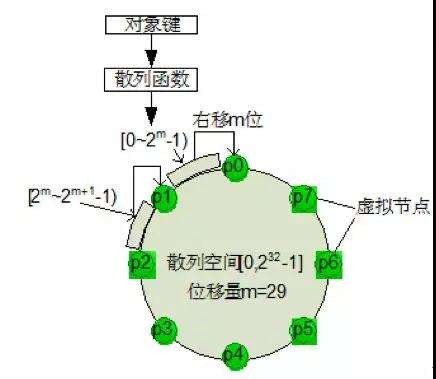
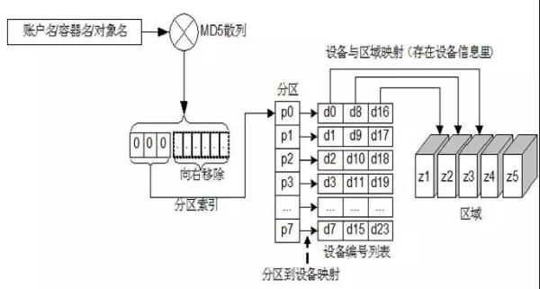
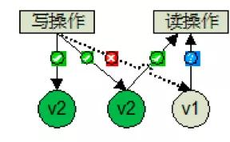

# 五大主流分布式存储技术对比分析

存储根据其类型，可分为[块存储，对象存储和文件存储](01-block-object-file.md)。在主流的分布式存储技术中，HDFS/GPFS/GFS属于文件存储，Swift属于对象存储，而Ceph可支持块存储、对象存储和文件存储，故称为统一存储。

几种主流分布式存储技术的特点比较如下：

| -       | Ceph    | GFS     | HDFS    | Swift   | Lustre |
| ------- | ------- | ------- | ------- | ------- | ------ |
| 开源属性    | 开源      | 闭源      | 开源      | 开源      | 开源     |
| 系统架构    | 去中心     | 中心      | 中心      | 去中心     | 中心     |
| 数据存储方式  | 块，文件，对象 | 文件      | 文件      | 对象      | 文件     |
| 元数据节点数量 | N       | 1       | 1-MS    | N       | 1      |
| 数据冗余    | 多副本/纠删码 | 多副本/纠删码 | 多副本/纠删码 | 多副本/纠删码 | 无      |
| 数据一致性   | 强一致性    | 最终一致性   | 过程一致性   | 弱一致性    | 无      |
| 分块大小    | 4MB     | 64MB    | 128MB   | 视对象大小   | 1MB    |
| 通用场景    | 频繁读写    | 大文件连续读写 | 大数据场景   | 云对象存储   | HPC超算  |

## 一、 Ceph

Ceph最早起源于Sage就读博士期间的工作、成果于2004年发表，并随后贡献给开源社区。经过多年的发展之后，已得到众多云计算和存储厂商的支持，成为应用最广泛的开源分布式存储平台。

Ceph根据场景可分为对象存储、块设备存储和文件存储。Ceph相比其它分布式存储技术，其优势点在于：它不单是存储，同时还充分利用了存储节点上的计算能力，在存储每一个数据时，都会通过计算得出该数据存储的位置，尽量将数据分布均衡。同时，由于采用了CRUSH、HASH等算法，使得它不存在传统的单点故障，且随着规模的扩大，性能并不会受到影响。

### 1.Ceph的主要架构

Ceph的最底层是RADOS(分布式对象存储系统)，它具有可靠、智能、分布式等特性，实现高可靠、高可拓展、高性能、高自动化等功能，并最终存储用户数据。RADOS系统主要由两部分组成，分别是OSD和Monitor。

RADOS之上是LIBRADOS，LIBRADOS是一个库，它允许应用程序通过访问该库来与RADOS系统进行交互，支持多种编程语言，比如C、C++、Python等。

基于LIBRADOS层开发的有三种接口，分别是RADOSGW、librbd和MDS。

RADOSGW是一套基于当前流行的RESTFUL协议的网关，支持对象存储，兼容S3和Swift。

librbd提供分布式的块存储设备接口，支持块存储。

MDS提供兼容POSIX的文件系统，支持文件存储。

### 2.Ceph的功能模块

Ceph的核心组件包括Client客户端、MON监控服务、MDS元数据服务、OSD存储服务，各组件功能如下：

Client客户端：负责存储协议的接入，节点负载均衡

MON监控服务：负责监控整个集群，维护集群的健康状态，维护展示集群状态的各种图表，如OSD Map、Monitor Map、PG Map和CRUSH Map

MDS元数据服务：负责保存文件系统的元数据，管理目录结构

OSD存储服务：主要功能是存储数据、复制数据、平衡数据、恢复数据，以及与其它OSD间进行心跳检查等。一般情况下一块硬盘对应一个OSD。

### 3.Ceph的资源划分

Ceph采用crush算法，在大规模集群下，实现数据的快速、准确存放，同时能够在硬件故障或扩展硬件设备时，做到尽可能小的数据迁移，其原理如下：

当用户要将数据存储到Ceph集群时，数据先被分割成多个object，(每个object一个object id，大小可设置，默认是4MB)，object是Ceph存储的最小存储单元。

由于object的数量很多，为了有效减少了Object到OSD的索引表、降低元数据的复杂度，使得写入和读取更加灵活，引入了pg(Placement Group )：PG用来管理object，每个object通过Hash，映射到某个pg中，一个pg可以包含多个object。

Pg再通过CRUSH计算，映射到osd中。如果是三副本的，则每个pg都会映射到三个osd，保证了数据的冗余。

### 4.Ceph的数据写入

Ceph数据的写入流程

1\) 数据通过负载均衡获得节点动态IP地址;

2\) 通过块、文件、对象协议将文件传输到节点上;

3\) 数据被分割成4M对象并取得对象ID;

4\) 对象ID通过HASH算法被分配到不同的PG;

5\) 不同的PG通过CRUSH算法被分配到不同的OSD

### 5.Ceph的特点

Ceph支持对象存储、块存储和文件存储服务，故 称为统一存储。

采用CRUSH算法，数据分布均衡，并行度高，不需要维护固定的元数据结构;

数据具有强一致，确保所有副本写入完成才返回确认，适合读多写少场景;

去中心化，MDS之间地位相同，无固定的中心节点

Ceph存在一些缺点：

去中心化的分布式解决方案，需要提前做好规划设计，对技术团队的要求能力比较高。

Ceph扩容时，由于其数据分布均衡的特性，会导致整个存储系统性能的下降。

## 二、 GFS

GFS是google的分布式文件存储系统，是专为存储海量搜索数据而设计的，2003年提出，是闭源的分布式文件系统。适用于大量的顺序读取和顺序追加，如大文件的读写。注重大文件的持续稳定带宽，而不是单次读写的延迟。

### 1.GFS的主要架构

GFS 架构比较简单，一个 GFS 集群一般由一个 master 、多个 chunkserver 和多个 clients 组成。

在 GFS 中，所有文件被切分成若干个 chunk，每个 chunk 拥有唯一不变的标识(在 chunk 创建时，由 master 负责分配)，所有 chunk 都实际存储在 chunkserver 的磁盘上。

为了容灾，每个 chunk 都会被复制到多个 chunkserve

GFS client客户端：为应用提供API，与POSIX API类似。同时缓存从GFS master读取的元数据chunk信息;

GFS master元数据服务器：管理所有文件系统的元数据，包括命令空间(目录层级)、访问控制信息、文件到chunk的映射关系，chunk的位置等。同时 master 还管理系统范围内的各种活动，包括chunk 创建、复制、数据迁移、垃圾回收等;

GFS chunksever存储节点：用于所有 chunk的存储。一个文件被分割为多个大小固定的chunk(默认64M)，每个chunk有全局唯一的chunk ID。

### 3.GFS的写入流程

1\) Client 向 master 询问要修改的 chunk在哪个 chunkserver上，以及 该chunk 其他副本的位置信息;

2\) Master 将Primary、secondary的相关信息返回给 client;

3\) Client 将数据推送给 primary 和 secondary;

4\) 当所有副本都确认收到数据后，client 发送写请求给 primary，primary 给不同 client 的操作分配序号，保证操作顺序执行;

5\) Primary 把写请求发送到 secondary，secondary 按照 primary 分配的序号顺序执行所有操作;

6\) 当 Secondary 执行完后回复 primary 执行结果;

7\) Primary 回复 client 执行结果。

由上述可见，GFS在进行写数据时，有如下特点：

GFS在数据读写时，数据流与控制流是分开的，并通过租约机制，在跨多个副本的数据写入中, 保障顺序一致性;

Master将chunk租约发放给其中一个副本，这个副本称为主副本，由主副本确定chunk的写入顺序，次副本则遵守这个顺序，这样就保障了全局顺序一致性;

Master返回客户端主副本和次副本的位置信息，客户端缓存这些信息以备将来使用，只有当主副本所在chunkserver不可用或返回租约过期了，客户端才需要再次联系Master;

GFS采用链式推送，以最大化利用每个机器的网络带宽，避免网络瓶颈和高延迟连接，最小化推送延迟;

GFS使用TCP流式传输数据，以最小化延迟。

### GFS特点

适合大文件场景的应用，特别是针对GB级别的大文件，适用于数据访问延时不敏感的搜索类业务

中心化架构，只有1个master处于active状态

缓存和预取，通过在client端缓存元数据，尽量减少与master的交互，通过文件的预读取来提升并发性能

高可靠性，master需要持久化的数据会通过操作日志与checkpoint的方式存放多份，故障后master会自动切换重启。

## 三、 HDFS

HDFS(Hadoop Distributed File System)，是一个适合运行在通用硬件(commodity hardware)上的分布式文件系统，是Hadoop的核心子项目，是基于流数据模式访问和处理超大文件的需求而开发的。该系统仿效了谷歌文件系统(GFS)，是GFS的一个简化和开源版本。

### 1.HDFS的主要架构

HDFS Client(客户端)：从NameNode获取文件的位置信息，再从DataNode读取或者写入数据。此外，client在数据存储时，负责文件的分割;

NameNode(元数据节点)：管理名称空间、数据块(Block)映射信息、配置副本策略、处理客户端读写请求;

DataNode(存储节点)：负责执行实际的读写操作，存储实际的数据块,同一个数据块会被存储在多个DataNode上;

Secondary NameNode：定期合并元数据，推送给NameNode，在紧急情况下，可辅助NameNode的HA恢复。

### 2.HDFS的特点(vs GFS)

分块更大，每个数据块默认128MB;

不支持并发，同一时刻只允许一个写入者或追加者;

过程一致性,写入数据的传输顺序与最终写入顺序一致;

Master HA，2.X版本支持两个NameNode，(分别处于Active和Standby状态)，故障切换时间一般几十秒到数分钟

### 3.HDFS适合的应用场景

适用于大文件、大数据处理，处理数据达到 GB、TB、甚至PB级别的数据。

适合流式文件访问，一次写入，多次读取。

文件一旦写入不能修改，只能追加。

### 4.HDFS不适合的场景：

低延时数据访问。

小文件存储

并发写入、文件随机修改

## 四、 Swift

Swift 最初是由Rackspace公司开发的分布式对象存储服务， 2010 年贡献给 OpenStack 开源社区。作为其最初的核心子项目之一，为其 Nova 子项目提供虚机镜像存储服务。

### 1.Swift的主要架构

Swift 采用完全对称、面向资源的分布式系统架构设计，所有组件都可扩展，避免因单点失效而影响整个系统的可用性。

Swift 组件包括

代理服务(Proxy Server)：对外提供对象服务 API，转发请求至相应的账户、容器或对象服务

认证服务(Authentication Server)：验证用户的身份信息，并获得一个访问令牌(Token)

缓存服务(Cache Server)：缓存令牌，账户和容器信息，但不会缓存对象本身的数据

账户服务(Account Server)：提供账户元数据和统计信息，并维护所含容器列表的服务

容器服务(Container Server)：提供容器元数据和统计信息，并维护所含对象列表的服务

对象服务(Object Server)：提供对象元数据和内容服务，每个对象会以文件存储在文件系统中

复制服务(Replicator)：检测本地副本和远程副本是否一致，采用推式(Push)更新远程副本

更新服务(Updater)：对象内容的更新

审计服务(Auditor)：检查对象、容器和账户的完整性，如果发现错误，文件将被隔离

账户清理服务(Account Reaper)：移除被标记为删除的账户，删除其所包含的所有容器和对象

### 2.Swift的数据模型

Swift的数据模型采用层次结构，共设三层：Account/Container/Object(即账户/容器/对象)，每层节点数均没有限制，可以任意扩展。数据模型如下：

### 3.一致性散列函数

Swift是基于一致性散列技术，通过计算将对象均匀分布到虚拟空间的虚拟节点上，在增加或删除节点时可大大减少需移动的数据量;

为便于高效的移位操作，虚拟空间大小通常采用 2 n;通过独特的数据结构 Ring(环)，再将虚拟节点映射到实际的物理存储设备上，完成寻址过程。如下图所示：

散列空间4 个字节(32为)，虚拟节点数最大为232，如将散列结果右移 m 位，可产生 2(32-m)个虚拟节点，(如上图中所示，当m=29 时，可产生 8 个虚拟节点)。

### 4.环的数据结构

Swift为账户、容器和对象分别定义了的环。

环是为了将虚拟节点(分区)映射到一组物理存储设备上，并提供一定的冗余度而设计的，环的数据信息包括存储设备列表和设备信息、分区到设备的映射关系、计算分区号的位移(即上图中的m)。

账户、容器和对象的寻址过程。(以对象的寻址过程为例)：

1\) 以对象的层次结构 account/container/object 作为键，采用 MD5 散列算法得到一个散列值;

2\) 对该散列值的前 4 个字节进行右移操作(右移m位)，得到分区索引号;

3\) 在分区到设备映射表里，按照分区索引号，查找该对象所在分区对应的所有物理设备编号。如下图：

### 5.Swift的一致性设计

Swift 采用 Quorum 仲裁协议

定义：N：数据的副本总数;W：写操作被确认接受的副本数量;R：读操作的副本数量

强一致性：R+W>N， 就能保证对副本的读写操作会产生交集，从而保证可以读取到最新版本;

弱一致性：R+W<=N，读写操作的副本集合可能不产生交集，此时就可能会读到脏数据;

Swift 默认配置是N=3，W=2，R=2，即每个对象会存在 3 个副本，至少需要更新 2 个副本才算写成功;如果读到的2个数据存在不一致，则通过检测和复制协议来完成数据同步。

如R=1，就可能会读到脏数据，此时，通过牺牲一定的一致性，可提高读取速度，(而一致性可以通过后台的方式完成同步，从而保证数据的最终一致性)

Quorum 协议示例如下所示：

### 6.Swift特点

原生的对象存储，不支持实时的文件读写、编辑功能

完全对称架构，无主节点，无单点故障，易于大规模扩展，性能容量线性增长

数据实现最终一致性，不需要所有副本写入即可返回，读取数据时需要进行数据副本的校验

是OpenStack的子项目之一，适合云环境的部署

Swift的对象存储与Ceph提供的对象存储区别：客户端在访问对象存储系统服务时，Swift要求客户端必须访问Swift网关才能获得数据。而Ceph可以在每个存储节点上的OSD(对象存储设备)获取数据信息; 在数据一致性方面，Swift的数据是最终一致，而Ceph是始终跨集群强一致性)

## 五、 Lustre

Lustre是基于Linux平台的开源集群(并行)文件系统，最早在1999年由皮特•布拉姆创建的集群文件系统公司(Cluster File Systems Inc.)开始研发，后由HP、Intel、Cluster File System和美国能源部联合开发，2003年正式开源，主要用于HPC超算领域。

### 1、Lustre的主要架构

Lustre组件包括：

管理服务器(MGS)：存放集群中所有Lustre文件系统的配置信息，Lustre客户通过联系MGS获取信息，可以与MDS共享存储空间。

元数据服务器(MDS): 管理存储在MDT中的元数据，使存储在一个或多个MDT中的元数据可供Lustre客户端使用，每个MDS可管理一个或多个MDT。

元数据目标(MDT): MDS用于存储元数据(例如文件名，目录，权限和文件布局)，一个MDT可用于多个MDS，但一次只能有一个MDS访问。

对象存储服务器(OSS)：为一个或多个本地OST提供文件I / O服务和网络请求处理, 通常，OSS服务于两个到八个OST。

对象存储目标(OST)：用户文件数据存储在一个或多个对象中，每个对象位于单独OST中。

Lustre客户端：运行Lustre客户端软件的计算节点，可挂载Lustre文件系统。客户端软件包括一个管理客户端(MGC)，一个元数据客户端(MDC)和多个对象存储客户端(OSC)。每个OSC对应于文件系统中的一个OST。

逻辑对象卷(LOV)通过聚合OSC以提供对所有OST的透明访问，逻辑元数据卷(LMV)通过聚合MDC提供一种对所有MDT透明的访问。

### 2、Lustre特点

支持数万个客户端系统，支持PB级存储容量，单个文件最大支持320TB容量

支持RDMA网络，大文件读写分片优化，多个OSS能获得更高的聚合带宽

缺少副本机制，存在单点故障。如果一个客户端或节点发生故障，存储在该节点上的数据在重新启动前将不可访问

适用高性能计算HPC领域，适用于大文件连续读写。

## 六、 主流分布式存储技术的比较

几种主流分布式存储技术的特点比较如下：

| -       | Ceph    | GFS     | HDFS    | Swift   | Lustre |
| ------- | ------- | ------- | ------- | ------- | ------ |
| 开源属性    | 开源      | 闭源      | 开源      | 开源      | 开源     |
| 系统架构    | 去中心     | 中心      | 中心      | 去中心     | 中心     |
| 数据存储方式  | 块，文件，对象 | 文件      | 文件      | 对象      | 文件     |
| 元数据节点数量 | N       | 1       | 1-MS    | N       | 1      |
| 数据冗余    | 多副本/纠删码 | 多副本/纠删码 | 多副本/纠删码 | 多副本/纠删码 | 无      |
| 数据一致性   | 强一致性    | 最终一致性   | 过程一致性   | 弱一致性    | 无      |
| 分块大小    | 4MB     | 64MB    | 128MB   | 视对象大小   | 1MB    |
| 通用场景    | 频繁读写    | 大文件连续读写 | 大数据场景   | 云对象存储   | HPC超算  |

此外，根据分布式存储系统的设计理念，其软件和硬件解耦，分布式存储的许多功能，包括可靠性和性能增强都由软件提供，因此大家往往会认为底层硬件已不再重要。但事实往往并非如此，我们在进行分布式存储系统集成时，除考虑选用合适的分布式存储技术以外，还需考虑底层硬件的兼容性。一般而言，分布式存储系统的产品有三种形态：软硬件一体机、硬件OEM和软件+标准硬件，大家在选择时，需根据产品的成熟度、风险规避、运维要求等，结合自身的技术力量等，选择合适的产品形态。

## 参考资料

[https://www.fmi.com.cn/index.php?m=content\&c=index\&a=show\&catid=9\&id=631446](https://www.fmi.com.cn/index.php?m=content\&c=index\&a=show\&catid=9\&id=631446)
