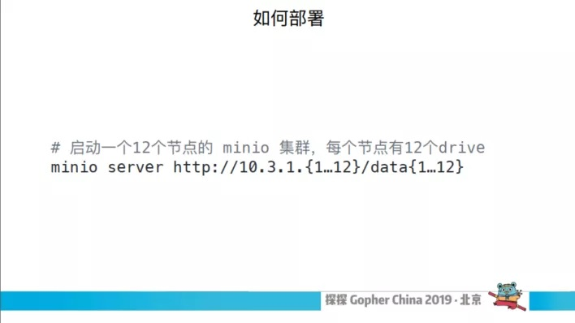

# MinIO选型

## 前言

在 2019年第五届 Gopher China 大会上，探探研发工程师于乐做了题为《基于 MINIO 的对象存储方案在探探的实践》的技术演讲。探探作为一个亿级用户千万日活的社交平台，每天会处理用户上传的大量图片、视频等媒体文件。最初将所有的对象存储在S3上，但随着存储容量越来越大，开始着手调研自己的存储系统。

经过一番比较，纯 Go 写的 Minio 最适合探探的业务场景。Minio 在设计上去繁就简，接口完全兼容 S3 协议。本次演讲会重点分享 Minio 在探探应用实践过程中积累的一些经验。以下为演讲实录。

## 探探 APP 的几个功能

### 1. 关于探探 APP


这是探探app的几个功能，它的基础功能非常简单左划右划，左划是不喜欢，右划是喜欢，当两个人相互喜欢就配对成功了，配对成功之后就开始相互聊天。你所看到的一些图片、视频还有在聊天中产生的语音，这些元素在对象存储的范畴里面，就是以对象保存下来。所以用户量的增长，探探所要存储的对象越来越多。

### 2. 存储的文件类型


这是探探目前不同类型对象所占的空间，显而易见图片是存储的一个大头，目前超过了 1PB，它定期清理所以大小基本上保持了稳定的状态。我们目前写入的 QPS 大概是 1 千左右，读取是 5 千左右，压力不是很大。之后在做技术转型的时候，我们在满足基本性能的前提下，希望方案越简单越好。

### 3. 开源方案


于是，我们就开始调研当前的一些开源方案，这些存储方案里面可以分为两种：一种是可以自定对象名称的；另外一种是系统自动生成对象名称。我们的对象名是自己生成的，里面包含了业务逻辑。像 FS 就是国内大佬开源的一个分支存储，但是因为不能自定义文件名所以不合适，左划掉。还有像领英的 Ambry、MogileFS 其实都不能自定对象名的，所以是不合适的。左上角 LeoFS 对我们来说不是很可控，所以不合适。TFS 是淘宝开源的，但是目前已经很少有人维护它并且也不是很活跃，所以当时就没有考虑。ceph 是一个比较强大的分布式存储，但是它整个系统非常复杂需要大量的人力进行维护，对我们的产品不是很符合，所以暂时不考虑。

## 初识 MINIO

剩下的比较有意思，GlusterFS 为本身是一个非常成熟的对象存储的方案。2011年左右被收购了，他们原版人马又做了另外一个存储系统MINIO，仙鹤就是他们的 logo，MINIO 对我们来说它是可控的，并且他们的文档非常详细、具体，再加上他们之前在存储方面有十几年的经验，所以就这样打动了我们，果断把它右划。

### 1. MINIO 架构

从那儿之后我们更加深入的了解一下 MINIO。首先我们先宏观的介绍一下 MINIO 的框架。


左边是 MINIO 集群的示意图，整个集群是由多个角色完全相同的节点所组成的。因为没有特殊的节点，所以任何节点宕机都不会影响整个集群节点之间的通信。通过 rest 跟 RPC 去通信的，主要是实现分布式的锁跟文件的一些操作。

右边这张图是单个节点的示意图，每个节点都单独对外提供兼容 S3 的服务。我们对 MINIO 有一个初步认识以后，再来看它的数据是怎么存储的。

### 2. MINIO 概念介绍


这块有几个概念比较重要，我们来看右边 MINIO 集群存储示意图，每一行是一个节点机器，这有 32 个节点，每个节点里有一个小方块我们称之 Drive，Drive 可以简单地理解为一个硬盘。一个节点有 32 个 Drive，相当于 32 块硬盘。Set 是另外一个概念，Set 是一组 Drive 的集合，所有红色标识的就组成了一个 Set，这两个概念是 MINIO 里面最重要的两个概念，一个对象最终是存储在 Set 上面的。

MINIO 是通过数据编码，将原来的数据编码成 N 份，N 就是一个 Set 上面 Drive 的数量，后面多次提到的 N 都是指这个意思。然后编码把数据写到对应的 Drive 上面，这就是把一个对象存储在整个 Set 上。一个集群包含多个 Set，每个对象最终存储在哪个 Set 上是根据对象的名称进行哈希，然后影射到唯一的 Set 上面，这个方式从理论上保证数据可以均匀的分布到所有的 Set 上。根据我们的观测，数据分布的也非常均匀，一个 Set 上包含多少个 Drive 是由系统自动根据集群规模算出来的，当然你可以自己去配置。一个 Set 的 Drive 系统会考虑尽可能把它放在多的节点上面，保证它的可靠性。

## MINIO 核心流程

### 1. 数据编码


刚才我们提到编码方式，我们之后会简称它是 Erasure Code 码，是通过数据的方法还原数据的一类算法。MINIO 使用的是 Reed-Solomon 的算法，他把对象编码成若干个数据块跟校验块。为了表述方便把数据块和校验块统称为编码块，之后可以通过编码块的一部分就能还原出整个对象。

大家看一下右边的图，右边就是我们刚才说的一个对象存储在一个 Set 上面，这个 Set 包含16个 Drive，其中左边灰色的一半是数据块，右边橙色的是校验块，这种方式最为可靠最多忍受一半的编码丢失或者损坏。也就是说可以从至少一半的编码块中成功还原成整个对象，这种方式的编码可靠性最强，当然它的冗余度也最高，所有编码块的大小加起来是原来的 2 倍。跟传统多副本存储的方案相比，它的冗余性比较低，它的可靠性反而更高。

其实这种方式就是将存储的机器上面空闲的 CPU 利用起来，因为存储机的 CPU 一般不怎么使用的。

下面是 Bit Rot Protection，直译过来就是比特腐烂，它是指在物理设备上的一些文件细微的损坏，没有被操作系统或硬件所察觉，但是他已经被损坏了，这是一个严重的问题。所以 Minio 把之前的编码块进行一 HighwayHash 的编码，最后要校验这个编码，以确保每个编码是正确的。基于这两个特性，Minio 的数据可靠性做的很高，另外 Minio 提供了一个管理工具，可以对所有的编码块进行校验，如果发现编码块有问题的话，再去修复它。

### 2. 存储形式


这张图比较直观的展示了每个节点上的数据存放形式，在所有对象的编码块和 mate 信息最终是以目录跟文件的形式存储在文件系统上面的。举个例子，比如说 My Bucket 就是在所有节点上的顶级目录创建了对应的目录叫 My Bucket。当我们上传一个对象的时候，就会在这个对象所对应的set上面创建一个目录叫 My Object，之后把所有编码块的数据跟 mate 的信息保存在目录下面，这就是 Minio 真实存储数据的方式。

右边这张图是 meta 信息的事例图，里面除了包含正常的 meta 信息之外还包括怎么做 ec 编码，以便之后可以解码出来。

### 3. 上传下载流程


下面我们详细看一下上传跟下载的流程。我们待会儿说所有的操作对于文化的读写操作都是针对于这个文件所属的set上所有的drive上操作的。是一个并发过程。

第一步，先根据对象名去做一个 hash 来计算出所对应的 set，然后来创建临时目录。为什么创建一个临时目录呢？因为确保数据的强一致性，所以中间数据都会被写入到临时目录里。直到所有数据写入完成之后再统一把目录录到最终的路径上去，接下来就是读数据编码，每次最多读 10 兆的数据出来，然后做编码，再被写入磁盘上，循环的过程就把数据保存下来。数据保存完之后再写入 meta 信息，然后再挪到最终的位置上面，删除临时目录，这样一个简单地文件上传的流程就做完了。

我们再看一下它的读，读就更简单了。第一步也是获取对应的 set，因为要找到对象存储在哪个set上面的，然后去读取 meta 信息，通过 meta 信息读取编码的方式，然后如何去解码。它是以 10 兆数据做 ec 编码，读的时候也是一个 part 解析，每一个 part 给它做解码然后写到 io write 里面。

我们刚刚说到做 ec 码的时候只要有一半的编码块就能还原出整个对象，所以读 meta 的时候是读了 N 份，但是读数据的时候只要读 N/2 就可以了。

### 4. IO 实现细节

刚才我们提到一个 io write。GO 里定义非常简洁的接口叫 io.writer 和 io.reader。这两个接口也特别简单，一个定义的是如何写，一个定义的是如何读的方式。

在做存储之前，其实我不是特别能理解为什么推荐所有的函数参数跟返回值里面用这些 io.writer 或者 io.reader 作为接口，作为返回值或者参数。看了这些代码之后我就觉得他非常强大，我们直接来看一下这些代码。

第一行是声明了一个 onlineDisks 的变量，它的类型是 StorageAPI 的一个数组。它其实是一个接口，它定义了如何去操作一些文件，包括文件的读写以及创建目录等等操作。它有两种实现，一种是针对本地硬盘的操作，另一种是用 writers Api 封装对所有文件进行操作的方法。还有这两种实体，因为实现了 IO writer 的一些方法，它就是一些 io write 和 io read。

下面这一段定义了 writer 的数组。他调用了一个叫 newBitrotWrite 这么一个函数，它传入

```
disk,
minioMetaTmpBucket,
tempErasureObj,
erasure.ShardFileSize(curPartSize),
DefaultBitrotAlgorithm,
erasure.ShardSize()
```

的参数进去之后，再返回一个 write。这样达到一个什么目的呢？返回的writer 里面，我们调入 write 方法的时候可以第一对写入的数据做一个编码，作为编码之后再调用上一个 api 写落盘是一个比较优雅的方式。最后 EC 编码的方式，它的传入值就是我们刚刚提到的 writers，通过读curPartReader，读出来之后通过 ec 编码然后再通过 write 的方法写进去。整个流程非常简洁，我们可以对比一下，如果我们不用 io writer, io reader 这种方案实现我们会怎么做呢？用自己的方式是自己定义一个byte 数组去做，第一步先把 curPartReader 的数据读出来，读到一部分内存里面然后再做一些编码，编码很多份。然后再做对照编码，确保每一组数据都是有值可以校验的，最后调 onlineDisks 写方法落盘。这样有什么区别呢？显而易见，第一种方式实现更为简洁一些，但实际它在定义一个 io write 的时候，在整个编码之前是把整个 io 通道都走完了，它可以确定整个 io 的通道是没有问题的，不会发生做了两次编码最后发现写磁盘的时候写不进去。

再稍微扩展一下，上面这个 StorageAPI，它有一种直接调用 writer 的方法，它其实是调用 writers server 然后再对端的设备上也同样实现了 io write 的方法。所以在最终做 EC 编码的时候，我们就已经把链路走通，可以让对端的 server 准备好开始写，这边在编码的时候那边就开始写了，这样比较有效率一些。

### 5. 借鉴

Minio 的实现里面有很多可以值得我们借鉴的地方，看到这个代码的时候也非常激动，它用的非常巧妙，这之前是没有标题的，因为我实在不知道怎么描述这个逻辑，这个逻辑还是挺复杂的。我们刚才讲读取的时候，mate 信息需要读 N 份，这个很简单我们发了 N 份等它返回。我们在读data 的时候，最少读 N/2 份就可以还原出整个数据，所以一般不会读 N 份，只要确保能读 N/2 就可以了。但是如果在读N/2的时候出现了有一个失败了，它不可避免的要去其他的机器上再读一份，这个逻辑加进去之后，整个实践就变得很复杂。


Minio 巧妙的利用了 channel 的机制，我们来大概的看一下，他定义了一个 readTriggerCh ，它最开始放了 N/2 的 p.dataBlocks 的数量，预先放了 N/2 的数量的数进去，然后下面的循环就是真正读数据的循环。

第一行是他来判断现在已经有的数据是不是已经可以解码了，如果可以解码就结束了，然后下面的 readTrigger 是不是 true，如果不是 true 的话就结束了。然后再看核心部分，它在这里起了一个（协程）(go routine)，在（go fun）先取了一个 dist，这个 dist 就是读数据的接口。如果 dist 是 nil，就相当于这个 dist 有问题，然后再给那边写一个出过来，整个循环就会再走一次。下面是真正读的过程，如果读失败的话还会再写一个true ，让循环再走一次。如果读成功的话会给你们写 false，因为写 false 循环会走第一步，看编码是不是可以完成解码。通过这样一个简单地循环就完成了刚才比较复杂的逻辑。

所以 Minio 不仅在上层的设计上非常简单，底层的实现也非常巧妙精简。

## 部署与扩容

### 1. 如何部署



Minio的确是把简洁做的非常极致，这是他如何部署集群的命名，他没有任何的配置文件，默认可以不需要配置文件。之前我说我们有调研过server，做 Minio 的时候几秒钟就可以把集群搭建起来了，这也是简洁逻辑的具体体现。

### 2. 性能压测


我们差不多了解了 Minio 大部分的功能之后，我们对它做了一次性能压测。Minio 对这方面考虑的很周全，他详细的介绍了如何用 cosBench 怎么做压测，cosBench 是专门对对象存储做压测的一个工具。所以我们就用不同的大小，不同的并发，不同的读写比例的组合进行压测：


我们来看一下压测结果。左边这一类是读请求，下面是响应时间，下面是 QPS，在4千 QPS 的时候，响应的平均延时是 35 毫秒，右边是写入的监控，写入大概在 900QPS 的时候，平均响应时间在 45 毫秒左右。这个性能不知道它是高还是低，但是完全符合我们自己的应用场景。我们自己读QPS 是5千，写的时候差不多是 1 千峰值。这只是 12 个集群的一个节点，它完全已经可以满足我们的基本需求了。

### 3. 多集群扩容


单个集群没有什么问题，我们要考虑一下如何扩容它，Minio 有一个限制，当一个集群搭建成功的时候是不可以更改集群规模。它一个对象到底存储在哪个 set，是通过固定的 hash 去寻找的，所以一旦发生更改的话 hash 就错乱了。所以他们避免这种情况存在，当一个集群搭建成功就不再依据这个功能进行变动。这样也有一个好处，像很多传统的一些对应存储的方案在扩容之后要做一个数据迁移，确保所有的数据是均匀分布在所有节点上面的。其次是他们自己之前实现了一个峰值锁叫 Dsync，这个逻辑也特别简单。在节点数量特别少的时候性能非常高，但是节点数量过多性能就下降了。功能实现最大的节点就是 32，所以导致 Minio 单个集群的最大节点数量也是 32。当时看到这个就在想，是 Minio 他们的人不够有实力做一个性能更好的分布式锁吗？难道这是他的一个性能瓶颈吗？


然后我就在 slack 上请教他们了，他们在slack上非常活跃，我们几乎任何时候去问问题都会有一些响应，这是引用他们的一些解释。这个主要意思是说他们十年做 GlusterFS 的经验来看，一个超大的集群是特别难以维护的，尤其是宕机之后的恢复时间也特别长，所以他们在 Minio 的时候的一个核心的设计理念就是简单，易于维护。

当单个集群容量有限，我们可以很简单地解决它，就是我们做多个集群。所以基于这个我们做了一个简单地多集群扩容的方案。


Minio本身提供一个叫联合模式的一种方式来组建多个集群，但是额外要引入其他的依赖。我们曾经做 AB 系统的时候，曾经用了 LB 做了根据它的请求里面的一些header做一些流量转发，这个方法非常高效简单，所以我们就借鉴了这个方案。

我们可以看右边这个图，在最上层的 LB 上根据请求的一些 header 信息录入到集群上面去，其实已经可以简单地解决这个问题了。我们可以简单说一下，比方我们在写入的时候，业务方可以在调入的时候将请求的 header加上集群信息就可以控制在哪个集群写；当配置多个集群的时候可以在多个集群写，所以写的 QPS 的容量没有什么问题。当某个集群容量达到阈值的时候就可以从配置里剔除出去变成了只读的集群。读的时候可以把集群 ID 或者信息编码到文件名上去，通过解析文件名也可以获取一个信息，这样可以录入到对应的集群，这也是比较简单地方案，但是实现了整个功能。


说到这儿的话，我们已经大概全面了解了 Minio，包括它的整体架构和核心流程的实现，但是集群的性能我们也要知道如何做多集群的扩容方案。接下来我们就开始筹划数据迁移、准备接入服务、采购机器准备上线。

### 4. 实际流量压力测试


但是我们在调研过程中几乎一个坑没有踩，我们很快把线上流量接入做实际流量的压测，跑了没多久就发现响应时间不太对劲，没有多久就到100毫秒，之后到200毫秒，然后到500毫秒，然后就报警电话来了。


我们看了一下，我们线上是 S3，S3 的下载响应时间是占用两条线，上面是原图的一个下载响应时间大概在 40 毫秒左右，裁剪的响应图片响应时间是在 20 毫秒，上传也是一样的，也是在 30 到 60 毫秒左右时间。


然后再看一下 Minio 的性能，最开始的一段时间是非常稳定的在 50 毫秒左右，没过多久就开始有了波峰而且波动非常厉害，这个究竟是什么呢？看了这些集群上的资源调动的情况，发现 io、CPU 都没有很多的负载，我们也读过一些代码，也大概了解过但是还是不知道究竟为什么性能如此之差，肯定是哪里出了问题。我们怎么去研究这个问题？

### 5. 性能分析


Minio 它自己也提供了比较好的工具，我们知道 Go 提供了一圈套核发的工具，Minio 把这些工具集中起来通过简单地命令可以对整个集群的方案的调用。你可以采集一些 CPU 内存锁的一些关系，然后得出一些可视化的图，然后去看整个的线的问题。我们看了之后其实还不知道时间为什么那么长？


无奈我们就使出了杀手锏，我们注入了一些统计运行时间的一些函数，把它关键函数统计时间记录下来。左上角的图，这是获得锁的一个图，之前我们特别怀疑是他的锁的问题，因为知觉上系统的资源像 CPU、IO 没有那么复杂，但是响应时间很高，锁就有很大的嫌疑。后面三张图是关于文件操作，它文件操作的耗时波动特别大，快不用一毫秒，慢可能几十毫秒。当时我不是特别了解磁盘的线路和系统 IO 的知识，我仔细研究了一下 IO 方面的一些知识。相信在场各位应该比我更了解一些 IO，因为我对这方面是小白，这块我就简单地把结论说一下，整个过程去看 PPT 了解。

### 6. 全面了解 IO


IO 有一个流程，然后 Buffered IO 和 Direct IO 大家了解应该知道，buffered IO 在读写的时候会经过一个 page Cache，Direct io 是绕过page Cache，直接对磁盘操作所以性能会差一些。然后下面 io Scheduler 说的是性能调动和算法，磁盘性能简单说一下结论，磁盘在顺序读写的时候是非常快的，磁盘最大的耗时是在寻道上面，如果我们做到数据读的话速度也很快，是因为有 page Cache。


了解了这些 IO 的知识以后回顾了一下碰到的问题，之前的压测结果中为什么刚开始的一段时间响应时间特别低？是因为刚开始启动的时候所有的磁盘操作并没有经过磁盘是在 page Cache 完成的。为什么之后响应时间变高了，它本来磁盘就需要那么高的时间，之前 page Cache 做了一次缓冲所以一开始时间特别低，之后 page Cache 被用尽以后会强制做一些flag操作导致之后的一些操作有的是 page Cache，有的是直接做盘，这就可以很好解释之前波动比较大的图。


这块也不细说，因为我们发现在做很多参数调优之后，整个的IO性能并没有提升，其实对于这些系统一般的调优是几个大问题，肯定是一些地方出了问题。了解那么多IO之后，我们对Minio有新的设计。

## 深度优化


再回顾一下Minio写的流程，我们刚刚说过数据最终形式就是写在文件系统上比较理想的文件，所以每次写都是随机的。随机写肯定不如顺序写，其次 EC 编码在低冗余情况下是高可靠性，但是同时也让它数量变多了，基本上一个对象写入需要做 2N 次的操作，其实 N 次是数据的操作，N 是 meta 的操作。这么一分析的话我们有一个比较简单的优化方案。

### 1. 优化方案


小文件合并成大文件是一个通用的方案也非常成熟，我们这块不用改很多Minio的架构，只需要在基础上把底层存储文件的部分稍微改一下，把原来随机写的小文件改成顺序写大文件，这样就能解决这个问题，利用page Cache 来提供磁盘的性能。具体的实现也非常简单，预先打开一个文件分配一个固定的空间，这些目的是保证文件在磁盘上真实存储的数据是连续的。当写文件的时候就给加锁保证数据写入，因为这个原因小文件的索引需要保存下来，所以我们引入了一个 levelDB 像大文件的 ID 和 size 的一些东西。我们之所以采用 levelDB 是因为它的性能是非常好的。

### 2. FIO 测试


我们在做这个之前用 FIO 测试了效果，这一页我们之前做了很多操作只是意向，并没有真正的测试它。FIO 这个功能非常强大，可以测试各种 IO 方式的一些 IO 的性能，如果测试一下在这上面会少走很多弯路，这个上面没有很多问题。顺序写比随机写性能高几百倍。在合并小文件的时候我还想过另外一个方式，同时写多个大文件还是同时写一个大文件，如果先把代码实现出来再看可能会耗费很长时间了，通过这个简单地测试一下，写多个大文件和写一个大文件是什么样的，其实差不多。


在第一版的代码，它是一个在大文件里面写小文件的函数 writeAll，刚开始给这个文件上锁，之后再解锁，然后再 IO copy 把参数里面的 IO read拷贝到大文件里面。这样一看没有什么问题，我们在压缩的时候，测试的时候也没有发现什么问题，性能非常好，并发也好。但是我们把这段代码合到 Minio 主干上去发现性能巨差，有好几百毫秒的延时。

为什么呢？之前我们提到，我们在刚开始讲上传下载流程的时候，它的IO操作接口都是传的 IO read 和 IO write。io read、io write 并不会从一开始就拷贝数据，是等所有的 io 通道打通之后才会调用最上层的编码方式或者计算写入数据，所以这块的 IO read 往上追溯到 EC 编码那块，这个就相当于从 ec 编码开始，编码的过程、网络传输的过程，再把网络传输拷到磁盘上去，拷贝的大文件里去这个力度就特别大。所以io read和io write的时候虽然简洁方便，但是也要避免不同介质的 IO 拷贝，这样不同介质有一些区别。

### 3. 性能压测


做好之后我们做一些性能压测，这时候看性能非常满意，左边大概在3500 QPS 的时候，响应时间在 35 毫秒左右，其实已经有了很大的进步。我们知道如果读数据的话，如果读的数据在 PAGE CACHE 的时候响应非常低。我们读的时候 20% 的数据是刚写入的数据，这个数据是刚写入的，是在 page cache 里面。剩下 80% 的数据其实是随机分布在硬盘上面的，所以我们的场景可以认为是大部分的数据都是读老数据，针对这个东西我们单独做了测试方案，我们利用 Minio 消息机制将它上传到对象列表写入 kafka 里面，然后写入一段时间之后再通过 KAFKA 里的文件进行压测。


之前我们说性能优化的时候，我们从理论上都知道它的性能一定会非常高，我们还会做读方面的优化，它是随机读所以也没有什么变化的。


出乎意料它的响应时间只有20几毫秒，当时不敢相信自己的眼睛。有了之前的教训之后不敢得以非常早，就仔细的分析了他的原因。因为我们数据写入数据，把列表文件清单发入到 kafka 的时候也是顺序的，所以命中了顺序读的策略，所以不是我们想要的真实的数据。我们假如随机因子之后，把读写的顺序打乱，然后读写的性能就下降。

我们再看一下 Minio 读流程，它主要发生在 IO 的地方是两个地方，一个是 meta 信息，然后再读 data 的时候至少从 N/2 个节点上度曲。每一次读取 meta 或者 data 的时候包括两个部分，第一个从 levelDB 读取索引，从大文件中读取对应的数据，因为并发读的最终时间取决于 N 个并发里面最慢的那个。在负载不是特别高的情况下，8个时间平均是单个时间的2倍左右，当负载稍微提高的时候一直是 5 到 6 倍没有上限的。

然后我们针对这个做了一个优化方案，我们把 Meta 信息，因为 Meta 信息并没有多少，我们把它进行一个压缩存到 levelDB 里，就直接读就行了不用读索引了。当 leveldb 存在性能更高的 ssd 里，set 数量越少份数就越少，相应的可靠性会降低一些，我们把满足可靠性场景下面我们调到了8，然后再来看一下整个的结果。

这是当时同样规模的集群，12 个节点，每个节点 12 个盘。在写操作有1200 个 QPS 的时候是 50 多毫秒，读的时候在 2500 QPS 的时候在 60 毫秒左右，这个差距是比较大的。

我们刚刚看到这个图，右边可以写上，我们最开始的时候有尖峰，这个可能是因为 leveIDB 的机制导致的。并且我们的场景是读取的数据大部分是冷数据，并且读的数据比写的数据高很多，现在能满足，但是我们的数据量增上去之后不是很好的选择，在这个之后我们可能会把 leveIDB 换成更合适的存储。我们的压测并没有跑多长时间，对于之前的教训整个集群至少要跑到快满的时候才能验证整个性能是否是满足需求。


我们再回顾一下 Minio，之前讲了很多设计上值得可取和借鉴的东西，我们因为对于自己的场景没有把控清楚，它在小文件上的表现其实没有那么的好，但是我们对它做一些轻微的改造之后其实是可以符合这些场景的。

### 4. 优化方案


Minio可能是一个面向于未来的存储，当然它现在可以月来做一些大文件存储，因为大文件是不存在那么多小的零碎的 IO 的。另外一个有特别深的感悟，磨刀不误砍柴工，二个意思，第一个刀是相关知识的储备，我们之前做相关存储的时候实际上对底层 IO 的实现了解特别少，所以我们会犯一些比较低级的错误，如果做好知识储备的话这些东西是完全可以避免的。另外一个刀指的是工具，我们开了一个 cosBench 的工具，我们不是很了解它的具体实现，只是做一些压测和性格分析。对一些特定的场景可能不能很好的支持，我们宁愿多花一些时间做一个自己的压缩工具来确保之后所有的结论都是正确的，这个比我们直接一上来就看整个系统受益来的多。


提问：我们压测的结果跟线上的结果不一样，这个是为什么呢？

于乐：之前压测数据是用 cosBench 方案压测的，他的工具可以制定我的并发、文件大小和读写的比例。但是我们当时忽略了一个东西，他每次压测很快就压完了得出比较漂亮的图表出来，我们当时只顾看不同比例的对接，忽略了压测结果要很长时间才能稳定下来。我们之后做真实压测的时候就发现了性能发生了问题。

提问：关于原信息的管理，最后几张PPT写的原信息也是写到 IO 里面去了，你们是几个副本还是一份？

于乐：我们之前是把一个文件直接存储在文件系统上面，现在改成存在大文件里面，所以在所有的drive是都有的，data 信息是指多份的。

提问：我从集群来看找到一个对象所对应的哪个文件，这种映射关系是哪一种呢？通过对象名字我怎样找到对象存储的路径？

于乐：一个对象首先它会根据它的名称做一次哈希，然后存储的时候KV，K就是对象的名称，这样上面是唯一的表示，在一个对象里面名字是唯一标识，根据这个就可以找到 meta 以及 data，因为 meta 在文件系统中存的就是一个文件，我们以同样的方式存进去就可以了。

提问：最核心就是相对于做一个哈希，找这个文件或者这组对应的set。

于乐：之前我们了解过很多关于meta的东西，它可以通过缓存可以取mas信息，在Minio架构里面他们希望所有的节点都是公平的，这样就省去了其他的一些负担。

## Q\&A

## 参考资料

[https://mp.weixin.qq.com/s?\__biz=MzA4ODg0NDkzOA==\&mid=2247487119\&idx=1\&sn=6e09abb32392e015911be3a1d7f066e5\&source=41#wechat_redirect](https://mp.weixin.qq.com/s?\__biz=MzA4ODg0NDkzOA==\&mid=2247487119\&idx=1\&sn=6e09abb32392e015911be3a1d7f066e5\&source=41#wechat_redirect)
