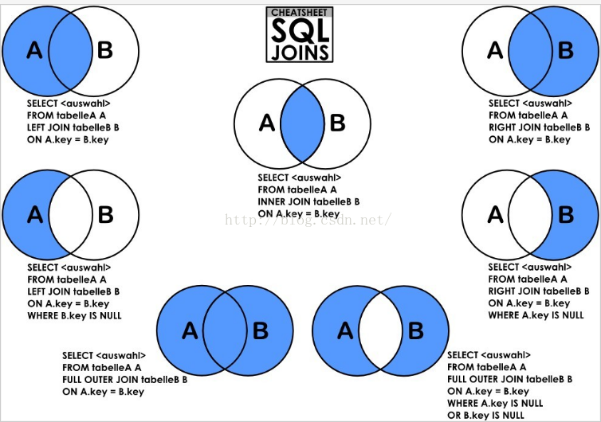

# 基本操作

## mysql 常用命令模板

## 创建数据库

## drop database if exists db_guest;

## create database if not exists db_guest default charset=utf8;

## 创建用户

## insert into mysql.user(Host,User,Password) values("localhost","guest",password("guest"));

## 更新用户密码

## SET PASSWORD FOR 'root'@'localhost' = PASSWORD('newpass');

## 删除用户

## use mysql

## Delete from user where user = "user_name" and host = "host_name" ;

## 使改变的用户生效

## flush privileges;

## 对用户授权指定的数据库的表的所有权限

## GRANT ALL PRIVILEGES ON db_guest.\* TO 'guest'@'localhost' IDENTIFIED BY 'guest' WITH GRANT OPTION;

## 对用户授权指定的数据库的表的指定权限

## grant select,update on db_guest.\* to 'guest'@'localhost'   identified by 'guest';

## 撤销权限 Revoke privileges (columns) on what from user ;  privileges是要取消的权限，user是要被取消权限的用户名

## revoke all on phpmyadmin.\* from guest@localhost ;

## 设置phpadmin初始化用户 username:guest password:guest databasename:db_guest

drop database if exists db_guest; drop database if exists phpmyadmin; create database if not exists db_guest default charset=utf8; create database if not exists phpmyadmin default charset=utf8; insert into mysql.user(Host,User,Password) values("localhost","guest",password("guest")); flush privileges; GRANT ALL PRIVILEGES ON db_guest._ TO 'guest'@'localhost' IDENTIFIED BY 'guest' WITH GRANT OPTION; GRANT ALL PRIVILEGES ON phpmyadmin._ TO 'guest'@'localhost' IDENTIFIED BY 'guest' WITH GRANT OPTION;

## mysql.server start

## mysql.server stop

## mysql -u root -p

## exit

## select \* from mysql.user;//查询所有用户

## status;

## select version();

## show global variables like 'port';

mysql> set character_set_client=utf8; mysql> set character_set_connection=utf8; mysql> set character_set_database=utf8; mysql> set character_set_results=utf8; mysql> set character_set_server=utf8; mysql> set character_set_system=utf8; mysql> set collation_connection=utf8; mysql> set collation_database=utf8; mysql> set collation_server=utf8; mysql> show variables like 'character_set_%';

## 链接查询



## 路人甲java的mysql教程（阿里P7）

[**第1篇：mysql基础知识**](https://mp.weixin.qq.com/s?\__biz=MzA5MTkxMDQ4MQ==\&mid=2648933257\&idx=1\&sn=0f0086a2465a2fcae13d3fea65064803\&chksm=88621bb7bf1592a1ac94fe4107ba1ef26a0fa97e1bf9aea7279009d8bd240f1ef7d27aa10393\&token=1876080189\&lang=zh_CN#rd)

 [**第2篇：详解mysql数据类型（重点）**](https://mp.weixin.qq.com/s?\__biz=MzA5MTkxMDQ4MQ==\&mid=2648933270\&idx=1\&sn=409080e17352da2035b0bfdf63ccdfde\&chksm=88621ba8bf1592beb2ef6106d6bf9f3eccd48d6814c7031f36e3c8be68821f17cf065129688c\&token=1876080189\&lang=zh_CN#rd)

 [**第3篇：管理员必备技能(必须掌握)**](https://mp.weixin.qq.com/s?\__biz=MzA5MTkxMDQ4MQ==\&mid=2648933279\&idx=1\&sn=f8591b95362cb3c352d895b1289d665a\&chksm=88621ba1bf1592b72a43a62e3f310695e8b87f17932d052145622c3edbb70ef8cb987849fc3e\&token=516655478\&lang=zh_CN#rd)

 [**第4篇：DDL常见操作**](https://mp.weixin.qq.com/s?\__biz=MzA5MTkxMDQ4MQ==\&mid=2648933289\&idx=1\&sn=c4f212c312ea86e08ad322caddd05e38\&chksm=88621b97bf159281156ee3be510a1a15234531d2c97d66957e67377829ab23779809ea55bbde\&token=1484565200\&lang=zh_CN#rd)

 [**第5篇：DML操作汇总（insert,update,delete）**](https://mp.weixin.qq.com/s?\__biz=MzA5MTkxMDQ4MQ==\&mid=2648933296\&idx=1\&sn=1c56256d60c5847a944d87c8cfc9c14d\&chksm=88621b8ebf159298b0789e2994d2aaf8b582effc7d8c1ba715deaca11c86a9dc8ac730878dc0\&token=2000571846\&lang=zh_CN#rd)

 [**第6篇：select查询基础篇**](https://mp.weixin.qq.com/s?\__biz=MzA5MTkxMDQ4MQ==\&mid=2648933300\&idx=1\&sn=bedef4d430dc76141e42e42ef6acfaa6\&chksm=88621b8abf15929caae7904019c946a396885a33855ca465bacdd4187538005ebc3c116888f5\&token=1814800041\&lang=zh_CN#rd)

 [**第7篇：玩转select条件查询，避免采坑**](https://mp.weixin.qq.com/s?\__biz=MzA5MTkxMDQ4MQ==\&mid=2648933305\&idx=1\&sn=2c5ba0bea6fcdd57d86cecd63541f91a\&chksm=88621b87bf1592915086c1e945119fcc95af6aa1127b90ef1b56b018083bfd787ad95efde918\&token=1144227002\&lang=zh_CN#rd)

 [**第8篇：详解排序和分页(order by & limit)**](https://mp.weixin.qq.com/s?\__biz=MzA5MTkxMDQ4MQ==\&mid=2648933309\&idx=1\&sn=0f7dfec8bc70e67daa7159ee219325b8\&chksm=88621b83bf1592951d949179061f39a1f4266b2879bc9a25af4da3b4b29f69ab1fcc595a462f\&token=516674265\&lang=zh_CN#rd)

 [**第9篇：分组查询详解（group by & having）**](https://mp.weixin.qq.com/s?\__biz=MzA5MTkxMDQ4MQ==\&mid=2648933315\&idx=1\&sn=4abf2b34a53a85cbd4a3b9ee31fcd398\&chksm=88621bfdbf1592eb6a5a13202588dde9068ac7e6391d8dbf3fde33647bf0e044839ba4228216\&token=1937580929\&lang=zh_CN#rd)

 [**第10篇：常用的几十个函数详解**](https://mp.weixin.qq.com/s?\__biz=MzA5MTkxMDQ4MQ==\&mid=2648933321\&idx=1\&sn=110f6cacb90845bf2327fbcd7acd708c\&chksm=88621bf7bf1592e1f1c0f2f01e40d4bd63a48d98daa4ba1157ecad4c6c6520d18b4b2c24c906\&token=1096041061\&lang=zh_CN#rd)

 [**第11篇：深入了解连接查询及原理**](https://mp.weixin.qq.com/s?\__biz=MzA5MTkxMDQ4MQ==\&mid=2648933325\&idx=1\&sn=33274227db275a3570e1e43ccdd4f49c\&chksm=88621bf3bf1592e5b75f537e21961c4295fafb782dbf31c0c1cbf9e36f5f4ed44d31cdad68b3\&token=1832579722\&lang=zh_CN#rd)

 [**第12篇：子查询**](https://mp.weixin.qq.com/s?\__biz=MzA5MTkxMDQ4MQ==\&mid=2648933342\&idx=2\&sn=2e41daa0926a9c32d5fddd23590391aa\&chksm=88621be0bf1592f66904a184858df7c11129e8b545c7626b8b6c1fcc32d3dfdd9ab21aeda8e5\&token=386795745\&lang=zh_CN#rd)

 [**第13篇：细说NULL导致的神坑，让人防不胜防**](https://mp.weixin.qq.com/s?\__biz=MzA5MTkxMDQ4MQ==\&mid=2648933349\&idx=1\&sn=6e81f9046119cda43f8eb602d1139ef0\&chksm=88621bdbbf1592cd9a20ec4715fe9f9459d079b641b04f607999c106cd52453d8c8508d939d7\&token=386795745\&lang=zh_CN#rd)

 [**第14篇：详解事务**](https://mp.weixin.qq.com/s?\__biz=MzA5MTkxMDQ4MQ==\&mid=2648933355\&idx=1\&sn=b426ad28dfc2a64bba813df5b7c341a4\&chksm=88621bd5bf1592c3c08e441398f699d0a4c2303a51519aac169447f22765cc613dfc3d991f8b\&token=385335213\&lang=zh_CN#rd)

 [**第15篇：详解视图**](https://mp.weixin.qq.com/s?\__biz=MzA5MTkxMDQ4MQ==\&mid=2648933370\&idx=1\&sn=4fe9b8e2aba766988c503737d34d9836\&chksm=88621bc4bf1592d2b06d659884bf9881bd207a042ac36176f12808bd72f235e8e3404366259e\&token=84059034\&lang=zh_CN#rd)

 [**第16篇：变量详解**](https://mp.weixin.qq.com/s?\__biz=MzA5MTkxMDQ4MQ==\&mid=2648933374\&idx=1\&sn=c294b6a69564a4c98d4c0cb29aeb9ac0\&chksm=88621bc0bf1592d650752c44ca50540c1fa0c88c0a514019f1317559e13098de7dac37ddfc05\&token=1531009350\&lang=zh_CN#rd)

 [**第17篇：存储过程&自定义函数详解**](https://mp.weixin.qq.com/s?\__biz=MzA5MTkxMDQ4MQ==\&mid=2648933382\&idx=1\&sn=4cf80b4f50c80dcc8171d2128b47cf63\&chksm=88621c38bf15952e193177a0ba3e03beeaeed996553ce6900f91518310332e99c915e8be2566\&token=1341741305\&lang=zh_CN#rd)

 [**第18篇：流程控制语句**](https://mp.weixin.qq.com/s?\__biz=MzA5MTkxMDQ4MQ==\&mid=2648933388\&idx=1\&sn=59cb1d23845e45894bb72c1e2479f074\&chksm=88621c32bf1595241573e4194912ca60a51eb8477f4b49492e26668c9bebc032e9d6672e7fdd\&token=1832749573\&lang=zh_CN#rd)

 [**第19篇：游标详解**](https://mp.weixin.qq.com/s?\__biz=MzA5MTkxMDQ4MQ==\&mid=2648933392\&idx=1\&sn=ff29e380b42a0aa7cb1dc7659d745686\&chksm=88621c2ebf1595380f99d9c4c89581638a27a5cf356de35d31aa9ae7ac17e63abe0e4adc813c\&token=1479782197\&lang=zh_CN#rd)

 [**第20篇：异常捕获及处理详解**](https://mp.weixin.qq.com/s?\__biz=MzA5MTkxMDQ4MQ==\&mid=2648933396\&idx=1\&sn=b6cc5d5287bf43d94e6706fa217aa8cb\&chksm=88621c2abf15953c3200c6d4d945ad70bdd2177f020f8e2229ae269153bbc8bf251af83e1135\&token=1846211483\&lang=zh_CN#rd)

 [**第21篇：什么是索引？**](https://mp.weixin.qq.com/s?\__biz=MzA5MTkxMDQ4MQ==\&mid=2648933400\&idx=1\&sn=61af771f10342ee4956efea6749abd71\&chksm=88621c26bf15953041a6bc65734edf788af711ff176ad36884fe6411e5c4cfd0bf967e0e33fc\&token=1781447741\&lang=zh_CN#rd)

 [**第22篇：mysql索引原理详解**](https://mp.weixin.qq.com/s?\__biz=MzA5MTkxMDQ4MQ==\&mid=2648933422\&idx=1\&sn=f28a92c195d914d636117c2316524c5e\&chksm=88621c10bf159506af8a3c6b947e32b11414ff72ed3ad19a9fa0b0cec0be6c3ae3931117b3d2\&token=1335865345\&lang=zh_CN#rd)

## 记录一次存储过程

```
CREATE DEFINER=`root`@`%` PROCEDURE `copyTaskToNew`(IN `originJobGroup` int,IN `targetJobGroup` int)
BEGIN
    DECLARE done BOOLEAN DEFAULT 0 ;
  DECLARE jobCron varchar(128) DEFAULT  '0 0/3 * * * ?';
  DECLARE jobDesc varchar(255) DEFAULT  '';
  DECLARE addTime datetime DEFAULT NULL;
  DECLARE updateTime datetime DEFAULT NULL;
  DECLARE author varchar(64) DEFAULT NULL;
  DECLARE alarmEmail varchar(255) DEFAULT NULL;
  DECLARE executorRouteStrategy varchar(50) DEFAULT NULL;
  DECLARE executorHandler varchar(255) DEFAULT NULL;
  DECLARE executorParam varchar(5120) DEFAULT NULL;
  DECLARE executorBlockStrategy varchar(50) DEFAULT NULL;
  DECLARE executorTimeout int(11) DEFAULT '0';
  DECLARE executorFailRetryCount int(11) DEFAULT '0';
  DECLARE glueType varchar(50) DEFAULT 'BEAN';
  DECLARE glueSource mediumtext;
  DECLARE glueRemark varchar(128) DEFAULT NULL;
  DECLARE glueUpdatetime datetime DEFAULT NULL;
  DECLARE childJobid varchar(255) DEFAULT NULL;

    DECLARE cur CURSOR FOR 
    SELECT 
    job_cron as jobCron,
    job_desc,
    add_time,
        update_time,
        author,
        alarm_email,
        executor_route_strategy,
        executor_handler,
        executor_param,
        executor_block_strategy,
        executor_timeout,
        executor_fail_retry_count,
        glue_type,
        glue_source,
        glue_remark,
        glue_updatetime,
        child_jobid
  FROM
    XXL_JOB_QRTZ_TRIGGER_INFO 
  WHERE job_group = originJobGroup;

    DECLARE CONTINUE HANDLER FOR SQLSTATE '02000' SET done = 1 ;

    OPEN cur ;
    REPEAT
        FETCH cur INTO 
    jobCron,
    jobDesc,
    addTime,
        updateTime,
        author,
        alarmEmail,
        executorRouteStrategy,
        executorHandler,
        executorParam,
        executorBlockStrategy,
        executorTimeout,
        executorFailRetryCount,
        glueType,
        glueSource,
        glueRemark,
        glueUpdatetime,
        childJobid;


    INSERT INTO XXL_JOB_QRTZ_TRIGGER_INFO
        (
            job_group,
            job_cron,
            job_desc,
            add_time,
            update_time,
            author,
            alarm_email,
            executor_route_strategy,
            executor_handler,
            executor_param,
            executor_block_strategy,
            executor_timeout,
            executor_fail_retry_count,
            glue_type,
            glue_source,
            glue_remark,
            glue_updatetime,
            child_jobid
        ) 
    VALUES
        (
            targetJobGroup,
            jobCron,
            jobDesc,
            addTime,
            updateTime,
            author,
            alarmEmail,
            executorRouteStrategy,
            executorHandler,
            executorParam,
            executorBlockStrategy,
            executorTimeout,
            executorFailRetryCount,
            glueType,
            glueSource,
            glueRemark,
            glueUpdatetime,
            childJobid
        ) ;
    UNTIL done 
  END REPEAT ;
  CLOSE cur ;
END
```
