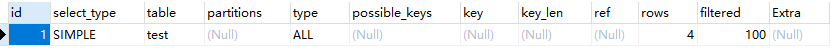
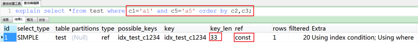

# 调优1

## 1.硬件/系统方面

对硬件设备和操作系统设置进行优化，例如调整操作系统参数、禁用Swap、增加内存、升级固态硬盘等等。

## 2.服务进程方面

对mysql服务的配置进行优化，例如对链接数的管理，对索引缓存、查询缓存、排序缓存等各种缓存大小进行优化;

## 3.SQL语句方面

对业务中使用的SQL语句进行优化，例如调整Where查询条件；

* 第1个原则：要找的最需要优化的SQL语句。要么是使用最频繁的语句，要么是优化后提高最明显的语句，可以通过查询MySQL的慢查询日志来发现需要进行优化的SQL语句；
* 第2个原则：要学会利用MySQL提供的分析工具。例如使用Explain来分析语句的执行计划，看看是否使用了索引，使用了哪个索引，扫描了多少记录，是否使用文件排序等等。或者利用Profile命令来分析某个语句执行过程中各个分步的耗时；
* 第3个原则：要注意使用查询语句是要避免使用Select \*，而是应该指定具体需要获取的字段。原因一是可以避免查询出不需要使用的字段，二是可以避免查询列字段的元信息；
* 第4个原则：是尽量使用Prepared Statements，一个是性能更好，另一个是可以防止SQL注入；
* 第5个原则：是尽量使用索引扫描来进行排序，也就是尽量在有索引的字段上进行排序操作。

### 确定慢查询

查看是否开启慢查询记录,以及记录文件存放位置

```
show variables like 'slow_query%';
```

| Variable_name       | Value                        |
| ------------------- | ---------------------------- |
| slow_query_log      | OFF                          |
| slow_query_log_file | /home/mysql/mysqldb-slow.log |

开启慢查询记录，以及设置慢查询记录文件位置

```
set global slow_query_log = on;
set global slow_query_log_file = /tmp/mysql_slow/mysqldb-slow.log;
```

查看慢查询阈值，系统默认为10S

```
show global  variables like 'long_query_time';
```

修改慢查询阈值

```
set global long_query_time =1;
```

慢查询日志无记录原因

* 在线动态设置long_query_time，比如 set global long_query_time=0.5，该设置对当前已建立的连接不会生效。
* 慢SQL里有大量锁等待，慢SQL的执行时间不包含锁等待的时间。
* log_slow_admin_statements=0，因此alter, create index, analyze table等操作即使超过 long_query_time，也不会记录到慢日志中。
* min_examined_row_limit设置为非0值，SQL检查行数未超过该值，也不会记录。
* slow log文件钻句柄发生了变化，如运行期间用vim打开log，最后又保存退出，此时文件句柄发生变化，需要执行flush slow logs。
* 误将slow_query_log_file 当作 slow log的开关，设置为1，此时slow log文件名为1。

### 3.1 explain查询计划

在 select 语句之前增加 explain 关键字，MySQL 会在查询上设置一个标记，执行查询时，会返回执行计划的信息，而不是执行这条SQL（如果 from 中包含子查询，仍会执行该子查询，将结果放入临时表中）

#### 测试使用到的表

```
DROP TABLE IF EXISTS `actor`;
CREATE TABLE `actor` (
  `id` int(11) NOT NULL,
  `name` varchar(45) DEFAULT NULL,
  `update_time` datetime DEFAULT NULL,
  PRIMARY KEY (`id`)
) ENGINE=InnoDB DEFAULT CHARSET=utf8;

INSERT INTO `actor` (`id`, `name`, `update_time`) VALUES (1,'a','2017-12-22 15:27:18'), (2,'b','2017-12-22 15:27:18'), (3,'c','2017-12-22 15:27:18');

DROP TABLE IF EXISTS `film`;
CREATE TABLE `film` (
  `id` int(11) NOT NULL AUTO_INCREMENT,
  `name` varchar(10) DEFAULT NULL,
  PRIMARY KEY (`id`),
  KEY `idx_name` (`name`)
) ENGINE=InnoDB DEFAULT CHARSET=utf8;

INSERT INTO `film` (`id`, `name`) VALUES (3,'film0'),(1,'film1'),(2,'film2');

DROP TABLE IF EXISTS `film_actor`;
CREATE TABLE `film_actor` (
  `id` int(11) NOT NULL,
  `film_id` int(11) NOT NULL,
  `actor_id` int(11) NOT NULL,
  `remark` varchar(255) DEFAULT NULL,
  PRIMARY KEY (`id`),
  KEY `idx_film_actor_id` (`film_id`,`actor_id`)
) ENGINE=InnoDB DEFAULT CHARSET=utf8;

INSERT INTO `film_actor` (`id`, `film_id`, `actor_id`) VALUES (1,1,1),(2,1,2),(3,2,1);
```

#### 示例

```
explain select * from actor;
```

 在查询中的每个表会输出一行，如果有两个表通过 join 连接查询，那么会输出两行。表的意义相当广泛：可以是子查询、一个 union 结果等。

#### explain 有两个变种：

*   explain extended：会在 explain 的基础上额外提供一些查询优化的信息。紧随其后通过 show warnings 命令可以 得到优化后的查询语句，从而看出优化器优化了什么。额外还有 filtered 列，是一个半分比的值，rows \* filtered/100 可以估算出将要和 explain 中前一个表进行连接的行数（前一个表指 explain 中的id值比当前表id值小的表）。

    ```
    mysql> explain extended select * from film where id = 1;
    ```

    

    ```
    mysql> show warnings;
    ```

    
* explain partitions: 相比 explain 多了个 partitions 字段，如果查询是基于分区表的话，会显示查询将访问的分区。

#### explain 中的列

**id列（\*）**

id列的编号是 select 的序列号，有几个 select 就有几个id，并且id的顺序是按 select 出现的顺序增长的。MySQL将 select 查询分为简单查询(SIMPLE)和复杂查询(PRIMARY)。

复杂查询分为三类：简单子查询、派生表（from语句中的子查询）、union 查询。

id列越大执行优先级越高，id相同则从上往下执行，id为NULL最后执行

*   简单子查询

    ```
    mysql> explain select (select 1 from actor limit 1) from film;
    ```

    
*   from子句中的子查询

    ```
    mysql> explain select id from (select id from film) as der;
    ```

    

这个查询执行时有个临时表别名为der，外部 select 查询引用了这个临时表

*   union查询

    ```
    mysql> explain select 1 union all select 1;
    ```

    

union结果总是放在一个匿名临时表中，临时表不在SQL中出现，因此它的id是NULL。

**select_type列**

select_type 表示对应行是简单还是复杂的查询，如果是复杂的查询，又是上述三种复杂查询中的哪一种。

*   simple：简单查询。查询不包含子查询和union

    ```
    mysql> explain select * from film where id = 2;
    ```

    
* primary：复杂查询中最外层的 select
* subquery：包含在 select 中的子查询（不在 from 子句中）
*   derived：包含在 from 子句中的子查询。MySQL会将结果存放在一个临时表中，也称为派生表（derived的英文含义）

    用这个例子来了解 primary、subquery 和 derived 类型

    ```
    mysql> explain select (select 1 from actor where id = 1) from (select * from film where id = 1) der;
    ```

    
* union：在 union 中的第二个和随后的 select
*   union result：从 union 临时表检索结果的 select

    用这个例子来了解 union 和 union result 类型：

    ```
    mysql> explain select 1 union all select 1;
    ```

    

    **table列**

    这一列表示 explain 的一行正在访问哪个表。

当 from 子句中有子查询时，table列是  格式，表示当前查询依赖 id=N 的查询，于是先执行 id=N 的查询。

当有 union 时，UNION RESULT 的 table 列的值为，1和2表示参与 union 的 select 行id。

**type列（\*）**

这一列表示关联类型或访问类型，即MySQL决定如何查找表中的行，查找数据行记录的大概范围。

依次从最优到最差分别为：system > const > eq_ref > ref > range > index > ALL

一般来说，得保证查询达到range级别，最好达到ref

NULL：mysql能够在优化阶段分解查询语句，在执行阶段用不着再访问表或索引。例如：在索引列中选取最小值，可以单独查找索引来完成，不需要在执行时访问表

```
mysql> explain select min(id) from film;
```


* const, system：mysql能对查询的某部分进行优化并将其转化成一个常量（可以看show warnings 的结果）。用于 primary key 或 unique key 的所有列与常数比较时，所以表最多有一个匹配行，读取1次，速度比较快。system是const的特例，表里只有一条元组匹配时为system

```
mysql> explain extended select * from (select * from film where id = 1) tmp;
```


```
mysql> show warnings;
```


* eq_ref：primary key 或 unique key 索引的所有部分被连接使用 ，最多只会返回一条符合条件的记录。这可能是在 const 之外最好的联接类型了，简单的 select 查询不会出现这种 type。

```
mysql> explain select * from film_actor left join film on film_actor.film_id = film.id;
```


* ref： 相比 eq_ref，不使用唯一索引，而是使用普通索引或者唯一性索引的部分前缀，索引要和某个值相比较，可能会找到多个符合条件的行。
*   简单 select 查询，name是普通索引（非唯一索引）

    ```
    mysql> explain select * from film where name = "film1";
    ```

    
*   关联表查询，idx_film_actor_id是film_id和actor_id的联合索引，这里使用到了film_actor的左边前缀film_id部分。

    ```
    mysql> explain select film_id from film left join film_actor on film.id = film_actor.film_id;
    ```

    
*   range：范围扫描通常出现在 in(), between ,> ,<, >= 等操作中。使用一个索引来检索给定范围的行。

    ```
    mysql> explain select * from actor where id > 1;
    ```

    
*   index：扫描全表索引，这通常比ALL快一些。（index是从索引中读取的，而all是从硬盘中读取）

    ```
    mysql> explain select * from film;
    ```

    
*   ALL：即全表扫描，意味着mysql需要从头到尾去查找所需要的行。通常情况下这需要增加索引来进行优化了

    ```
    mysql> explain select * from actor;
    ```

    

**possible_keys列**

这一列显示查询可能使用哪些索引来查找。

explain 时可能出现 possible_keys 有列，而 key 显示 NULL 的情况，这种情况是因为表中数据不多，mysql认为索引对此查询帮助不大，选择了全表查询。

如果该列是NULL，则没有相关的索引。在这种情况下，可以通过检查 where 子句看是否可以创造一个适当的索引来提高查询性能，然后用 explain 查看效果。

**key列(\*)**

这一列显示mysql实际采用哪个索引来优化对该表的访问。

如果没有使用索引，则该列是 NULL。如果想强制mysql使用或忽视possible_keys列中的索引，在查询中使用 force index、ignore index。

**key_len列**

这一列显示了mysql在索引里使用的字节数，通过这个值可以算出具体使用了索引中的哪些列。

举例来说，film_actor的联合索引 idx_film_actor_id 由 film_id 和 actor_id 两个int列组成，并且每个int是4字节。通过结果中的key_len=4可推断出查询使用了第一个列：film_id列来执行索引查找。

```
mysql> explain select * from film_actor where film_id = 2;
```


key_len计算规则如下：

* 字符串
  * char(n)：n字节长度
  * varchar(n)：2字节存储字符串长度，如果是utf-8，则长度 3n + 2
* 数值类型
  * tinyint：1字节
  * smallint：2字节
  * int：4字节
  * bigint：8字节　　
* 时间类型
  * date：3字节
  * timestamp：4字节
  * datetime：8字节
* 如果字段允许为 NULL，需要1字节记录是否为 NULL

索引最大长度是768字节，当字符串过长时，mysql会做一个类似左前缀索引的处理，将前半部分的字符提取出来做索引。

**ref列**

这一列显示了在key列记录的索引中，表查找值所用到的列或常量，常见的有：const（常量），字段名（例：film.id）

**rows列(\*)**

这一列是mysql估计要读取并检测的行数，注意这个不是结果集里的行数。

**Extra列(\*)**

这一列展示的是额外信息。常见的重要值如下：

*   Using index：查询的列被索引覆盖，并且where筛选条件是索引的前导列，是性能高的表现。一般是使用了覆盖索引(索引包含了所有查询的字段)。对于innodb来说，如果是辅助索引性能会有不少提高

    ```
    mysql> explain select film_id from film_actor where film_id = 1;
    ```

    
*   Using where：查询的列未被索引覆盖，where筛选条件非索引的前导列

    ```
    mysql> explain select * from actor where name = 'a';
    ```

    
*   Using where Using index：查询的列被索引覆盖，并且where筛选条件是索引列之一但是不是索引的前导列，意味着无法直接通过索引查找来查询到符合条件的数据

    ```
    mysql> explain select film_id from film_actor where actor_id = 1;
    ```

    
*   NULL：查询的列未被索引覆盖，并且where筛选条件是索引的前导列，意味着用到了索引，但是部分字段未被索引覆盖，必须通过“回表”来实现，不是纯粹地用到了索引，也不是完全没用到索引

    ```
    mysql>explain select * from film_actor where film_id = 1;
    ```

    
*   Using index condition：与Using where类似，查询的列不完全被索引覆盖，where条件中是一个前导列的范围；

    ```
    mysql> explain select * from film_actor where film_id > 1;
    ```

    
* Using temporary：mysql需要创建一张临时表来处理查询。出现这种情况一般是要进行优化的，首先是想到用索引来优化。
  *   actor.name没有索引，此时创建了张临时表来distinct

      ```
      mysql> explain select distinct name from actor;
      ```

      
  *   film.name建立了idx_name索引，此时查询时extra是using index,没有用临时表

      ```
      mysql> explain select distinct name from film;
      ```

      
* Using filesort：mysql 会对结果使用一个外部索引排序，而不是按索引次序从表里读取行。此时mysql会根据联接类型浏览所有符合条件的记录，并保存排序关键字和行指针，然后排序关键字并按顺序检索行信息。这种情况下一般也是要考虑使用索引来优化的。
  *   actor.name未创建索引，会浏览actor整个表，保存排序关键字name和对应的id，然后排序name并检索行记录

      ```
      mysql> explain select * from actor order by name;
      ```

      
  *   film.name建立了idx_name索引,此时查询时extra是using index

      ```
      mysql> explain select * from film order by name;
      ```

      

#### [https://blog.csdn.net/wuseyukui/article/details/71512793](https://blog.csdn.net/wuseyukui/article/details/71512793)

```
CREATE TABLE `test` (
  `id` int(11) NOT NULL,
  `num` int(11) NOT NULL,
  `day` int(11) NOT NULL,
  PRIMARY KEY (`id`),
  KEY `index_name` (`day`)
) ENGINE=InnoDB DEFAULT CHARSET=utf8
```

```
INSERT INTO `test` VALUES (1, 1, 1);
INSERT INTO `test` VALUES (2, 2, 2);
INSERT INTO `test` VALUES (3, 3, 3);
INSERT INTO `test` VALUES (4, 4, 4);
```

```
EXPLAIN SELECT * FROM test;
```

explain执行计划包含的信息  其中最重要的字段为：id、type、key、rows、Extra

#### 3.1.1 ID

select查询的序列号，包含一组数字，表示查询中执行select子句或操作表的顺序，包含三种情况：

* 1、id相同：执行顺序由上至下
* 2、id不同：如果是子查询，id的序号会递增，id值越大优先级越高，越先被执行 
* 1、id相同又不同（两种情况同时存在）：id如果相同，可以认为是一组，从上往下顺序执行；在所有组中，id值越大，优先级越高，越先执行 

#### 3.1.5 Type

访问类型，sql查询优化中一个很重要的指标，结果值从好到坏依次是： system > const > eq_ref > ref > fulltext > ref_or_null > index_merge > unique_subquery > index_subquery > range > index > ALL 一般来说，好的sql查询至少达到range级别，最好能达到ref

* 1、system：表只有一行记录（等于系统表），这是const类型的特例，平时不会出现，可以忽略不计
* 2、const：表示通过索引一次就找到了，const用于比较primary key 或者 unique索引。因为只需匹配一行数据，所有很快。如果将主键置于where列表中，mysql就能将该查询转换为一个const
* 3、eq_ref：唯一性索引扫描，对于每个索引键，表中只有一条记录与之匹配。常见于主键 或 唯一索引扫描。
* 4、ref：非唯一性索引扫描，返回匹配某个单独值的所有行。本质是也是一种索引访问，它返回所有匹配某个单独值的行，然而他可能会找到多个符合条件的行，所以它应该属于查找和扫描的混合体
* 5、range：只检索给定范围的行，使用一个索引来选择行。key列显示使用了那个索引。一般就是在where语句中出现了bettween、<、>、in等的查询。这种索引列上的范围扫描比全索引扫描要好。只需要开始于某个点，结束于另一个点，不用扫描全部索引
* 6、index：Full Index Scan，index与ALL区别为index类型只遍历索引树。这通常为ALL块，应为索引文件通常比数据文件小。（Index与ALL虽然都是读全表，但index是从索引中读取，而ALL是从硬盘读取）
* 7、ALL：Full Table Scan，遍历全表以找到匹配的行

## 4.结构/索引方面

针对数据库设计、表结构设计以及索引设置纬度进行的优化；

* 第1个原则：要在设计表结构时，考虑数据库的水平与垂直扩展能力，提前规划好未来1年的数据量、读写量的增长，规划好分库分表方案。比如设计用户信息表，预计1年后用户数据10亿条，写QPS约5000，读QPS30000，可以设计按UID纬度进行散列，分为4个库每个库32张表，单表数据量控制在KW级别；
* 第2个原则：要为字段选择合适的数据类型，在保留扩展能力的前提下，优先选用较小的数据结构。例如保存年龄的字段，要使用TINYINT而不要使用INT；
* 第3个原则：可以将字段多的表分解成多个表，必要时增加中间表进行关联。假如一张表有4、50个字段显然不是一个好的设计；
* 第4个原则：是设计关系数据库时需要满足第三范式，但为了满足第三范式，我们可能会拆分出多张表。而在进行查询时需要对多张表进行关联查询，有时为了提高查询效率，会降低范式的要求，在表中保存一定的冗余信息，也叫做反范式。但要注意反范式一定要适度；
* 第5个原则：要擅用索引，比如为经常作为查询条件的字段创建索引、创建联合索引时要根据最左原则考虑索引的复用能力，不要重复创建索引；要为保证数据不能重复的字段创建唯一索引等等。不过要注意索引对插入、更新等写操作是有代价的，不要滥用索引。比如像性别这样唯一很差的字段就不适合建立索引；
* 第6个原则：列字段尽量设置为Not Null，MySQL难以对使用Null的列进行查询优化，允许Null会使索引、索引统计和值更加复杂。允许Null值的列需要更多的存储空间，还需要MySQL内部进行特殊处理。

## 索引最佳实践

### 使用的表

```
CREATE TABLE `employees` (
  `id` int(11) NOT NULL AUTO_INCREMENT,
  `name` varchar(24) NOT NULL DEFAULT '' COMMENT '姓名',
  `age` int(11) NOT NULL DEFAULT '0' COMMENT '年龄',
  `position` varchar(20) NOT NULL DEFAULT '' COMMENT '职位',
  `hire_time` timestamp NOT NULL DEFAULT CURRENT_TIMESTAMP COMMENT '入职时间',
  PRIMARY KEY (`id`),
  KEY `idx_name_age_position` (`name`,`age`,`position`) USING BTREE
) ENGINE=InnoDB AUTO_INCREMENT=4 DEFAULT CHARSET=utf8 COMMENT='员工记录表';

INSERT INTO employees(name,age,position,hire_time) VALUES('LiLei',22,'manager',NOW());
INSERT INTO employees(name,age,position,hire_time) VALUES('HanMeimei', 23,'dev',NOW());
INSERT INTO employees(name,age,position,hire_time) VALUES('Lucy',23,'dev',NOW());
```

### 最佳实践

*   1.全值匹配

    ```
    EXPLAIN SELECT * FROM employees WHERE name= 'LiLei';
    ```

    

    ```
    EXPLAIN SELECT * FROM employees WHERE name= 'LiLei' AND age = 22;
    ```

    

    ```
    EXPLAIN SELECT * FROM employees WHERE name= 'LiLei' AND age = 22 AND position ='manager';
    ```

    
* 2.最佳左前缀法则

如果索引了多列，要遵守最左前缀法则。指的是查询从索引的最左前列开始并且不跳过索引中的列。

```
EXPLAIN SELECT * FROM employees WHERE age = 22 AND position ='manager';
EXPLAIN SELECT * FROM employees WHERE position = 'manager';
EXPLAIN SELECT * FROM employees WHERE name = 'LiLei';
```


*   3.不在索引列上做任何操作（计算、函数、（自动or手动）类型转换），会导致索引失效而转向全表扫描

    ```
    EXPLAIN SELECT * FROM employees WHERE name = 'LiLei';
    EXPLAIN SELECT * FROM employees WHERE left(name,3) = 'LiLei';
    ```

    
*   4.存储引擎不能使用索引中范围条件右边的列

    ```
    EXPLAIN SELECT * FROM employees WHERE name= 'LiLei' AND age = 22 AND position ='manager';
    EXPLAIN SELECT * FROM employees WHERE name= 'LiLei' AND age > 22 AND position ='manager';
    ```

    
*   5.尽量使用覆盖索引（只访问索引的查询（索引列包含查询列）），减少select \*语句

    ```
    EXPLAIN SELECT name,age FROM employees WHERE name= 'LiLei' AND age = 23 AND position ='manager';
    ```

    

```
EXPLAIN SELECT * FROM employees WHERE name= 'LiLei' AND age = 23 AND position ='manager';
```


*   6.mysql在使用不等于（！=或者<>）的时候无法使用索引会导致全表扫描

    ```
    EXPLAIN SELECT * FROM employees WHERE name != 'LiLei'
    ```

    
*   7.is null,is not null 也无法使用索引

    ```
    EXPLAIN SELECT * FROM employees WHERE name is null
    ```

    
*   8.like以通配符开头（'$abc...'）mysql索引失效会变成全表扫描操作

    ```
    EXPLAIN SELECT * FROM employees WHERE name like '%Lei'
    ```

    

```
EXPLAIN SELECT * FROM employees WHERE name like 'Lei%'
```


问题：解决like'%字符串%'索引不被使用的方法？

a）使用覆盖索引，查询字段必须是建立覆盖索引字段

```
EXPLAIN SELECT name,age,position FROM employees WHERE name like '%Lei%';
```


b）当覆盖索引指向的字段是varchar(380)及380以上的字段时，覆盖索引会失效！

*   9.字符串不加单引号索引失效

    ```
    EXPLAIN SELECT * FROM employees WHERE name = '1000';
    EXPLAIN SELECT * FROM employees WHERE name = 1000;
    ```

    
*   10.少用or,用它连接时很多情况下索引会失效

    ```
    EXPLAIN SELECT * FROM employees WHERE name = 'LiLei' or name = 'HanMeimei';
    ```

    
* 11.总结： 

like KK%相当于=常量，%KK和%KK% 相当于范围

## 常见问题分析

### 使用的表

```
drop table if exists test; 
create table test( id int primary key auto_increment, c1 varchar(10), c2 varchar(10), c3 varchar(10), c4 varchar(10), c5 varchar(10) ) 
ENGINE=INNODB 
default CHARSET=utf8;
insert into test(c1,c2,c3,c4,c5) values('a1','a2','a3','a4','a5');
insert into test(c1,c2,c3,c4,c5) values('b1','b2','b3','b4','b5');
insert into test(c1,c2,c3,c4,c5) values('c1','c2','c3','c4','c5');
insert into test(c1,c2,c3,c4,c5) values('d1','d2','d3','d4','d5');
insert into test(c1,c2,c3,c4,c5) values('e1','e2','e3','e4','e5');
```

### 创建索引


### 分析以下Case索引使用情况

#### case1

 分析：

①创建复合索引的顺序为c1,c2,c3,c4。

②上述四组explain执行的结果都一样：type=ref，key_len=132，ref=const,const,const,const。

结论：在执行常量等值查询时，改变索引列的顺序并不会更改explain的执行结果，因为mysql底层优化器会进行优化，但是推荐按照索引顺序列编写sql语句。

#### case2

  分析：

当出现范围的时候，type=range，key_len=99，比不用范围key_len=66增加了，说明使用上了索引，但对比Case1中执行结果，说明c4上索引失效。

结论：范围右边索引列失效，但是范围当前位置（c3）的索引是有效的，从key_len=99可证明。

#### Case 2.1：

 分析：

与上面explain执行结果对比，key_len=132说明索引用到了4个，因为对此sql语句mysql底层优化器会进行优化：范围右边索引列失效（c4右边已经没有索引列了），注意索引的顺序（c1,c2,c3,c4），所以c4右边不会出现失效的索引列，因此4个索引全部用上。

结论：范围右边索引列失效，是有顺序的：c1,c2,c3,c4，如果c3有范围，则c4失效；如果c4有范围，则没有失效的索引列，从而会使用全部索引。

#### Case 2.2：

 分析：

如果在c1处使用范围，则type=ALL，key=Null，索引失效，全表扫描，这里违背了最佳左前缀法则，带头大哥已死，因为c1主要用于范围，而不是查询。

解决方式使用覆盖索引。

结论：在最佳左前缀法则中，如果最左前列（带头大哥）的索引失效，则后面的索引都失效。

### Case 3：


分析：

利用最佳左前缀法则：中间兄弟不能断，因此用到了c1和c2索引（查找），从key_len=66，ref=const,const，c3索引列用在排序过程中。

#### Case 3.1：

 分析：

从explain的执行结果来看：key_len=66，ref=const,const，从而查找只用到c1和c2索引，c3索引用于排序。

#### Case 3.2：

 分析：

从explain的执行结果来看：key_len=66，ref=const,const，查询使用了c1和c2索引，由于用了c4进行排序，跳过了c3，出现了Using filesort。

### Case 4：

 分析：

查找只用到索引c1，c2和c3用于排序，无Using filesort。

### Case 4.1：

 分析：

和Case 4中explain的执行结果一样，但是出现了Using filesort，因为索引的创建顺序为c1,c2,c3,c4，但是排序的时候c2和c3颠倒位置了。

### Case 4.2：

  分析：

在查询时增加了c5，但是explain的执行结果一样，因为c5并未创建索引。

### Case 4.3：

 分析：

与Case 4.1对比，在Extra中并未出现Using filesort，因为c2为常量，在排序中被优化，所以索引未颠倒，不会出现Using filesort。

### Case 5：

 分析：

只用到c1上的索引，因为c4中间间断了，根据最佳左前缀法则，所以key_len=33，ref=const，表示只用到一个索引。

#### Case 5.1：

 分析：

对比Case 5，在group by时交换了c2和c3的位置，结果出现Using temporary和Using filesort，极度恶劣。原因：c3和c2与索引创建顺序相反。

### Case 6：

 分析：

①在c1,c2,c3,c4上创建了索引，直接在c1上使用范围，导致了索引失效，全表扫描：type=ALL，ref=Null。因为此时c1主要用于排序，并不是查询。

②使用c1进行排序，出现了Using filesort。

③解决方法：使用覆盖索引。


### Case 7：

 分析：

虽然排序的字段列与索引顺序一样，且order by默认升序，这里c2 desc变成了降序，导致与索引的排序方式不同，从而产生Using filesort。

### Case 8：

EXPLAIN extended select c1 from test where c1 in ('a1','b1') ORDER BY c2,c3;  分析：

对于排序来说，多个相等条件也是范围查询

### 总结：

①MySQL支持两种方式的排序filesort和index，Using index是指MySQL扫描索引本身完成排序。index效率高，filesort效率低。

②order by满足两种情况会使用Using index。

1.order by语句使用索引最左前列。

2.使用where子句与order by子句条件列组合满足索引最左前列。

③尽量在索引列上完成排序，遵循索引建立（索引创建的顺序）时的最佳左前缀法则。

④如果order by的条件不在索引列上，就会产生Using filesort。

⑤group by与order by很类似，其实质是先排序后分组，遵照索引创建顺序的最佳左前缀法则。注意where高于having，能写在where中的限定条件就不要去having限定了。

通俗理解口诀：

全值匹配我最爱，最左前缀要遵守；

带头大哥不能死，中间兄弟不能断；

索引列上少计算，范围之后全失效；

LIKE百分写最右，覆盖索引不写星；

不等空值还有or，索引失效要少用。

### 补充：in和exsits优化

原则：小表驱动大表，即小的数据集驱动大的数据集

in：当B表的数据集必须小于A表的数据集时，in优于exists

```
select * from A where id in (select id from B)
等价于：
for select id from B　　for select * from A where A.id = B.id
```

exists：当A表的数据集小于B表的数据集时，exists优于in

将主查询A的数据，放到子查询B中做条件验证，根据验证结果（true或false）来决定主查询的数据是否保留

```
select * from A where exists (select 1 from B where B.id = A.id) 
等价于     
for select * from A for select * from B where B.id = A.id #A表与B表的ID字段应建立索引
```

1、EXISTS (subquery)只返回TRUE或FALSE,因此子查询中的SELECT \* 也可以是SELECT 1或select X,官方说法是实际执行时会忽略SELECT清单,因此没有区别

2、EXISTS子查询的实际执行过程可能经过了优化而不是我们理解上的逐条对比

3、EXISTS子查询往往也可以用JOIN来代替，何种最优需要具体问题具体分析
