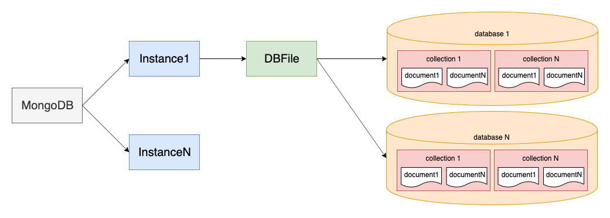

# MongoDB

## [官网](https://www.mongodb.com)

## 架构示意图

## 和关系型数据库中概念比对

| 关系型数据库                | MongoDB                        |
| --------------------- | ------------------------------ |
| database              | database                       |
| table                 | collection                     |
| row                   | document                       |
| column                | field                          |
| index（主键索引，唯一索引，联合索引） | index（全文索引）                    |
| join（主外键关系）           | embed document（嵌套文档）           |
| primary key(主键，联合主键)  | primary key(\_id)              |
| aggreation(GroupBy)   | aggreation(Pipeline MapReduce) |

## 环境部署

* [单机部署](chapter0.md)
* [主从部署](chapter1.md)
*   [分片部署](./)

    ****[**运行监控**](chapter4.md)****

    **基本操作**
* [库表操作](broken-reference)
* [数据操作](chapter5.md)
