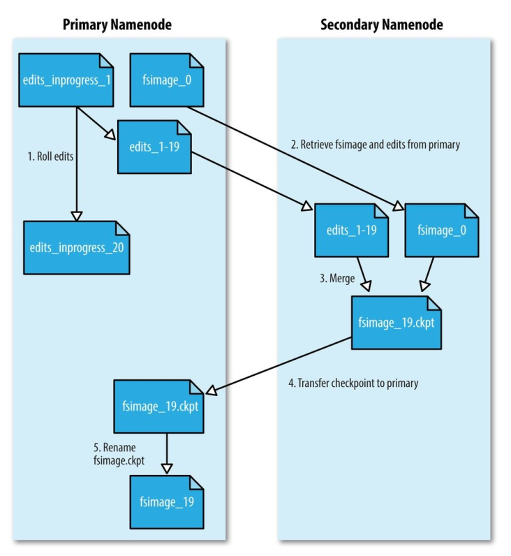
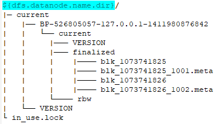
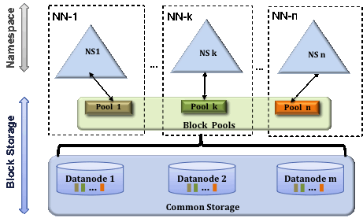
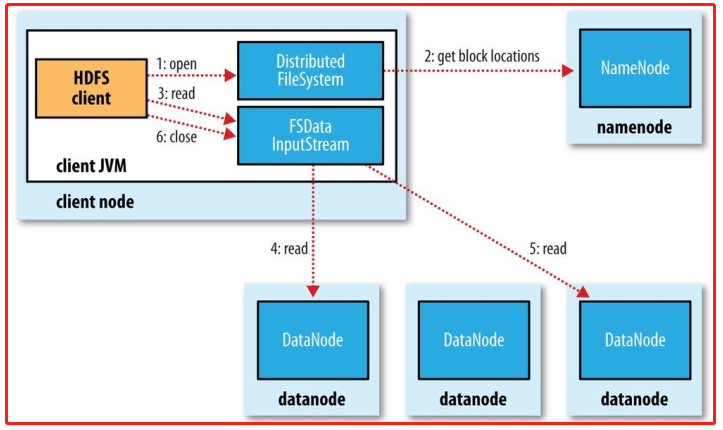
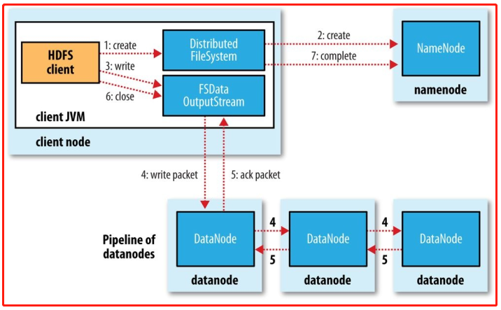
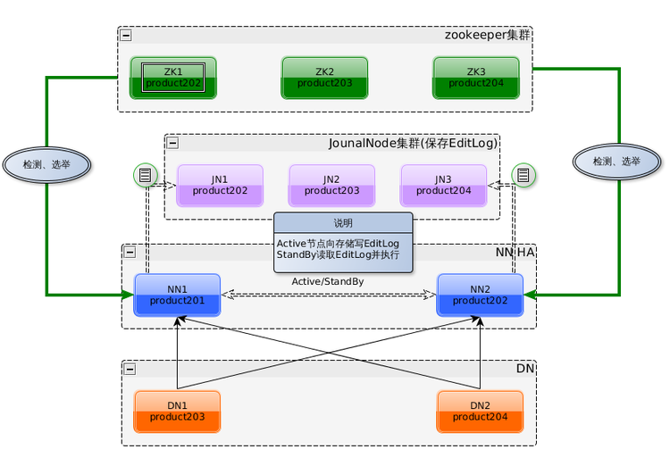
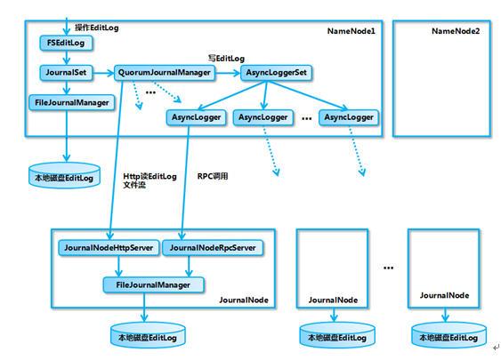
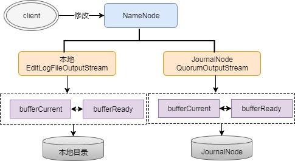
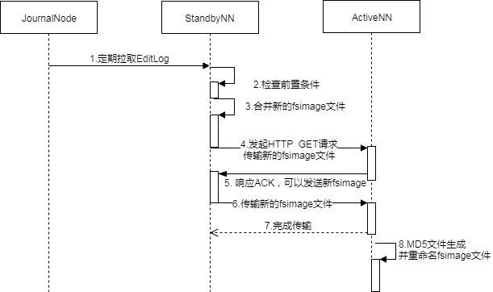
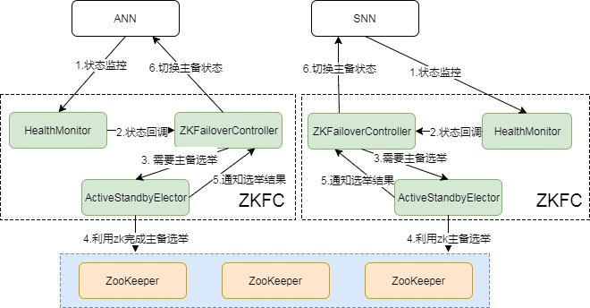

# HDFS核心概念

Hadoop分布式文件系统(HDFS)被设计成适合运行在通用硬件(commodity hardware)上的分布式文件系统。它和现有的分布式文件系统有很多共同点。但同时，它和其他的分布式文件系统的区别也是很明显的。HDFS是一个高度容错性的系统，适合部署在廉价的机器上。HDFS能提供高吞吐量的数据访问，非常适合大规模数据集上的应用。HDFS放宽了一部分POSIX约束，来实现流式读取文件系统数据的目的。HDFS在最开始是作为Apache Nutch搜索引擎项目的基础架构而开发的。HDFS是Apache Hadoop Core项目的一部分。

Hadoop 是Apache基金会下一个开源的分布式计算平台，它以分布式文件系统HDFS和MapReduce算法为核心，为用户提供了系统底层细节透明的分布式基础架构。用户可以在不了解分布式底层细节的情况下，充分利用分布式集群进行高速运算和存储。

Hadoop是一个能够让用户轻松架构和使用的分布式计算平台。它主要有以下几个优点：

* 高可靠性。Hadoop按位存储和处理数据的能力值得人们信赖。　　
* 高扩展性。Hadoop是在可用的计算机集簇间分配数据并完成计算任务的，这些集簇可以方便地扩展到数以千计的节点中。　　
* 高效性。Hadoop能够在节点之间动态地移动数据，并保证各个节点的动态平衡，因此处理速度非常快。　　
* 高容错性。Hadoop能够自动保存数据的多个副本，并且能够自动将失败的任务重新分配。　　
* 低成本。与一体机、商用数据仓库以及QlikView、Yonghong Z-Suite等数据集市相比，Hadoop是开源的，项目的软件成本因此会大大降低。　　

缺点：

* 不适合低延迟数据访问。　　
* 无法高效存储大量小文件，会占用大量的namenode内存。　　
* 不支持多用户写入以及任意修改文件。

## HDFS的架构与设计

### HDFS的设计

HDFS以流式数据访问模式来存储超大文件，运行于商用硬件集群上。

以下是对HDFS的设计简单描述（详细可以参阅该[文章](http://www.aosabook.org/en/hdfs.html)）：

* 超大文件 ：“超大文件”在这里指具有几百MB、几百GB甚至几百TB大小的文件。目前已经有存储PB级数据的Hadoop集群了。
* 流式数据访问 ：HDFS的构建思路是这样的：一次写入、多次读取是最高效的访问模式。数据集通常由数据源生成或从数据源复制而来，接着长时间 在此数据集上进行各种分析。每次分析都将涉及该数据集的大部分数据甚至全部，因此读取整个数据集的时间延迟比读取第一条记录的时间延迟更重要。
* 商用硬件 ：Hadoop并不需要运行在昂贵且高可靠的硬件上。
* 低时间延迟的数据访问 ：要求低时间延迟数据访问的应用，例如几十毫秒范围，不适合在HDFS上运行。HDFS是为高数据吞吐量应用优化的，这可能会以提高时间延迟为代价。对于低延迟的访问需求，HBase是更好的选择。
* 大量的小文件 ：由于namenode将文件系统的元数据存储在内存中，因此该文件系统所能存储的文件总数受限于NameNode的内存容量。
* 多用户写入，任意修改文件 ：HDFS中的文件写入只支持单个写入者，而且写操作总是以“只添加”方式在文件末尾写数据。它不支持多个写入者的操作，也不支持在文件的任意位置进行修改。但可能以后会支持，不过这种相对比较低效。

### HDFS核心组件

HDFS采用master/slave架构。一个HDFS集群是有一个Namenode和一定数目的Datanode组成。Namenode是一个中心服务器，负责管理文件系统的namespace和客户端对文件的访问。Datanode在集群中一般是一个节点，负责管理节点上它们附带的存储。在内部，一个文件其实分成一个或多个block，这些block存储在Datanode集合里。Namenode执行文件系统的namespace操作，例如打开、关闭、重命名文件和目录，同时决定block到具体Datanode节点的映射。Datanode在Namenode的指挥下进行block的创建、删除和复制。Namenode和Datanode都是设计成可以跑在普通的廉价的运行Linux的机器上。HDFS采用java语言开发，因此可以部署在很大范围的机器上。一个典型的部署场景是一台机器跑一个单独的Namenode节点，集群中的其他机器各跑一个Datanode实例。这个架构并不排除一台机器上跑多个Datanode，不过这比较少见。集群中单一Namenode的结构大大简化了系统的架构。Namenode是所有HDFS元数据的仲裁者和管理者，这样，用户数据永远不会流过Namenode。

下图是Hadoop的架构设计图：


## HDFS的概念

### 数据块

每个磁盘都有默认的数据块大小，这是磁盘进行数据读/写的最小单位。构建于单个磁盘之上的文件系统通过磁盘块来管理该文件系统中的块，该文件系统块的大小可以是磁盘块的整数倍。文件系统块一般为几千字节，而磁盘块一般为512字节。但这些对于需要读/写文件的文件系统用户来说是透明的。

HDFS同样也有块(block)的概念，但是大得多，默认为128MB。与单一磁盘上的文件系统相似，HDFS上的文件也被划分为块大小的多个分块，作为独立的存储单元。但与面向单一磁盘的文件系统不同的是，HDFS中小于一个块大小的文件不会占据整个块的空间，例如当一个1MB的文件存储在一个128MB的块中时，文件只使用1MB的磁盘空间，而不是128MB。

HDFS中的块为什么这么大？HDFS的块比磁盘的块大，其目的是为了最小化寻址开销。如果块足够大，从磁盘传输数据的时间会明显大于定位这个块开始位置所需的时间。因为，传输一个由多个块组成的大文件的时间取决于磁盘传输速率。但是块大小这个参数也不会设置得过大，MapReduce中map任务通常一次只处理一个块中的数据，因此如果任务数太少（少于集群中的节点数量），作业的运行速度就会比较慢。

对分布式文件系统中的块进行抽象会带来很多好处。

* 第一好处是一个文件的大小可以大于网络中任意一个磁盘的容量。
* 第二个好处是使用抽象块而非整个文件作为存储单元，大大简化了存储子系统的设计。
*   第三个好处是块还非常适合用于数据备份进而提供数据容错能力和提高可用性。

    HDFS将每个块复制到少数几个物理上相互独立的机器上（默认为3个），可以确保在块、磁盘或机器发生故障后数据不会丢失。如果发现一个块不可用，系统会从其他地方读取另一个复本，而这个过程对用户是透明的。一个因损坏或机器故障而丢失的块可以从其他候选地点复制到另一台可以正常运行的机器上，以保证复本的数量回到正常水平。同样，有些应用程序可能选择为一些常用的文件块设置更高的复本数量进而分散集群中的读取负载。

在HDFS中显示块信息：

> hdfs fsck / -files -blocks

可以执行命令修改HDFS的数据块大小以及复本数量：

> vim $HADOOP_HOME/etc/hadoop/hdfs-site.xml


### NameNode（管理节点）

#### NameNode目录结构

运行中的NameNode有如下所示的目录结构：


*   VERSION文件 ：是一个Java属性文件，其中包含正在运行的HDFS的版本信息。该文件一般包含以下内容：

    > \#Mon Sep 29 09:54:36 BST 2014 namespaceID=1342387246 clusterID=CID-01b5c398-959c-4ea8-aae6-1e0d9bd8b142 cTime=0 storageType=NAME_NODE blockpoolID=BP-526805057-127.0.0.1-1411980876842 layoutVersion=-57

    * layoutVersion ：这是一个负整数，描述HDFS持久性数据结构（也称布局）的版本，但是该版本号与Hadoop发布包的版本号无关。只要布局变更，版本号将会递减，此时HDFS也要升级。否则，新版本的NameNode（或DataNode）就无法正常工作。
    * namespaceID ：文件系统命名空间的唯一标识符，是在NameNode首次格式化时创建的。
    * clusterID ： 在HDFS集群上作为一个整体赋予的唯一标识符，这对于联邦HDFS非常重要。
    * blockpoolID ：数据块池的唯一标识符，数据块池中包含了由一个NameNode管理的命名空间中的所有文件。
    * cTime ：标记了NameNode存储系统的创建时间。刚格式化的存储系统，值为0，但升级后，该值会更新到新的时间戳。
    * storageType ：该存储目录包含的时NameNode的数据结构。
*   编辑日志（edits log）

    编辑日志(edits log) ：文件系统客户端执行写操作时，这些事务首先被记录到edits中。NameNode在内存中维护文件系统的元数据；当被修改时，相关元数据信息也同步更新。内存中的元数据可支持客户端的读请求。我们可以使用OEV查看edits文件：

    选项解析：

    * \-i，--inputFile ：要处理的编辑文件
    * \-o，--outputFile ：输出文件的名称；如果指定的文件存在，它将被覆盖
    * \-p，--processor ：选择要应用于编辑文件的处理器类型 (XML|FileDistribution|Web|Delimited)

    oev中的e指定了镜像文件

    命令如下：

    ```markup
    <?xml version="1.0" encoding="UTF-8"?>
    <EDITS>
        <EDITS_VERSION>-63</EDITS_VERSION>
        <RECORD>
            <!-- 开始日志段-->
            <OPCODE>OP_START_LOG_SEGMENT</OPCODE>
            <DATA>
                <!-- 事务id-->
                <TXID>1</TXID>
            </DATA>
        </RECORD>
        <RECORD>
            <!-- 结束日志段-->
            <OPCODE>OP_END_LOG_SEGMENT</OPCODE>
            <DATA>
                <TXID>2</TXID>
            </DATA>
        </RECORD>
    </EDITS>
    ```
*   命名空间镜像文件（fsimage）

    文件系统元数据的持久检查点，每个fsimage文件包含文件系统中的所有目录和文件inode的序列化信息（从Hadoop-2.4.0起，FSImage开始采用Google Protobuf编码格式），每个inodes表征一个文件或目录的元数据信息以及文件的副本数、修改和访问时间等信息。数据块存储在DataNode中，但fsimage文件并不描述DataNode。我们可以使用OIV查看fsimage文件 ：

    选项解析：

    * \-i，--inputFile ：要处理的镜像文件
    * \-o，--outputFile ：输出文件的名称；如果指定的文件存在，它将被覆盖
    * \-p，--processor ：选择要应用于镜像文件的处理器类型 (XML|FileDistribution|Web|Delimited)

    oiv中的i指定了image文件

    命令如下：

    > \# hdfs oiv -p XML -i fsimage\_0000000000000014026 -o fsimage.xml

    ```markup
    <?xml version="1.0"?>
    <fsimage>
        <NameSection>
            <!-- 默认的开启编号-->
            <genstampV1>1000</genstampV1>
            <!-- 最后一个块的编号-->
            <genstampV2>2215</genstampV2>
            <genstampV1Limit>0</genstampV1Limit>
             <!-- 最后一个分配的块的块id-->
            <lastAllocatedBlockId>1073743027</lastAllocatedBlockId>
            <!-- 开始的事务id号-->
            <txid>14026</txid>
        </NameSection>
        <INodeSection>
            <!-- 最后一个文件(目录)的inode号-->
            <lastInodeId>18763</lastInodeId>
            <!--当前文件系统中只有根目录，以下为根目录的相关信息-->
            <inode>
                <id>16385</id>
                <type>DIRECTORY</type>
                <name></name>
                <mtime>1560256204322</mtime>
                <permission>root:root:rwxrwxrwx</permission>
                <nsquota>9223372036854775807</nsquota>
                <dsquota>-1</dsquota>
            </inode>
            <inode>
                <id>16417</id>
                <type>DIRECTORY</type>
                <name>myInfo</name>
                <mtime>1552974220469</mtime>
                <permission>root:root:rwxrwxrwx</permission>
                <nsquota>-1</nsquota>
                <dsquota>-1</dsquota>
            </inode>
            <inode>
                <id>16418</id>
                <type>FILE</type>
                <name>myInfo.txt</name>
                <replication>1</replication>
                <mtime>1552830434241</mtime>
                <atime>1552974031814</atime>
                <perferredBlockSize>134217728</perferredBlockSize>
                <permission>root:root:rwxrwxrwx</permission>
                <blocks>
                    <block>
                        <id>1073741855</id>
                        <genstamp>1031</genstamp>
                        <numBytes>147</numBytes>
                    </block>
                </blocks>
            </inode>
            .........   // inode文件太多，省略
        </INodeSection>
        <INodeReferenceSection></INodeReferenceSection>
        <SnapshotSection>
            <snapshotCounter>0</snapshotCounter>
        </SnapshotSection>
        <INodeDirectorySection>
            <directory>
                <parent>16385</parent>
                <inode>18543</inode>
                <inode>16474</inode>
                <inode>16419</inode>
                <inode>16417</inode>
                <inode>16427</inode>
                <inode>17544</inode>
                <inode>17561</inode>
            </directory>
            <directory>
                <parent>16417</parent>
                <inode>16420</inode>
            </directory>
            <directory>
                <parent>16419</parent>
                <inode>17399</inode>
                <inode>17258</inode>
                <inode>16418</inode>
                <inode>17294</inode>
            </directory>
             ......        // 省略其他<directory>标签
        </INodeDirectorySection>
        <FileUnderConstructionSection>        
        </FileUnderConstructionSection>
        <SecretManagerSection>
            <currentId>0</currentId>
            <tokenSequenceNumber>0</tokenSequenceNumber>
        </SecretManagerSection>
        <CacheManagerSection>
            <nextDirectiveId>1</nextDirectiveId>
        </CacheManagerSection>
    </fsimage>
    ```
*   seen_txid文件

    该文件对于NameNode非常重要，它是存放transactionId的文件，format之后是0，它代表的是NameNode里面的edits\__文件的尾数，NameNode重启的时候，会按照seen_txid的数字，循序从头跑edits\_000_01\~到seen_txid的数字。当hdfs发生异常重启的时候，一定要比对seen_txid内的数字是不是你edits最后的尾数，不然会发生建置NameNode时元数据信息缺失，导致误删DataNode上多余block。
*   in_use.lock文件

    是一个锁文件，NameNode使用该文件为存储目录加锁。可以避免其他NameNode实例同时使用（可能会破坏）同一个存储目录的情况。

#### NameNode的工作原理

NameNode管理文件系统的命名空间。它维护着文件系统树及整棵树内所有的文件和目录。这些信息以两个文件形式永久保存在本地磁盘上：命名空间镜像文件（fsimage）和编辑日志文件（edits log）。它也记录着每个文件中各个块所在的数据节点信息，但它并不永久保存块的位置信息，因为这些信息会在系统启动时根据DataNode节点信息重建，块信息存储在内存中。

可以看得出来NameNode的正常运行是非常重要的，如果运行的NameNode服务的机器毁坏，文件系统上所有的文件将会丢失，因为我们不知道如何根据DataNode的块重建文件。因此，Hadoop为此提供两种实现NameNode容错机制：

* 备份组成文件系统元数据持久状态的文件。一般是将持久状态写入本地磁盘的同时，写入一个远程挂载的网络文件系统（NFS），HDFS与NFS安装配置可以参考该[文章](https://blog.51cto.com/45545613/2083475)。
* 运行一个辅助NameNode。但它不能作为主NameNode，这个辅助NameNode的重要作用是定期合并编辑日志（edits）与命名空间镜像文件（fsimage），以防止编辑日志过大。一般来说辅助NameNode在一个单独的机器上运行，因为它需要占用大量CPU时间并且一样多的内存来执行合并操作。设计成这样的好处在于，一旦主NameNode发生故障，辅助NameNode立刻就可以接替它的工作，但是由于保存数据是定时进行的，所以难免会有损失的数据，此时就可以把保存在其他地方(NFS)的数据复制到辅助NameNode，然后辅助NameNode作为新的主NameNode运行（注意，也可以运行热备份NameNode代替运行辅助NameNode）。

### SecondaryNamenode（辅助NameNode）

Hadoop SecondaryNameNode并不是Hadoop的第二个namanode，它不提供NameNode服务，而仅仅是NameNode的一个工具，这个工具帮助NameNode管理元数据信息。可能是由于SecondaryNameNode这个名字给人带来的混淆，Hadoop后面的版本(1.0.4)建议不要使用，而使用CheckPoint Node。但在这小节中，小编还是使用SecondaryNamenode。

运行中的SecondaryNamenode（辅助NameNode）的目录结构与主NameNode的目录结构几乎一样，但有部分时间不相同，它为主NameNode内存中的文件系统元数据创建检查点（后面解释）尚未成功时两者不相同。运行中的SecondaryNamenode有如下所示的目录结构：


当NameNode 启动时，需要合并fsimage和edits文件，按照edits文件内容将fsimage进行事务处理，从而得到HDFS的最新状态。实际应用中，NameNode很少重新启动。假如存在一个庞大的集群，且关于HDFS的操作相当频繁与复杂，那么就会产生一个非常大的edits文件用于记录操作，这就带来了以下问题：

* edits文件过大会带来管理问题；
* 一旦需要重启HDFS时，就需要花费很长一段时间对edits和fsimage进行合并，这就导致HDFS长时间内无法启动；
* 如果NameNode挂掉了，会丢失部分操作记录（这部分记录存储在内存中，还未写入edits）；

此时，Secondary NameNode就要发挥它的作用了：合并edits文件，防止edits文件持续增长。该辅助NameNode会为主NameNode内存中的文件系统元数据创建检查点（fsimage文件），创建检查点前HDFS会自动进入安全模式（safe mode），当NameNode处在安全模式，管理员也可手动调用hdfs dfsadmin -saveNameSpace命令来创建检查点。创建检查点的步骤如下所示（如图中也简单地描述）。

* 辅助NameNode请求主NameNode停止使用正在进行中的edits文件，这样新的编辑操作记录到一个新文件中。主NameNode还会更新所有存储目录中的seen_txid文件。
* 辅助NameNode从主NameNode获取最近的fsimage和edits文件（采用HTTP GET）。
* 辅助NameNode将fsimage文件载入内存，逐一执行edits文件中的事务，创建新的合并后的fsimage文件。
* 辅助NameNode将新的fsimage文件发送回主NameNode（使用HTTP PUT），主NameNode将其保存为临时的.ckpt文件。
* 主NameNode重新命名临时的fsimage文件，便于日后使用。

创建检查点的步骤图



最终，主NameNode拥有最新的fsimage文件和一个更小的正在进行中的edits文件（edits文件可能非空，因为在创建检查点过程中主NameNode还可能收到一些编辑请求）。这个过程清晰解释了辅助NameNode和主NameNode拥有相近内存需求的原因（因为辅助NameNode也把fsimage文件载入内存）。因此，在大型集群中，辅助NameNode需要运行在一台专用机器上。

在hdfs-site.xml中可以配置与检查点触发点有关的属性：

```markup
<property>
  <name>dfs.namenode.checkpoint.period</name>
  <value>3600</value>
  <description>两个定期检查点之间的秒数
  </description>
</property>

<property>
  <name>dfs.namenode.checkpoint.txns</name>
  <value>1000000</value>
  <description>secondarynamenode或检查点节点将创建检查点
        每个“dfs.namenode.checkpoint.txns”事务的名称空间
        判断“dfs.namenode.checkpoint.period”是否已过期
  </description>
</property>

<property>
  <name>dfs.namenode.checkpoint.check.period</name>
  <value>60</value>
  <description>SecondaryNameNode和CheckpointNode将轮询NameNode    
        每隔'dfs.namenode.checkpoint.check.period'秒查询一次
        未存入检查点事务
  </description>
</property>
```

默认情况下，辅助NameNode每隔一个小时创建检查点；此外，如果从上一个检查点开始编辑日志的大小已经达到100万个事务时，即使不到一小时，也会创建检查点，检查频率为每分钟一次。

这个过程namesecondary目录发生了更新；secondaryNameNode的检查点目录的布局与NameNode的是相同的，这种设计的好处是NameNode发生故障时，可以从secondaryNameNode恢复数据；有两种实现方法：一是将相关存储目录复制到新的NameNode中；二是使用-importCheckpoint选项启动NameNode守护进程，从而将secondaryNameNode用作新的NameNode

与第一次开启hdfs过程不同的是此次有30多秒的安全模式：


在安全模式中在等待块报告，这也关系到DataNode的运行过程。

### DataNode（工作节点）

DataNode是文件系统的工作节点。它们根据需要存储并检索数据块（受客户端或NameNode调度），并且定期向NameNode发送它们所存储的块的列表。

#### DataNode目录结构

和NameNode不同的是，DataNode的存储目录是初始阶段自动创建的，不需要额外格式化。DataNode的关键文件和目录如下所示：



分析：从上图可以看出，dataNode的文件结构主要由blk\_前缀文件、BP-random integer-NameNode-IP address-creation time和VERSION构成。

* BP-random integer-NameNode-IP address-creation time ：
  * BP代表BlockPool的，就是Namenode的VERSION中的集群唯一blockpoolID
  * 从上图可以看出我的DataNode是一个BP，也就是说只有一个NameNode管理全部的文件系统命名空间，如果有两个以上的BP，该HDFS是Federation HDFS，所以该目录下有两个BP开头的目录，IP部分和时间戳代表创建该BP的NameNode的IP地址和创建时间戳。
* finalized/rbw ：
  * 这两个目录都是用于实际存储HDFS BLOCK的数据，里面包含许多block_xx文件以及相应的.meta后缀的元数据文件，.meta文件包含了checksum信息。
  * rbw是“replica being written”的意思，该目录用于存储用户当前正在写入的数据。
* blk\_前缀文件 ：
  * HDFS中的文件块，存储的是原始文件内容。
  * 块的元数据信息，每一个块有一个相关联的.meta文件，一个文件块由存储的原始文件字节组成。
  * .meta文件包括头部（含版本和类型信息）和该块各区段的一系列的校验和。
  * 每个块属于一个数据块池（在本篇文章中，只有一个数据块池），每个数据块池都有自己的存储目录，目录根据数据块池ID形成（和NameNode的VERSION文件中的数据块池ID相同）

注 ：当目录中数据块的数量增加到一定规模时，DataNode会创建一个子目录来存放新的数据块及其元数据信息。如果当前目录已经存储了64个（通过dfs.datanode.numblocks属性设置）数据块时，就创建一个子目录。终极目标是设计一棵高扇出的目录树，即使文件系统中的块数量非常多，目录树的层数也不多。通过这种方式，DataNode可以有效管理各个目录中的文件，避免大多数操作系统遇到的管理难题，即很多（成千上万个）文件放在同一个目录之中。

*   VERSION ：

    > \#Mon Sep 29 09:54:36 BST 2014storageID=DS-c478e76c-fe1b-44c8-ba45-4e4d6d266547 clusterID=CID-01b5c398-959c-4ea8-aae6-1e0d9bd8b142 cTime=0 datanodeUuid=75ffabf0-813c-4798-9a91-e7b1a26ee6f1 storageType=DATA_NODE layoutVersion=-57

    * storageID ：相对于DataNode来说是唯一的，用于在NameNode处标识DataNode 
    * clusterID ：是系统生成或手动指定的集群ID 
    * cTime ：表示NameNode存储时间的创建时间 
    * datanodeUuid ：表示DataNode的ID号
    * storageType ：将这个目录标志位DataNode数据存储目录。 
    * layoutVersion ：是一个负整数，保存了HDFS的持续化在硬盘上的数据结构的格式版本号。
* in_use.lock :\
  是一个锁文件，NameNode使用该文件为存储目录加锁。可以避免其他NameNode实例同时使用（可能会破坏）同一个存储目录的情况。

### 块缓存

通常DataNode从磁盘中读取块，但对于访问频繁的文件，其对应的块可能被显式地缓存在DataNode内存中，以堆外块缓存(off-heap block cache)的形式存在。默认情况下，一个块仅缓存在一个DataNode的内存中，当然可以对每个文件配置DataNode的数量。作业调度器（用于MapReduce、Spark和其他框架的）通过在缓存块的DataNode上运行任务，可以利用块缓存的优势提高读操作的性能。

用户或应用通过在缓存池(cache pool)中增加一个 cache directive来告诉NameNode需要缓存哪些文件及存多久。缓存池是一个用于管理缓存权限和资源使用的管理性分组。

本小节只简单描述，有关HDFS的缓存管理请查阅[官方文档](http://hadoop.apache.org/docs/stable/hadoop-project-dist/hadoop-hdfs/CentralizedCacheManagement.html#Cache_directive)或者其他等相关资料。

### 联邦HDFS

NameNode在内存中保存文件系统中每个文件和每个数据块的引用关系，这意味着对于一个拥有大量文件的超大集群来说，内存将成为限制系统横向扩展的瓶颈。在2.X发行版本系列中引入的联邦HDFS允许系统通过添加NameNode实现扩展，其中每个NameNode管理文件系统命名空间中的一部分。

在联邦环境中，每个NameNode维护一个命名空间卷(namespace volume)，由命名空间的元数据和一个数据块池(block pool)组成，数据块池包含该命名空间下文件的所有数据块。命名空间卷之间是相互独立的，两两之间并不相互通信，甚至其中一个NameNode的失效也不会影响由其他NameNode维护的命名空间的可用性。

集群中的DataNode还需要注册到每个NameNode，并且存储着来自多个数据块池中的数据块。

联邦HDFS的架构图如下图所示：



联邦HDFS更详细的请查阅[官方文档](http://hadoop.apache.org/docs/stable/hadoop-project-dist/hadoop-hdfs/Federation.html)。

### HDFS读数据



* HDFS客户端通过调用FileSystem对象的open()方法来打开希望读取的文件，对于HDFS来说，这个对象是DistributedFileSystem的一个实例。
* DistributedFileSystem通过使用远程过程调用（RPC）来调用NameNode，以确定文件起始块的位置。对于每个块，NameNode返回具有该块副本的DataNode地址。此外，这些DataNode根据它们与客户端的距离来排序（根据集群的网络拓扑），如果该客户端本身就是一个DataNode，便从本地读取数据。接着DistributedFileSystem类返回一个FSDataInputStream对象（一个支持文件定位的输入流）给客户端以便读取数据。FSDataInputStream类转而封装DFSInputStream对象，该对象管理着DataNode和NameNode的 I/O。
* 客户端对这个输入流调用read()方法，存储着文件起始几个块的DataNode地址的DFSInputStream随即连接距离最近的文件中第一个块所在的DataNode。
* 通过对数据流反复调用read()方法，可以将数据从DataNode传输到HDFS 客户端。
* 读取数据到块的末端时，DFSInputStream关闭与该DataNode的连接，然后寻找下一个块的最佳DataNode。在HDFS客户端所看来它一直在读取一个连续的流，这些对于客户端来说是透明的。
* 客户端从流中读取数据时，块是按照打开DFSInputStream与DataNode新建连接的顺序读取的，它也会根据需要询问NameNode来检索下一批数据块的DataNode的位置，一旦客户端读取完毕，就会调用close()方法。但在读取时，DFSInputStream与DataNode通信时遇到错误，会尝试从这个块的另外一个最邻近DataNode读取数据，它也会记住那个故障DataNode，以保证以后不会反复读取该节点上后续的块。DFSInputStream也会通过校验和确认从DataNode发来的数据是否完整。如果发现有损坏的块，DFSInputStream会试图从其他DataNode读取其复本，也会将被损坏的块通知给NameNode。

HDFS读数据过程这一设计的一个重点是：客户端可以直接连接到DataNode检索数据，且NameNode告知客户端每个块所在的最佳DataNode，由于数据流分散在集群中的所有DataNode，所以这种设计能使HDFS扩展到大量的并发客户端。同时，NameNode只需要响应块位置的请求（这些信息存储在内存中，因而非常高效），无需响应数据请求，否则随着客户端数量的增长，NameNode会很快称为瓶颈。

这里HdfsDataInputStream是FSDataInputStream的子类，这里是通过子类创建父类对象。


### HDFS写数据



* 客户端通过对DistributedFileSystem对象调用create()来新建对象。
* DistributedFileSystem对NameNode创建一个RPC调用，在文件系统的命名空间中新建一个文件，此时该文件中还没有响应的数据块。NameNode执行各种不同的检查以确保这个文件不存在以及客户端有新建该文件的权限。
  * 如果这些检查均通过，NameNode就会为创建新文件记录一条记录；DistributedFileStream向客户端返回一个FSDataOutputStream对象，由此客户端可以开始写入数据。就像读取事件一样，文件系统数据输出流控制一个DFSOutputStream，负责处理datanode和namenode之间的通信。
  * 否则，文件创建失败并向客户端抛出一个IOException异常。
* 在客户端写入数据时，DFSOutputStream将它分成一个个的数据包，并写入内部队列，称为“数据队列”(data queue)。DataStreamer处理数据队列，它的责任是挑选出适合存储数据复本的一组DataNode，并据此来要求NameNode分配新的数据块。这一组DataNode构成一个管线——我们假设复本数为3，所以管线中有3个节点。
* DataStream将数据包流式传输到管线中第1个DataNode，该DataNode存储数据包并将它发送到管线中的第2个DataNode。同样，第2个DataNode存储该数据包并且发送给管线中的第3个（也是最后一个）DataNode。
* DFSOutputStream也维护着一个内部数据包队列来等待DataNode的收到确认回执，称为“确认队列”(ack queue)。收到管道中所有DataNode确认信息后，该数据包才会从确认队列删除。如果有DataNode在数据写入期间发生故障，则执行以下操作（对写入数据的客户端是透明的）。
  * 首先关闭管线，确认把队列中的所有数据包都添加回数据队列的最前端，以确保故障节点下游的DataNode不会漏掉任何一个数据包。
  * 为存储在另一正常DataNode的当前数据块指定一个新的标识，并将该标识传送给NameNode，以便故障DataNode在恢复后可以删除存储的部分数据块。
  * 从管线中删除故障DataNode，基于两个正常DataNode构建一条新管线。
  * 余下的数据块写入管线中正常的DataNode。
  * NameNode注意到块复本量不足时，会在另一个节点上创建一个新的复本。后续的数据块继续正常接受处理。
* 客户端完成数据的写入后，对数据流调用close()。
* 在联系到NameNode告知其文件写入完成之前，此操作会将剩余的所有数据包写入DataNode管线并等待确认。NameNode已经直到文件由哪些块组成（因为Datastreamer请求分配数据块），所以它在返回成功前只需要等待数据块进行最小量的复制。

## HDFS的高可用性（High Availability）

通过联合使用在多个文件系统中备份NameNode的元数据和通过备用NameNode创建监测点能防止数据丢失，但是依旧无法实现文件系统的高可用性。NameNode依旧存在单点失效（SPOF）的问题。如果NameNode失效了，那么所有的客户端，包括MapReduce作业，均无法读、写或列举文件，因为NameNode是唯一存储元数据与文件到数据块映射的地方，对于一个大型并拥有大量文件和数据块的集群，NameNode的冷启动需要30分钟，甚至更长时间，系统恢复时间太长了，也会影响到日常维护。在这一情况下，Hadoop系统无法提供服务直到有新的NameNode上线。

在这样的情况下要向从一个失效的NameNode恢复，系统管理员得启动一个拥有文件系统元数据副本得新的NameNode，并配置DataNode和客户端以便使用这个新的NameNode。新的NameNode直到满足以下情形才能相应服务：

* 将命名空间镜像文件导入内存中；
* 重演编辑日志；
* 接收到足够多的来自DataNode的数据块报告并退出安全模式

Hadoop2.X以上版本针对上述问题增加了对HDFS高可用性（HA）的支持。在这一实现中，配置了一对活动-备用（active-standby） NameNode。当活动NameNode失效，备用NameNode就会接管它的任务并开始服务于来自客户端的请求，不会有任何明显中断。实现这一目标需要在架构上做如下修改。HDFS HA架构图如下所示：



* NameNode之间需要通过高可用共享存储实现编辑日志的共享。当备用NameNode接管工作之后，它将通读共享编辑日志直至末尾，以实现与活动NameNode的状态同步，并继续读取由活动NameNode写入的新条目。
* DataNode需要同时向两个NameNode发送数据块处理报告，因为数据块的映射信息存储在NameNode的内存中，而非磁盘。
* 客户端需要使用特定的机制来处理NameNode的失效问题，这一机制对用户是透明的。
* 辅助NameNode的角色被备用NameNode所包含，备用NameNode为活动的NameNode命名空间设置周期性检查点。 

有两种高可用性共享存储可以做出选择：NFS过滤器或群体日志管理器（QJM, quorum journal manager）。QJM是一个专用的HDFS实现，为提供一个高可用的编辑日志而设计，被推荐用于大多数HDFS部署中，同时，QJM的实现并没使用Zookeeper，但在HDFS HA选取活动的NameNode时使用了Zookeeper技术。QJM以一组日志节点(journalnode)的形式运行，一般是奇数点结点组成，每个JournalNode对外有一个简易的RPC接口，以供NameNode读写EditLog到JN本地磁盘。当写EditLog时，NameNode会同时向所有JournalNode并行写文件，只要有N/2+1结点写成功则认为此次写操作成功，遵循Paxos协议。其内部实现框架如下：



从图中可看出，主要是涉及EditLog的不同管理对象和输出流对象，每种对象发挥着各自不同作用：

* FSEditLog：所有EditLog操作的入口。  
* JournalSet：集成本地磁盘和JournalNode集群上EditLog的相关操作。  
* FileJournalManager：实现本地磁盘上EditLog操作。  
* QuorumJournalManager：实现JournalNode集群EditLog操作。  
* AsyncLoggerSet：实现JournalNode集群EditLog的写操作集合。  
* AsyncLogger：发起RPC请求到JN，执行具体的日志同步功能。  
* JournalNodeRpcServer：运行在JournalNode节点进程中的RPC服务，接收NameNode端的AsyncLogger的RPC请求。## HDFS的读写原理 
* JournalNodeHttpServer：运行在JournalNode节点进程中的Http服务，用于接收处于Standby状态的NameNode和其它JournalNode的同步EditLog文件流的请求。

### QJM写过程分析

上面提到EditLog，NameNode会把EditLog同时写到本地和JournalNode。写本地由配置中参数dfs.namenode.name.dir控制，写JN由参数dfs.namenode.shared.edits.dir控制，在写EditLog时会由两个不同的输出流来控制日志的写过程，分别为：EditLogFileOutputStream(本地输出流)和QuorumOutputStream(JN输出流)。写EditLog也不是直接写到磁盘中，为保证高吞吐，NameNode会分别为EditLogFileOutputStream和QuorumOutputStream定义两个同等大小的Buffer，大小大概是512KB，一个写Buffer(buffCurrent)，一个同步Buffer(buffReady)，这样可以一边写一边同步，所以EditLog是一个异步写过程，同时也是一个批量同步的过程，避免每写一笔就同步一次日志。

这个是怎么实现边写边同步的呢，这中间其实是有一个缓冲区交换的过程，即bufferCurrent和buffReady在达到条件时会触发交换，如bufferCurrent在达到阈值同时bufferReady的数据又同步完时，bufferReady数据会清空，同时会将bufferCurrent指针指向bufferReady以满足继续写，另外会将bufferReady指针指向bufferCurrent以提供继续同步EditLog。上面过程用流程图就是表示如下：



#### 问题一：

既然EditLog是异步写的，怎么保证缓存中的数据不丢呢,其实这里虽然是异步,但实际所有日志都需要通过logSync同步成功后才会给client返回成功码，假设某一时刻NameNode不可用了，其内存中的数据其实是未同步成功的，所以client会认为这部分数据未写成功。还有EditLog怎么在多个JN上保持一致的呢？

解决方案：

**隔离双写**

在ANN每次同步EditLog到JN时，先要保证不会有两个NN同时向JN同步日志，也就是说同一时间QJM仅允许一个NameNode向编辑日志中写入数据。这个隔离是怎么做的。这里面涉及一个很重要的概念Epoch Numbers，很多分布式系统都会用到。Epoch有如下几个特性：

* 当NN成为活动结点时，其会被赋予一个EpochNumber。
* 每个EpochNumber是唯一的，不会有相同的EpochNumber出现。
* EpochNumber有严格顺序保证，每次NN切换后其EpochNumber都会自增1，后面生成的EpochNumber都会大于前面的EpochNumber。

但QJM是怎么保证上面的特性的呢，主要有以下几点：

* 在对EditLog作任何修改前，QuorumJournalManager(NameNode上)必须被赋予一个EpochNumber；
* QJM把自己的EpochNumber通过newEpoch(N)的方式发送给所有JN结点
* 当JN收到newEpoch请求后，会把QJM的EpochNumber保存到一个lastPromisedEpoch变量中并持久化到本地磁盘；
* ANN同步日志到JN的任何RPC请求（如logEdits(),startLogSegment()等），都必须包含ANN的EpochNumber；
* JN在收到RPC请求后，会将之与lastPromisedEpoch对比，如果请求的EpochNumber小于lastPromisedEpoch,将会拒绝同步请求，反之，会接受同步请求并将请求的EpochNumber保存在lastPromisedEpoch。

这样就能保证主备NN发生切换时，就算同时向JN同步日志，也能保证日志不会写乱，因为发生切换后，原ANN的EpochNumber肯定是小于新ANN的EpochNumber，所以原ANN向JN的发起的所有同步请求都会拒绝，实现隔离功能，防止了脑裂。

**恢复in-process日志**

如果在写过程中写失败了，可能各个JN上的EditLog的长度都不一样，需要在开始写之前将不一致的部分恢复。恢复机制如下：

* ANN先向所有JN发送getJournalState请求；
* JN会向ANN返回一个Epoch（lastPromisedEpoch)；
* ANN收到大多数JN的Epoch后，选择最大的一个并加1作为当前新的Epoch，然后向JN发送新的newEpoch请求，把新的Epoch下发给JN；
* JN收到新的Epoch后，和lastPromisedEpoch对比，若更大则更新到本地并返回给ANN自己本地一个最新EditLogSegment起始事务Id,若小则返回NN错误；
* ANN收到多数JN成功响应后认为Epoch生成成功，开始准备日志恢复；
* ANN会选择一个最大的EditLogSegment事务ID作为恢复依据，然后向JN发送prepareRecovery； RPC请求，对应Paxos协议2p阶段的Phase1a，若多数JN响应prepareRecovery成功，则可认为Phase1a阶段成功；
* ANN选择进行同步的数据源，向JN发送acceptRecovery RPC请求，并将数据源作为参数传给JN。
* JN收到acceptRecovery请求后，会从JournalNodeHttpServer下载EditLogSegment并替换到本地保存的EditLogSegment，对应Paxos协议2p阶段的Phase1b，完成后返回ANN请求成功状态。
* ANN收到多数JN的响应成功请求后，向JN发送finalizeLogSegment请求，表示数据恢复完成，这样之后所有JN上的日志就能保持一致。

数据恢复后，ANN上会将本地处于in-process状态的日志更名为finalized状态的日志，形式如edits\[start-txid]\[stop-txid]。

**日志同步**

日志从ANN同步到JN的过程,具体如下：

* 执行logSync过程，将ANN上的日志数据放到缓存队列中；
* 将缓存中数据同步到JN，JN有相应线程来处理logEdits请求
* JN收到数据后，先确认EpochNumber是否合法，再验证日志事务ID是否正常，将日志刷到磁盘，返回ANN成功码；
* ANN收到JN成功请求后返回client写成功标识，若失败则抛出异常。

通过上面一些步骤，日志能保证成功同步到JN，同时保证JN日志的一致性，进而备NN上同步日志时也能保证数据是完整和一致的。

### QJM读过程分析

这个读过程是面向备NN(SNN)的，SNN定期检查JournalNode上EditLog的变化，然后将EditLog拉回本地。SNN上有一个线程StandbyCheckpointer，会定期将SNN上FSImage和EditLog合并，并将合并完的FSImage文件传回主NN（ANN）上，就是所说的Checkpointing过程。下面我们来看下Checkpointing是怎么进行的。

在2.x版本中，已经将原来的由SecondaryNameNode主导的Checkpointing替换成由SNN主导的Checkpointing。下面是一个CheckPoint的流向图:



总的来说，就是在SNN上先检查前置条件，前置条件包括两个方面：距离上次Checkpointing的时间间隔和EditLog中事务条数限制。前置条件任何一个满足都会触发Checkpointing，然后SNN会将最新的NameSpace数据即SNN内存中当前状态的元数据保存到一个临时的fsimage文件( fsimage.ckpt）然后比对从JN上拉到的最新EditLog的事务ID，将fsimage.ckpt\_中没有，EditLog中有的所有元数据修改记录合并一起并重命名成新的fsimage文件，同时生成一个md5文件。将最新的fsimage再通过HTTP请求传回ANN。通过定期合并fsimage有什么好处呢，主要有以下几个方面：

* 可以避免EditLog越来越大，合并成新fsimage后可以将老的EditLog删除；
* 可以避免主NN（ANN）压力过大，合并是在SNN上进行的；
* 可以避免fsimage保存的是一份最新的元数据，故障恢复时避免数据丢失。

### HDFS HA如何实现故障切换与规避？

在活动namenode（ANN）失效之后，备用namenode（SNN）能够快速（几十秒的时间）实现任务接管，因为最新的状态存储在内存中：包括最新的编辑日志条目和最新的数据块映射信息。实际观察到的失效时间略长一点（需要1分钟左右），这是因为系统需要保守确定活动namenode是否真的失效了。活动namenode失效且备用namenode也失效的情况下，当然这类情况发生的概率非常低非常低的，现在Hadoop 3.X发行版本已经支持运行更多备用namenode来提供更高的容错性。

系统中有一个称为故障转移控制器（failover controller）的新实体，管理着将活动namenode转移为备用namenode的转换过程。有多种故障转移控制器，但默认一种是使用了Zookeeper来确保有且仅有一个活动namenode。每一个namenode运行着一个轻量级的故障转移控制器，其工作就是监视宿主namenode是否失效（通过一个简单的心跳机制实现）并在namenode失效时进行故障转移，这就是HA的主备切换机制，主备选举依赖于Zookeeper。下面是主备切换的状态图：



从图中可以看出，整个切换过程是由ZKFC（即故障转移控制器，全称Zookeeper Failover Controller）来控制的，具体又可分为HealthMonitor、ZKFailoverController和ActiveStandbyElector三个组件。

* ZKFailoverController：是HealthMontior和ActiveStandbyElector的母体，执行具体的切换操作。
* HealthMonitor：监控NameNode健康状态，若状态异常会触发回调ZKFailoverController进行自动主备切换。
* ActiveStandbyElector：通知ZK执行主备选举，若ZK完成变更，会回调ZKFailoverController相应方法进行主备状态切换。

在故障切换期间，Zookeeper主要是发挥什么作用呢，有以下几点：

* 失败保护：集群中每一个NameNode都会在Zookeeper维护一个持久的session，机器一旦挂掉，session就会过期，故障迁移就会触发。
* Active NameNode选择：Zookeeper有一个选择ActiveNN的机制，一旦现有的ANN宕机，其他NameNode可以向Zookeeper申请成为下一个Active节点。
* 防脑裂：ZK本身是强一致和高可用的，可以用它来保证同一时刻只有一个活动节点。

在哪些场景会触发自动切换呢，从HDFS-2185中归纳了以下几个场景：

* ANN JVM崩溃：ANN上HealthMonitor状态上报会有连接超时异常，HealthMonitor会触发状态迁移至SERVICE_NOT_RESPONDING，然后ANN上的ZKFC会退出选举，SNN上的ZKFC会获得Active Lock，作相应隔离后成为Active节点。
* ANN JVM冻结：这个是JVM没崩溃，但也无法响应，同崩溃一样，会触发自动切换。
* ANN 机器宕机：此时ActiveStandbyElector会失去同ZK的心跳，会话超时，SNN上的ZKFC会通知ZK删除ANN的活动锁，作相应隔离后完成主备切换。
* ANN 健康状态异常：此时HealthMonitor会收到一个HealthCheckFailedException，并触发自动切换。
* Active ZKFC崩溃：虽然ZKFC是一个独立的进程，但因设计简单也容易出问题，一旦ZKFC进程挂掉，虽然此时NameNode是正常运行的，但系统也认为需要切换，此时SNN会发一个请求到ANN要求ANN放弃主节点位置，ANN收到请求后，会触发自动切换。
* Zookeeper集群崩溃：如果ZK集群崩溃了，主备NN上的ZKFC都会感知并断连，此时主备NN会进入一个NeutralMode模式，同时不改变主备NN的状态，继续发挥作用，只不过此时，如果ANN也故障了，那集群无法发挥Failover，也就无法使用集群了，所以对于此种场景，ZK集群一般是不允许挂掉到多台，至少要有(N / 2 + 1)台保持服务才算是安全的。

管理员也可以通过手动发起故障转移，例如在进行日常维护时，这称为”平稳的故障转移“（graceful failover），因为故障转移控制器可以组织两个namenode有序地切换角色。命令参考如下所示。

> // 将 active 状态由 nn1 切换到 nn2 # hdfs haadmin -failover --forcefence --forceactive nn1 nn2
>
> // 在启用自动故障转移的集群上 --forcefence -- forceactive 参数不起作用 // 使用以下方法检查名称节点状态（假设 nn1 为 active，nn2 standby）： # hdfs haadmin -getServiceState nn1 active # hdfs haadmin -getServiceState nn2 standby
>
> // 于是我们人为制造故障，在 nn1 上查看 NameNode 进程 # jps # kill -9 \[进程ID] // 自动故障转移将会激活 nn2 节点，状态从 standby 转换为 active

但在非平稳故障转移的情况下，无法确切直到失效NameNode是否已经停止运行。例如网速较慢或者网络被分割的情况下，可能激发故障转移，但Active NameNode依然运行着并且依旧是Active NameNode。高可用实现做了更一步的优化，以确保先前Active NameNode不会执行危害系统并导致系统崩溃的操作，该方法称为”规避“。

规避机制包括：撤销NameNode访问共享存储目录的权限（通常使用供应商指定的NFS命令）、通过远程管理命令屏蔽相应的网络端口。最不行的话，可以通过“一枪爆头”（断电关机）等制造人为故障技术。

## 参考资料

[https://blog.csdn.net/sjmz30071360/article/details/79877846](https://blog.csdn.net/sjmz30071360/article/details/79877846) [https://www.cnblogs.com/luengmingbiao/p/11235327.html](https://www.cnblogs.com/luengmingbiao/p/11235327.html) [https://developer.51cto.com/art/201910/604800.htm](https://developer.51cto.com/art/201910/604800.htm) [https://blog.csdn.net/gwd1154978352/article/details/81095592](https://blog.csdn.net/gwd1154978352/article/details/81095592) [https://www.cnblogs.com/zknublx/p/8075368.html](https://www.cnblogs.com/zknublx/p/8075368.html)
