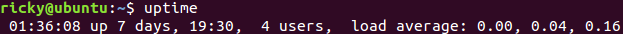
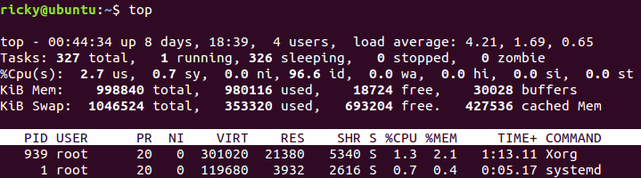
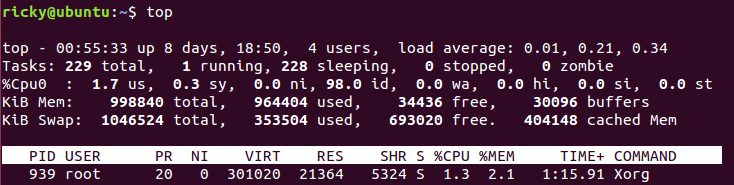
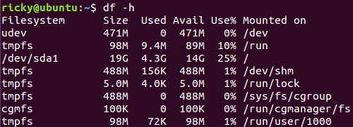
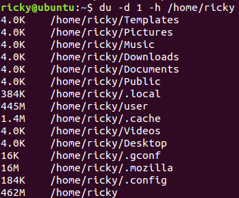
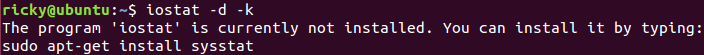
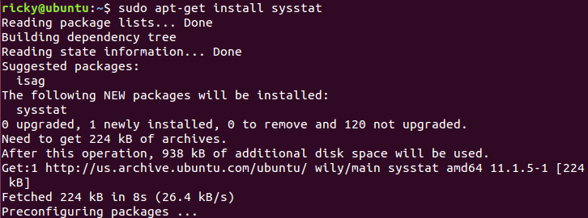
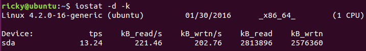
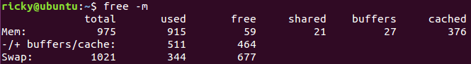
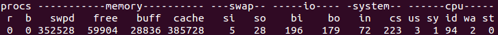

# 系统监控

* 系统负载
* CPU
* 内存
* 磁盘
* 网络

## load：反映系统忙闲程度

在Linux系统中，可以通过top和uptime命令来查看系统的load值，那么什么是load呢？系统的load被定义为特定时间间隔内运行队列中的平均线程数，如果一个线程满足以下条件，该线程就会处于运行队列中：

* 没有处于I/O等待状态
* 没有主动进入等待状态，也就是没有调用wait操作
* 没有被终止当然load计算的算法较为复杂，因此，这种情况也不是绝对的。

load值越大，也就意味着系统的CPU越繁忙，这样线程运行完以后等待操作系统分配下一个时间片段的时间也就越长。假设：

* CPU1分钟内最多处理100个线程任务，load值为0.2，意味着这1分钟内CPU处理了20个任务
* CPU1分钟内最多处理100个线程任务，load值为1，意味着这1分钟内CPU刚好将这100个任务处理完
* CPU1分钟内最多处理100个线程任务，load值为1.7，意味着这1分钟内CPU除了处理了这100个任务外，还有70个任务等待处理

当然，load的计算算法较为复杂，并不像上面说的这么简单，这么打比方只是为了简单说明问题。假设一般来说，只要load值不大于3，我们认为它的负载是正常的（考虑到多核CPU的系统），如果load值大于5，则表示当前系统的负载已经非常高了，需要采取相应的措施来降低系统的负载。

w、top、uptime这三个命令都可以用来查看系统的load值，下面演示一下使用uptime命令查看系统的load：

load average后面跟的三个值分别表示在过去1分钟、5分钟、15分钟内系统的load值。

## CPU利用率：反映CPU的使用和消耗情况

在Linux系统中，CPU的时间消耗主要在这几个方面：用户进程、内核进程、中断处理、I/O等待、Nice时间、丢失时间、空闲等几个部分，而CPU的利用率则为这些时间所占用的总时间的百分比。通过CPU的利用率，能够反映出CPU的使用和消耗情况。

可以通过top命令来查看Linux系统的CPU消耗情况：

上面一部分，也就是"%Cpu(s)"开头的内容是我们需要关注的，后面跟的列便是各种状态下CPU所消耗的时间比，看下每一列的意思：

* 用户时间（User  Time）即us所对应的列，表示CPU执行用户进程所占用的时间，通常情况下希望us的占比越高越好 
* 系统时间（System Time）即sy所对应该的列，表示CPU自内核态所花费的时间，sy占比比较高通常意味着系统在某些方面设计得不合理，比如频繁的系统调用导致的用户态和内核态的频繁切换
* Nice时间（Nice Time）即ni所对应的列，表示系统在调整进程优先级的时候所花费的时间
* 空闲时间（Idle Time）即id所对应的列，表示系统处于空闲期，等待进程运行，这个过程所占用的时间。当然，我们希望id的占比越低越好
* 等待时间（Waiting Time）即wa所对应的列，表示CPU在等待I/O操作所花费的时间，系统不应该花费大量的时间来进行等待，否则便表示可能有某个地方设计不合理
* 硬件中断处理时间（Hard Irq Time）即hi对应的列，表示系统处理硬件中断所占用的时间
* 软件中断处理时间（Soft Irq Time）即si对应的列，表示系统处理软件中断所占用的时间
* 丢失时间（Steal Time）即st对应的列，实在硬件虚拟化开始流行后操作系统新增的一列，表示被强制等待虚拟CPU的时间

对于多个或多核CPU的情况，常常需要查看每个CPU的利用情况，此时可以按1，便可以查看到每个核的CPU利用率：

看到上面出现了"%Cpu0"而不是"%Cpu(s)"，因为只有一个CPU，所以只展示Cpu0的CPU利用率

## 磁盘剩余空间

磁盘剩余空间也是一个非常关键的指标，如果磁盘没有足够的剩余空间，正常的日志写入以及系统I/O都将无法进行。

通过df命令可以查看磁盘的剩余空间：

\-h表示按单位格式化输出。该命令显示sda1一共有19GB的空间，使用了4.3GB，剩余14GB可用。

如果要查看具体目录所占用的内存空间，分析大文件所处位置，可以使用du命令来进行查看：

\-d指定了递归深度为1层，表示只列出指定目录的下一级目录文件大小，-h用来表示格式化输出。

## 磁盘I/O

磁盘I/O的繁忙程度也是一个重要的系统指标，对于I/O密集型的应用来说，比如数据库应用和分布式文件系统，I/O的繁忙程度也一定程度上反映了系统的负载情况，容易成为应用程序性能的瓶颈。可以使用iostat来查看系统的I/O状况：

看到报错，这也很正常。Linux环境下每个命令就和Windows环境下的软件一样，必须先安装再使用，按照报错的提示来看，iostat当前并没有安装。所以我们按照提示的来安装一下sysstat就可以了：

安装完毕后，再使用iostat：

* \-d表示查看磁盘使用状况，
* \-k表示以KB为单位显示。

各个列中，

* Device表示设备名称、
* tps表示每秒处理的I/O请求数、
* kB_read/s表示每秒从设备读取的数据量、
* kB_wrtn/s表示美标向设备写入的数据量、
* kB_read表示读取的数据总量、
* kB_wrtn表示写入的数据总量。

### [磁盘IO状态监控](../../java/summary-3/iostat.md)

## 内存使用

程序运行时的数据加载、线程并发、I/O缓冲等，都依赖于内存，可用内存的大小决定了程序是否能正常运行以及运行的性能。

通过free命令能够查看到系统的内存使用情况，加上-m参数表示以MB为单位：

Linux的内存包括物理内存Mem和虚拟内存Swap，下面介绍每一列的含义：

* total----内存总共的大小
* used----已使用的内存大小
* free----可使用的内存大小
* shared----多个进程共享的内存大小
* buffers----缓冲区的大小
* cached----缓存的大小

Linux系统的内存管理机制与Windows系统有所不同，其中有一个思想便是内存利用率最大化，内核会将剩余的内存申请为cached，而cached不属于free范畴。因此，当系统运行时间较长时，会发现cached这块区域比较大，对于有频繁文件读/写操作的系统，这种现象更为明显。

但是，free的内存小，并不代表可用小，当程序需要申请更大的内存时，如果free内存不够，系统会将剩余部分cached会buffers内存回收，回收的内存再分配给应用程序。因此，Linux可用于分配的内存不仅仅只有free的内存。可看free命令显示的第三行，也就是"-/+ buffers/cache"对应的行，这一行将内存进行了重新计算，used减去buffers和cached占用的内存，而free则加上了buffers和cached对应的内存。

对于应用来说，更值得关注的应该是虚拟内存Swap的消耗，Swap内存使用过多，表示物理内存已经不够用了，操作系统将本应该物理内存存储的一部分内存页调度到磁盘上，以腾出足够的空间给当前的进程使用。当其他进程需要运行时，再从磁盘将内存的页调度到物理内存当中，以恢复进程的运行。而这个调度的过程中，会产生Swap I/O，如果Swap I/O较为频繁，将严重地影响系统的性能。

通过vmstat命令，可以查看到Swap I/O的情况：

其中，swap列的si表示每秒从磁盘交换到内存的数据量，单位是KB/s，so表示每秒从内存交换到磁盘的数据量，单位也是KB/s。

## 参考资料

[https://www.cnblogs.com/xrq730/p/5171463.html](https://www.cnblogs.com/xrq730/p/5171463.html)
