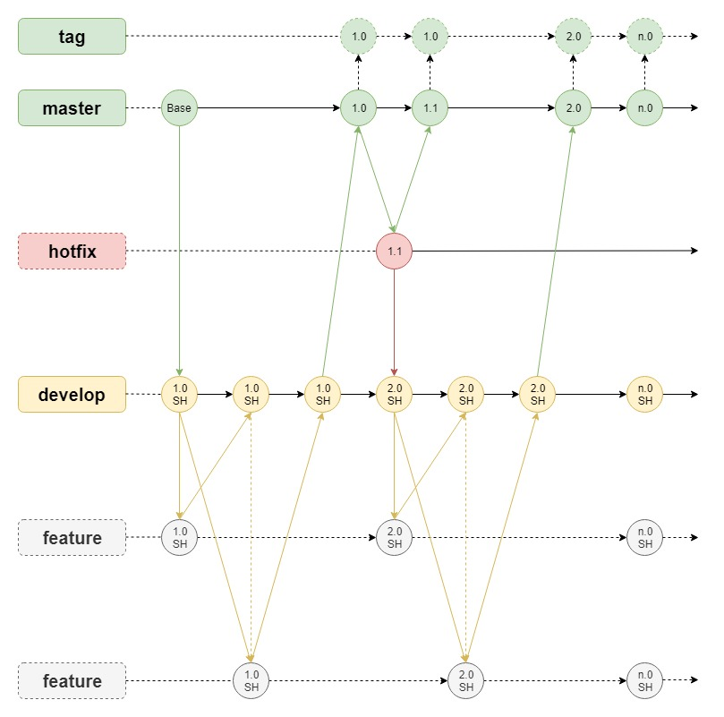

# Git

## 本地配置

1.  查看git配置信息

    > $ git config --list
2.  查看git用户名、密码、邮箱的配置

    > $ git config user.name
    >
    > $ git config user.password
    >
    > $ git config user.email
3.  设置git用户名、密码、邮箱的配置（工作空间）

    > $ git config user.name "DingPengwei"
    >
    > $ git config user.password "123456"
    >
    > $ git config user.email "www.dingpengwei@foxmail.com"
4.  设置git用户名、密码、邮箱的配置（全局配置）

    > $ git config --global user.name "DingPengwei"
    >
    > $ git config --global user.password "123456"
    >
    > $ git config --global user.email "www.dingpengwei@foxmail.com"

## 协同模型



* master -- 线上正在运行，可随时发版，受保护的分支。
* develop -- 测试环境或者开发环境正在运行，可随时发版，受保护的分支。
* feature -- 逻辑分支，本地开发自测，需从develop pull最新代码，开发完成后提交（或许伴随着变基以解决冲突），提交后发起MR到develop。
* hotfix -- 逻辑分支，线上bug修复，需从master pull最新代码，开发完成后提交（或许伴随着变基以解决冲突），提交后发起MR到master和develop。
* tag -- 可选项

## 提交规范

```
<type>(<scope>): <subject>
```

### type(必须)

用于说明git commit的类别，只允许使用下面的标识。

feat：新功能（feature）。

fix/to：修复bug，可以是QA发现的BUG，也可以是研发自己发现的BUG。

fix：产生diff并自动修复此问题。适合于一次提交直接修复问题

* to：只产生diff不自动修复此问题。适合于多次提交。最终修复问题提交时使用fix
* docs：文档（documentation）。

style：格式（不影响代码运行的变动）。

refactor：重构（即不是新增功能，也不是修改bug的代码变动）。

perf：优化相关，比如提升性能、体验。

test：增加测试。

chore：构建过程或辅助工具的变动。

revert：回滚到上一个版本。

merge：代码合并。

sync：同步主线或分支的Bug。

### scope(可选)

scope用于说明 commit 影响的范围，比如数据层、控制层、视图层等等，视项目不同而不同。

例如在Angular，可以是location，browser，compile，compile，rootScope， ngHref，ngClick，ngView等。如果你的修改影响了不止一个scope，你可以使用\*代替。

### subject(必须)

subject是commit目的的简短描述，不超过50个字符。

建议使用中文（感觉中国人用中文描述问题能更清楚一些）。

* 结尾不加句号或其他标点符号。
*   根据以上规范git commit message将是如下的格式：

    ```
    fix(DAO):用户查询缺少username属性 
    feat(Controller):用户查询接口开发
    ```

## 参考资料

* [https://zhuanlan.zhihu.com/p/182553920](https://zhuanlan.zhihu.com/p/182553920)
