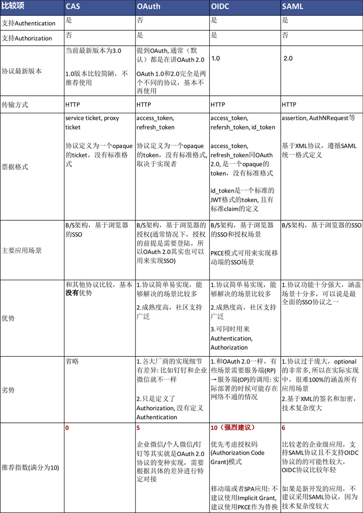

# 服务鉴权
单点登录(SSO)常用的标准协议类型有 CAS、OAuth、OpenID Connect、SAML。

## 认证（Authentication）与授权（Authorization）的区别
- 认证（Authentication）即确认该用户的身份是他所声明的那个人；
- 授权（Authorization）即根据用户身份授予他访问特定资源的权限。

也就是说，当用户登录应用系统时，系统需要先认证用户身份，然后依据用户身份再进行授权。认证与授权需要联合使用，才能让用户真正登入并使用应用系统。

## [CAS](web/sso/cas/README.md)

## [OAuth](web/sso/oauth/README.md) 

## [OIDC]()

## [SAML]()

上面简单介绍了主流的几种SSO协议，本质上它们大同小异，都是基于中心信任的机制，服务提供者和身份提供者之间通过互信来交换用户信息，只是每个协议信息交换的细节不同，或者概念上有些不同。最后，通过一个简单对比表格来总结本文重点内容：

## 开源服务
https://gitee.com/dromara/MaxKey
https://gitee.com/mkk/oauth2-shiro
https://blog.csdn.net/zbw125/article/details/114770697

## 参考
https://zhuanlan.zhihu.com/p/267845330
