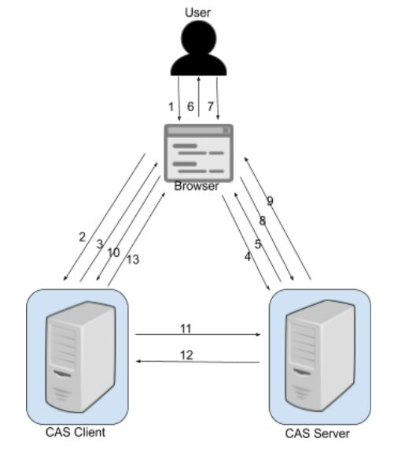
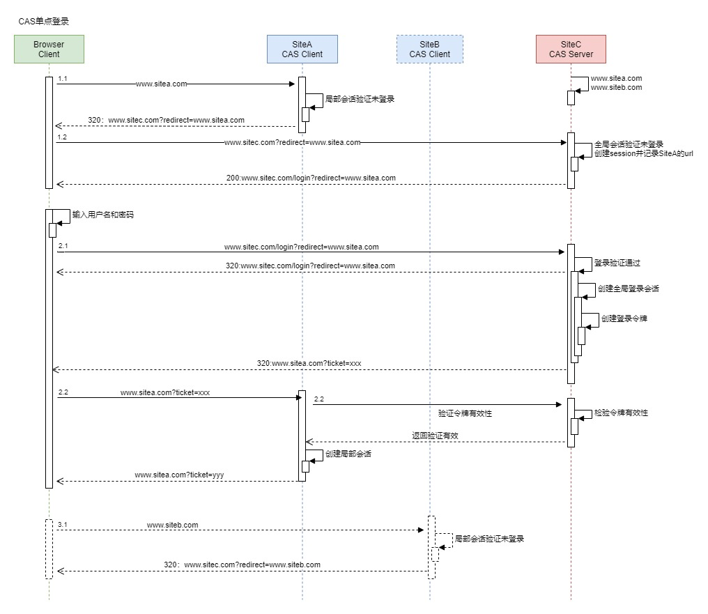
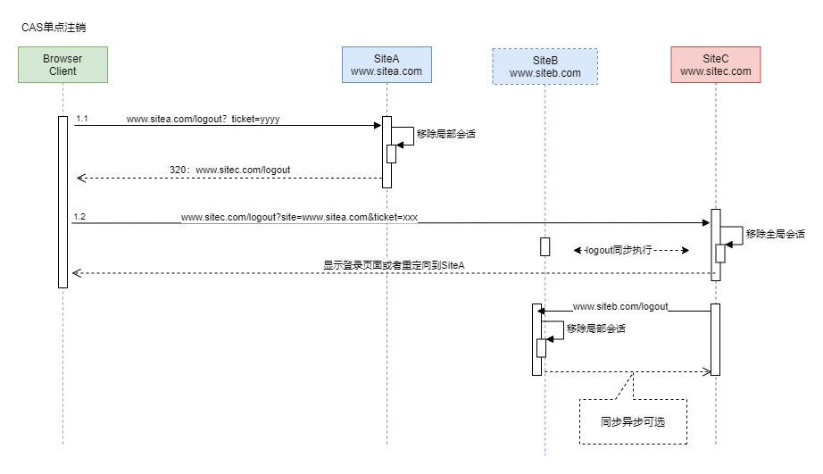

# CAS（Central Authentication Service）

CAS，是一种常见的B/S架构的SSO协议。和其他任何SSO协议一样，用户仅需登陆一次，访问其他应用则无需再次登陆。顾名思义，CAS是一种仅用于Authentication的服务，它和OAuth/OIDC协议不一样，并不能作为一种Authorization的协议。当前CAS协议包括CAS 1.0、CAS2.0、CAS3.0版本，这三个版本的认证流程基本类似。CAS的认证流程通过包括几部分参与者:

- Client: 通常为使用浏览器的用户
- CAS Client: 实现CAS协议的Web应用
- CAS Server: 作为统一认证的CAS服务器

1. Client(终端用户)在浏览器里请求访问Web应用example；
1. 浏览器发起一个GET请求访问example应用的主页https://www.example.com；
1. 应用example发现当前用户处于未登陆状态，Redirect用户至CAS服务器进行认证；
1. 用户请求CAS服务器；
1. CAS发现当前用户在CAS服务器中处于未登陆状态, 要求用户必须得先登陆；
1. CAS服务器返回登陆页面至浏览器；
1. 用户在登陆界面中输入用户名和密码（或者其他认证方式）；
1. 用户把用户名和密码通过POST，提交至CAS服务器；
1. CAS对用户身份进行认证，若用户名和密码正确，则生成SSO会话, 且把会话ID通过Cookie的方式返回至用户的浏览器端（此时，用户在CAS服务端处于登陆状态）；
1. CAS服务器同时也会把用户重定向至CAS Client, 且同时发送一个Service Ticket；
1. CAS Client的服务端收到这个Service Ticket以后，请求CAS Server对该ticket进行校验；
1. CAS Server把校验结果返回给CAS Client, 校验结果包括该ticket是否合法，以及该ticket中包含对用户信息；
1. 至此，CAS Client根据Service Ticket得知当前登陆用户的身份，CAS Client处于登陆态。
1. 经过上述流程以后，CAS Server和CAS Client都处于登陆态，当用户如果访问另外一个CAS Client 2的时候，用户不需要再次认证，即会跳过5、6、7、8、9这几步，从而达到SSO的效果。

注:CAS 1.0是个非常简单粗陋的协议，在2.0、3.0版本中，Service Ticket的校验结果均为XML格式， 且引入了一种proxy模式（不在本文做深入讨论）。

[CAS协议的详细标准定义](https://apereo.github.io/cas/6.2.x/protocol/CAS-Protocol-Specification.html)

1. CAS协议是一个比较简陋单点登陆协议，协议本身比较轻量级也比较容易实现，但是能够解决的场景比较单一；
2. 杂乱：CAS 3.0又引入了基于SAML对Service Ticket进行校验；
3. CAS Client和CAS Server之间的互信是通过接口调用的方式来建立, 没有任何加密/签名机制来保证进一步的安全；
4. 缺乏校验CAS Client自身身份的机制；
5. 市面上实现了CAS协议的应用并不多，不推荐这种协议。

## 登录时序图

## 注销时序图

## 参考
https://zhuanlan.zhihu.com/p/267845330