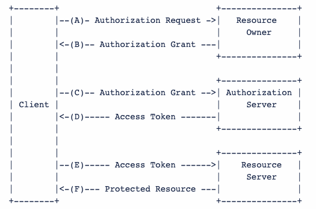

# OAuthor2.0
谈到OAuth, 通常是指OAuth 2.0协议，它是一种Authorization协议并不是一种Authentication协议，虽然OAuth 2的流程中只描述了Authorization。但是在实际使用中，Authorization脱离Authentication并没有任何意义。

OAuth 2.0解决的主要场景是: 第三方应用如何被授权访问资源服务器。整个流程参与者包括几个组成部分:

- Resource Owner: 资源拥有者，通常为终端用户
- Resource Server: 资源提供者
- Authorization Server: 授权服务器
- Client: 请求访问服务访问的应用

抽象的授权流程大致为:




假定一个在线音乐服务，用户zhangsan想通过某音视频播放软件来播放在线音乐, 但是在播放音乐之前，该音视频软件必须得通过YuFu（即玉符IDaaS）认证授权，得到zhangsan的同意之后才能访问在线音乐。

在这个场景中，zhangsan为Resource Owner, 在线音乐服务为Resource Server, Client为某音视频播放软件，YuFu作为Authorization Server。

1. 音视频软件向zhangsan发起授权请求，请求zhangsan同意访问在线音乐服务；
1. 根据不同的授权模式，zhangsan同意该授权，且返回一个"授权"给音视频服务；
1. 音视频服务携带zhangsan的授权，请求YuFu颁发一个access_token, 用于访问在线音乐；
1. YuFu校验音视频服务自身的合法性之后，颁发access_token；
1. 音视频服务携带access_token, 代表zhangsan请求访问在线音乐；
1. 在线音乐服务校验完access_token以后，提供音乐服务. 播放器开始播放音乐。

上述是一个抽象的授权流程，而在具体实现中，在前三步中会有几个变种，即不同的授权模式，常见的授权模式包括:

- Authorization Code Grant: 授权码模式，最为常用，最安全，强烈推荐；
- Implicit Grant: 隐藏式，适用于SPA应用，已经不再推荐使用，被PKCE模式所替代；
- Resource Owner Password Credentials Grant: 密码式，需要把用户的用户名和密码暴露给Client；
- Client Credential Grant: 凭证式，整个流程没有用户的概念，适用于服务端->服务端调用的场景。

可以发现在整个流程中，音视频播放器并不需要知道zhangsan的密码，只是需要得到zhangsan的授权就可以访问在线音乐，而整个授权是由Authorization Server来负责。


本文并不会展开讨论Authorization Code模式，详细协议文档定义请参考：https://tools.ietf.org/html/rfc6749

笔者意见：相比CAS协议，OAuth2.0不同的授权模式能够解决更多的场景，更安全、更流行，且通过PKCE模式能够实现移动端的单点登录，这个是其他SSO协议都不具备的。

OAuth 2.0 的标准是[RFC 6749](https://tools.ietf.org/html/rfc6749) 文件。该文件先解释了 OAuth 是什么。

OAuth 引入了一个授权层，用来分离两种不同的角色：客户端和资源所有者。......资源所有者同意以后，资源服务器可以向客户端颁发令牌。客户端通过令牌，去请求数据。

这段话的意思就是，OAuth 的核心就是向第三方应用颁发令牌。

注意，不管哪一种授权方式，第三方应用申请令牌之前，都必须先到系统备案，说明自己的身份，然后会拿到两个身份识别码：客户端 ID（client ID）和客户端密钥（client secret）。这是为了防止令牌被滥用，没有备案过的第三方应用，是不会拿到令牌的。


## 授权时序图


## Authorization Code Grant: 授权码模式
授权码（authorization code）方式，指的是第三方应用先申请一个授权码，然后再用该码获取令牌。

这种方式是最常用的流程，安全性也最高，它适用于那些有后端的 Web 应用。授权码通过前端传送，令牌则是储存在后端，而且所有与资源服务器的通信都在后端完成。这样的前后端分离，可以避免令牌泄漏。

第一步，A 网站提供一个链接，用户点击后就会跳转到 B 网站，授权用户数据给 A 网站使用。下面就是 A 网站跳转 B 网站的一个示意链接。

```text
https://b.com/oauth/authorize?
  response_type=code&
  client_id=CLIENT_ID&
  redirect_uri=CALLBACK_URL&
  scope=read
```

上面 URL 中，response_type参数表示要求返回授权码（code），client_id参数让 B 知道是谁在请求，redirect_uri参数是 B 接受或拒绝请求后的跳转网址，scope参数表示要求的授权范围（这里是只读）。

第二步，用户跳转后，B 网站会要求用户登录，然后询问是否同意给予 A 网站授权。用户表示同意，这时 B 网站就会跳回redirect_uri参数指定的网址。跳转时，会传回一个授权码，就像下面这样。

```text
https://a.com/callback?code=AUTHORIZATION_CODE
```

上面 URL 中，code参数就是授权码。

第三步，A 网站拿到授权码以后，就可以在后端，向 B 网站请求令牌。

```text
https://b.com/oauth/token?
 client_id=CLIENT_ID&
 client_secret=CLIENT_SECRET&
 grant_type=authorization_code&
 code=AUTHORIZATION_CODE&
 redirect_uri=CALLBACK_URL
```

上面 URL 中，client_id参数和client_secret参数用来让 B 确认 A 的身份（client_secret参数是保密的，因此只能在后端发请求），grant_type参数的值是AUTHORIZATION_CODE，表示采用的授权方式是授权码，code参数是上一步拿到的授权码，redirect_uri参数是令牌颁发后的回调网址。

第四步，B 网站收到请求以后，就会颁发令牌。具体做法是向redirect_uri指定的网址，发送一段 JSON 数据。

```text
{    
  "access_token":"ACCESS_TOKEN",
  "token_type":"bearer",
  "expires_in":2592000,
  "refresh_token":"REFRESH_TOKEN",
  "scope":"read",
  "uid":100101,
  "info":{...}
}
```

上面 JSON 数据中，access_token字段就是令牌，A 网站在后端拿到了。


## Implicit Grant: 隐藏式
有些 Web 应用是纯前端应用，没有后端。这时就不能用上面的方式了，必须将令牌储存在前端。RFC 6749 就规定了第二种方式，允许直接向前端颁发令牌。这种方式没有授权码这个中间步骤，所以称为（授权码）"隐藏式"（implicit）。

第一步，A 网站提供一个链接，要求用户跳转到 B 网站，授权用户数据给 A 网站使用。

```text
https://b.com/oauth/authorize?
  response_type=token&
  client_id=CLIENT_ID&
  redirect_uri=CALLBACK_URL&
  scope=read
```

上面 URL 中，response_type参数为token，表示要求直接返回令牌。

第二步，用户跳转到 B 网站，登录后同意给予 A 网站授权。这时，B 网站就会跳回redirect_uri参数指定的跳转网址，并且把令牌作为 URL 参数，传给 A 网站。

```text
https://a.com/callback#token=ACCESS_TOKEN
```

上面 URL 中，token参数就是令牌，A 网站因此直接在前端拿到令牌。

注意，令牌的位置是 URL 锚点（fragment），而不是查询字符串（querystring），这是因为 OAuth 2.0 允许跳转网址是 HTTP 协议，因此存在"中间人攻击"的风险，而浏览器跳转时，锚点不会发到服务器，就减少了泄漏令牌的风险。

这种方式把令牌直接传给前端，是很不安全的。因此，只能用于一些安全要求不高的场景，并且令牌的有效期必须非常短，通常就是会话期间（session）有效，浏览器关掉，令牌就失效了。

## Resource Owner Password Credentials Grant: 密码式
如果你高度信任某个应用，RFC 6749 也允许用户把用户名和密码，直接告诉该应用。该应用就使用你的密码，申请令牌，这种方式称为"密码式"（password）。

第一步，A 网站要求用户提供 B 网站的用户名和密码。拿到以后，A 就直接向 B 请求令牌。
```text
https://oauth.b.com/token?
  grant_type=password&
  username=USERNAME&
  password=PASSWORD&
  client_id=CLIENT_ID
```

上面 URL 中，grant_type参数是授权方式，这里的password表示"密码式"，username和password是 B 的用户名和密码。

第二步，B 网站验证身份通过后，直接给出令牌。注意，这时不需要跳转，而是把令牌放在 JSON 数据里面，作为 HTTP 回应，A 因此拿到令牌。

这种方式需要用户给出自己的用户名/密码，显然风险很大，因此只适用于其他授权方式都无法采用的情况，而且必须是用户高度信任的应用。

## Client Credential Grant: 凭证式
适用于没有前端的命令行应用，即在命令行下请求令牌。

第一步，A 应用在命令行向 B 发出请求。
```text
https://oauth.b.com/token?
  grant_type=client_credentials&
  client_id=CLIENT_ID&
  client_secret=CLIENT_SECRET
```

上面 URL 中，grant_type参数等于client_credentials表示采用凭证式，client_id和client_secret用来让 B 确认 A 的身份。

第二步，B 网站验证通过以后，直接返回令牌。

这种方式给出的令牌，是针对第三方应用的服务，而不是针对用户的，即有可能多个用户共享同一个令牌。

### 令牌的使用
A 网站拿到令牌以后，就可以向 B 网站的 API 请求数据了。

此时，每个发到 API 的请求，都必须带有令牌。具体做法是在请求的头信息，加上一个Authorization字段，令牌就放在这个字段里面。
```text
curl -H "Authorization: Bearer ACCESS_TOKEN" \
"https://api.b.com"
```

上面命令中，ACCESS_TOKEN就是拿到的令牌。

### 更新令牌
令牌的有效期到了，如果让用户重新走一遍上面的流程，再申请一个新的令牌，很可能体验不好，而且也没有必要。OAuth 2.0 允许用户自动更新令牌。

具体方法是，B 网站颁发令牌的时候，一次性颁发两个令牌，一个用于获取数据，另一个用于获取新的令牌（refresh token 字段）。令牌到期前，用户使用 refresh token 发一个请求，去更新令牌。

```text
https://b.com/oauth/token?
  grant_type=refresh_token&
  client_id=CLIENT_ID&
  client_secret=CLIENT_SECRET&
  refresh_token=REFRESH_TOKEN
```

上面 URL 中，grant_type参数为refresh_token表示要求更新令牌，client_id参数和client_secret参数用于确认身份，refresh_token参数就是用于更新令牌的令牌。

B 网站验证通过以后，就会颁发新的令牌。

写到这里，颁发令牌的四种方式就介绍完了。[下一篇文章](https://www.ruanyifeng.com/blog/2019/04/github-oauth.html)会编写一个真实的 Demo，演示如何通过 OAuth 2.0 向 GitHub 的 API 申请令牌，然后再用令牌获取数据。

## 参考
https://zhuanlan.zhihu.com/p/267845330
https://blog.csdn.net/seccloud/article/details/8192707
https://www.ruanyifeng.com/blog/2019/04/oauth-grant-types.html