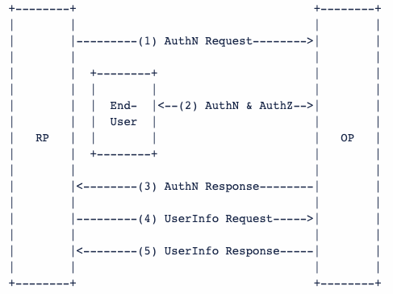

# OpenID Connect

OpenID Connect简称OIDC，是基于[OAuth2.0](../oauth/README.md)扩展出来的一个协议。除了能够OAuth2.0中的Authorization场景，还额外定义了Authentication的场景，可以说OIDC协议是当今最流行的协议。

相比OAuth2，OIDC引入了id_token等和userinfo相关的概念：

- 整个OAuth2协议，只是定义了access_token/refresh_token，但是这俩token只是为了保护Resource Server的，并没有Resource Owner的身份信息；
- OIDC引入了id_token的概念，用这个特殊的token来表示这是Resource Owner的身份证：
    - 标准化id_token的格式：即大家熟知的JWT；
    - 标准化id_token的内容：Standard Claims
        - 参考：https://openid.net/specs/openid-connect-core-1_0.html#StandardClaims
- OIDC引入了关于如何获取详细userinfo的Endpoint；
- OIDC定义了类似于SAML Metadata的Discovery接口，俗称well-known接口：
    - 参考：https://openid.net/specs/openid-connect-discovery-1_0.html
- OIDC协议的登陆授权流程和OAuth2.0基本类似, 整个流程的参与者也类似，只不过换了个术语：
    - OpenID Provider：简称OP，负责认证和授权
    - Relying Party：简称RP，OAuth 2.0中的Client

可以说OIDC协议是目前最主流的SSO标准协议，且对开发者友好，实现起来比较简单。

详细协议标准定义参考：https://openid.net/specs/openid

## 参考
https://zhuanlan.zhihu.com/p/267845330
https://blog.csdn.net/seccloud/article/details/8192707
https://www.ruanyifeng.com/blog/2019/04/oauth-grant-types.html