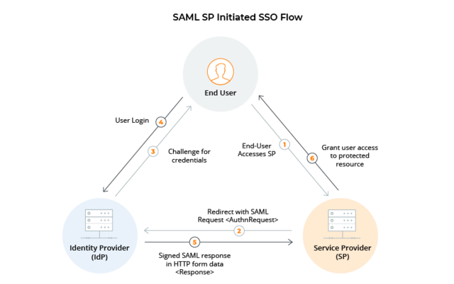

# SAML
SAML协议全称为Security Assertion Markup Language，它是一个基于XML的标准协议。SAML标准定义了身份提供者（Identity Provider）和服务提供者（Service Provider）之间，如何通过SAML规范，采用加密和签名的方式来建立互信，从而交换用户身份信息。

SAML是一个非常古老的Authentication的协议，在早期B/S架构的企业级应用中非常流行。SAML协议非常庞大，定义了很多optional的细节（即不是必须实现）。但这个也是双刃剑，这一点恰恰也是SAML协议的缺点，作为实现者，必须得同时兼顾这些optional的细节，给开发者带来较大的挑战。

技术上，SAML协议基于XML，以Assertion的方式，通过签名和加密交换用户身份信息. 这一点和OIDC协议中的ID_Token类似（采用签名/加密的id_token来交换用户身份）。

SAML流程的参与者包括Service Provider（SP）和Identity Provider（IDP）两个重要角色，且整个流程包括如下两个使用场景：

- SP Initiated: 服务提供者主动发起
-  IDP Initiated: 身份认证服务器主动发起

下面是大致的认证流程：

1. End User从浏览器中请求访问某SP：https://www.example.com ；
1. https://www.example.com发现用户未登陆，则发起SAML的AuthnRequest请求至IDP, 用户浏览器跳转至IDP页面；
1. IDP发现用户处于未登陆状态，重定向用户至IDP的登陆界面，请求用户进行身份验证
1. 用户在登陆页面中进行身份认证, 通常情况下需要校验用户名和密码；
1. IDP校验用户身份，若成功，则把包含着用户身份信息的校验结果，以SAML Reponse的形式，签名/加密发送给SP；
1. SP拿到用户身份信息以后，进行签名验证/解密，拿到明文的用户身份信息，此时SP处于登陆状态，可以对用户提供服务。

可以看到，在整个流程中，IDP是负责颁发用户身份，SP负责信任IDP颁发的用户身份, SP和IDP之间的信任关系是需要提前建立的，即SP和IDP需要提前把双方的信息预先配置到对方，通过证书信任的方式来建立互信。

SAML协议的标准定义可参考：http://docs.oasis-open.org/sec

## 参考
https://zhuanlan.zhihu.com/p/267845330
https://blog.csdn.net/seccloud/article/details/8192707
https://www.ruanyifeng.com/blog/2019/04/oauth-grant-types.html